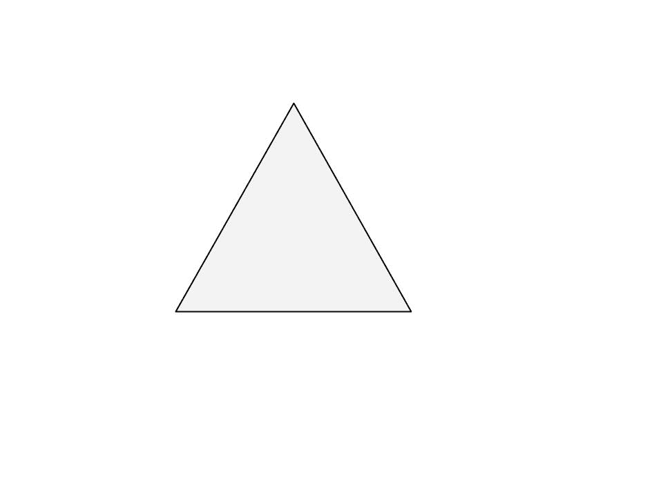
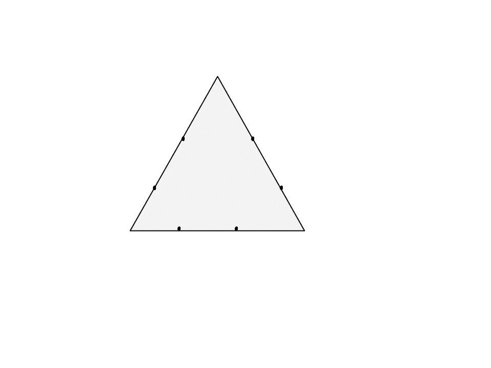
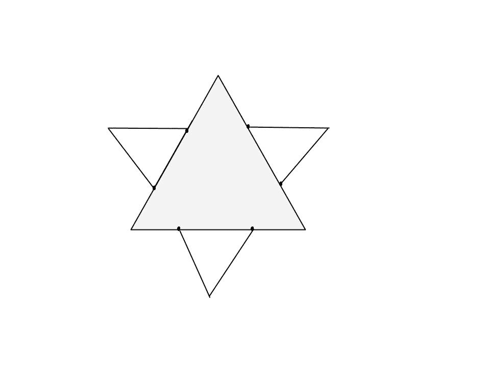
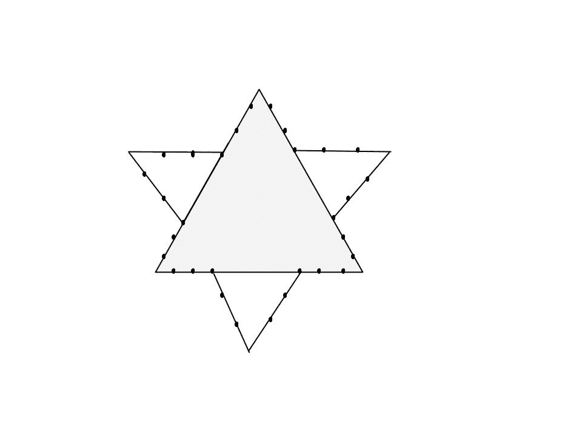
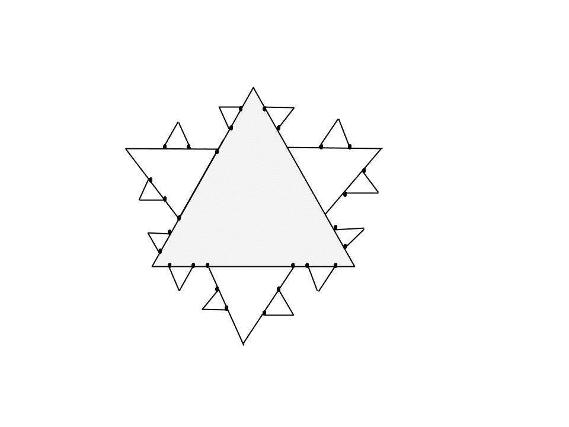

# 科赫曲线或科赫雪花

> 原文:[https://www.geeksforgeeks.org/koch-curve-koch-snowflake/](https://www.geeksforgeeks.org/koch-curve-koch-snowflake/)

**什么是科赫曲线？**

科赫雪花(也称为科赫曲线、科赫星或科赫岛)是一种数学曲线，也是最早描述的分形曲线之一。它基于科赫曲线，该曲线出现在瑞典数学家赫尔格·冯·科赫 1904 年的一篇题为“在没有切线的连续曲线上，可由初等几何构造”的论文中。

雪花面积的级数收敛到原来三角形面积的 8/5 倍，而雪花周长的级数发散到无穷大。因此，雪花有一个由无限长的线限定的有限区域。

* * *

# **施工**

**第一步:**

画一个等边三角形。你可以用指南针或量角器画它，或者如果你不想花太多时间画雪花，就盯着它。

*   It’s best if the length of the sides are divisible by 3, because of the nature of this fractal. This will become clear in the next few steps.

    

    **第二步:**

    把每一边分成三等份。这就是为什么边能被三整除的原因。
    

    **第三步:**

    在每个中间部分画一个等边三角形。测量中间三分之一的长度，知道这些新三角形的边长。
    

    **第四步:**

    将每个外侧分成三份。你可以看到第二代三角形覆盖了第一代的一部分。这三条线段不应该一分为三。
    

    **第五步:**

    在每个中间部分画一个等边三角形。

    *   Note how you draw each next generation of parts that are one 3rd of the mast one.

    

    * * *

    # **表示为林登迈尔系统**

    * * *

    科赫曲线可以用下面的[重写系统](https://en.wikipedia.org/wiki/Rewriting) ( [林登迈尔系统](https://en.wikipedia.org/wiki/Lindenmayer_system))表示:

    **字母**:F
    T3【常数】T4:+，？
    **公理** : F
    **生产规则** : F？F+F–F+F

    这里，F 表示“向前划”，–表示“右转 60 度”，而+表示“左转 60 度”。
    要创建科赫雪花，可以使用 F++F++F(等边三角形)作为公理。

    # Untuk membuat Kurva Koch:

    ```py
    # Python program to print partial Koch Curve.
    # importing the libraries : turtle standard 
    # graphics library for python
    from turtle import *

    #function to create koch snowflake or koch curve
    def snowflake(lengthSide, levels):
        if levels == 0:
            forward(lengthSide)
            return
        lengthSide /= 3.0
        snowflake(lengthSide, levels-1)
        left(60)
        snowflake(lengthSide, levels-1)
        right(120)
        snowflake(lengthSide, levels-1)
        left(60)
        snowflake(lengthSide, levels-1)

    # main function
    if __name__ == "__main__":

        # defining the speed of the turtle
        speed(0)                   
        length = 300.0              

        # Pull the pen up – no drawing when moving.
        penup()                     

        # Move the turtle backward by distance, 
        # opposite to the direction the turtle 
        # is headed.
        # Do not change the turtle’s heading.
        backward(length/2.0)        

        # Pull the pen down – drawing when moving.
        pendown()         

        snowflake(length, 4)

        # To control the closing windows of the turtle
        mainloop() 
    ```

    **输出:**

    <video class="wp-video-shortcode" id="video-159017-1" width="665" height="356" preload="metadata" controls=""><source type="video/mp4" src="https://media.geeksforgeeks.org/wp-content/uploads/output_1.mp4?_=1">[https://media.geeksforgeeks.org/wp-content/uploads/output_1.mp4](https://media.geeksforgeeks.org/wp-content/uploads/output_1.mp4)</video>

    为了用科赫曲线创建一个完整的雪花，我们需要重复相同的模式三次。所以让我们来试试。

    ```py
    # Python program to print complete Koch Curve.
    from turtle import *

    # function to create koch snowflake or koch curve
    def snowflake(lengthSide, levels):
        if levels == 0:
            forward(lengthSide)
            return
        lengthSide /= 3.0
        snowflake(lengthSide, levels-1)
        left(60)
        snowflake(lengthSide, levels-1)
        right(120)
        snowflake(lengthSide, levels-1)
        left(60)
        snowflake(lengthSide, levels-1)

    # main function
    if __name__ == "__main__":
        # defining the speed of the turtle
        speed(0)                   
        length = 300.0   

        # Pull the pen up – no drawing when moving.
        # Move the turtle backward by distance, opposite
        # to the direction the turtle is headed.
        # Do not change the turtle’s heading.           
        penup()                     

        backward(length/2.0)

        # Pull the pen down – drawing when moving.        
        pendown()           
        for i in range(3):    
            snowflake(length, 4)
            right(120)

         # To control the closing windows of the turtle
        mainloop()       
    ```

    输出:

    ```py
    <video class="wp-video-shortcode" id="video-159017-2" width="665" height="355" preload="metadata" controls=""><source type="video/mp4" src="https://media.geeksforgeeks.org/wp-content/uploads/output_2.mp4?_=2">[https://media.geeksforgeeks.org/wp-content/uploads/output_2.mp4](https://media.geeksforgeeks.org/wp-content/uploads/output_2.mp4)</video>

    ```

    本文由 **[Subhajit Saha](https://www.linkedin.com/in/subhajit-saha-06aa29131/)** 供稿。如果你喜欢 GeeksforGeeks 并想投稿，你也可以使用[contribute.geeksforgeeks.org](http://www.contribute.geeksforgeeks.org)写一篇文章或者把你的文章邮寄到 contribute@geeksforgeeks.org。看到你的文章出现在极客博客主页上，帮助其他极客。

    如果你发现任何不正确的地方，或者你想分享更多关于上面讨论的话题的信息，请写评论。