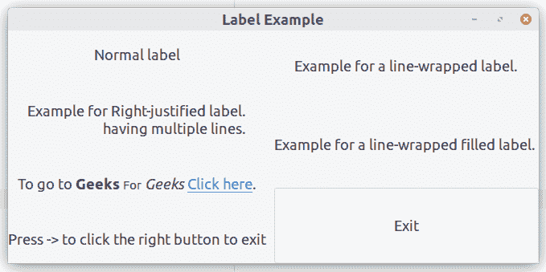

# Python GTK+3 中的标签

> 原文:[https://www.geeksforgeeks.org/label-in-python-gtk-3/](https://www.geeksforgeeks.org/label-in-python-gtk-3/)

标签是在窗口中放置不可编辑文本的主要方法。例如，标签可以用作条目小部件旁边的标题。标签的一些重要特征是–

*   标签的选择可以使用`Gtk.Label.set_selectable()`完成。可选标签允许用户将内容复制到剪贴板。标签包含要复制的有用信息，例如可以作为可选标签的错误消息。
*   标签文本对齐和换行可以分别通过`Gtk.Label.set_justify()`、`Gtk.Label.set_line_wrap()`方法实现。
*   另外，`Gtk.Label`支持可点击的超链接。链接的标记借用了 HTML，使用了带有`href`和标题属性的 a。GTK+呈现的链接类似于它们在网络浏览器中的显示方式，带有彩色下划线的文本。
*   助记符是标签中带下划线的字符，用于键盘导航；可以通过给函数`Gtk.Label.set_text_with_mnemonic()`赋予一个在助记符前带有下划线的字符串来创建，例如“_Geeks For Geeks”。

**按照以下步骤创建标签:**

1.  导入 GTK+ 3 模块。
2.  创建主窗口。
3.  创建一个盒子。
4.  实施标签。
5.  实现按钮。

**Example :**

```
import gi

gi.require_version("Gtk", "3.0")
from gi.repository import Gtk

class LabelWindow(Gtk.Window):

    def __init__(self):
        Gtk.Window.__init__(self, title ="Label Example")

        # Create Box
        hbox = Gtk.Box(spacing = 10)
        hbox.set_homogeneous(False)
        vbox_left = Gtk.Box(orientation = Gtk.Orientation.VERTICAL, 
                    spacing = 10)
        vbox_left.set_homogeneous(False)
        vbox_right = Gtk.Box(orientation = Gtk.Orientation.VERTICAL, 
                    spacing = 10)
        vbox_right.set_homogeneous(False)

        hbox.pack_start(vbox_left, True, True, 0)
        hbox.pack_start(vbox_right, True, True, 0)

        # Create label
        label = Gtk.Label("Normal label")
        vbox_left.pack_start(label, True, True, 0)

        # Create justified label
        # with multiple lines
        label = Gtk.Label("Example for "
                "Right-justified label.\n"
                "having multiple lines.")
        label.set_justify(Gtk.Justification.RIGHT)
        vbox_left.pack_start(label, True, True, 0)

        label = Gtk.Label(
            "Example for a line-wrapped label."

        )
        label.set_line_wrap(True)
        vbox_right.pack_start(label, True, True, 0)

        label = Gtk.Label(
            "Example for a line-wrapped filled label. "
        )
        label.set_line_wrap(True)
        label.set_justify(Gtk.Justification.FILL)
        vbox_right.pack_start(label, True, True, 0)

        # Create label markup
        label = Gtk.Label()
        label.set_markup(
            "To go to <b>Geeks</b> "
            "<small>For</small> <i>Geeks</i> "
            '<a href ="https://www.geeksforgeeks.org/" '
            'title ="">Click here</a>.'
        )
        label.set_line_wrap(True)
        vbox_left.pack_start(label, True, True, 0)

        # Create label mnemonic
        label = Gtk.Label.new_with_mnemonic(
            "_Press -> to click the right button to exit"
        )
        vbox_left.pack_start(label, True, True, 0)
        label.set_selectable(True)

        # Create Button
        button = Gtk.Button(label ="Exit")
        label.set_mnemonic_widget(button)
        vbox_right.pack_start(button, True, True, 0)

        self.add(hbox)

window = LabelWindow()
window.connect("destroy", Gtk.main_quit)

# Display the window.
window.show_all()

# Start the GTK + processing loop
Gtk.main()
```

**输出:**
