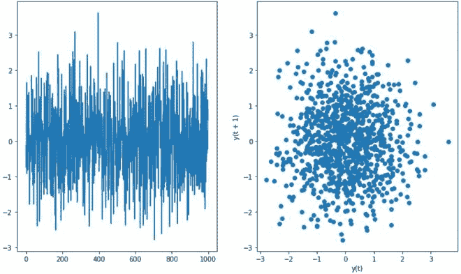
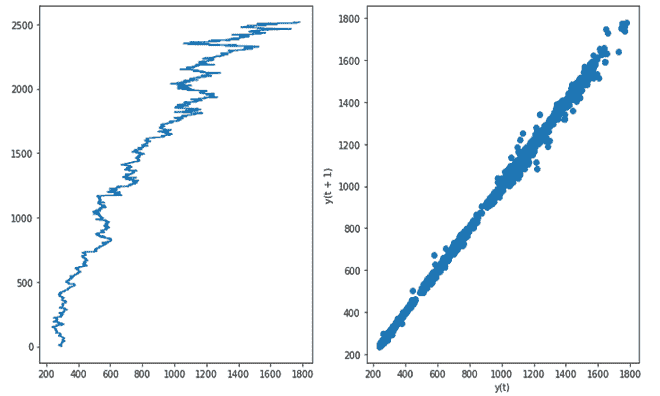
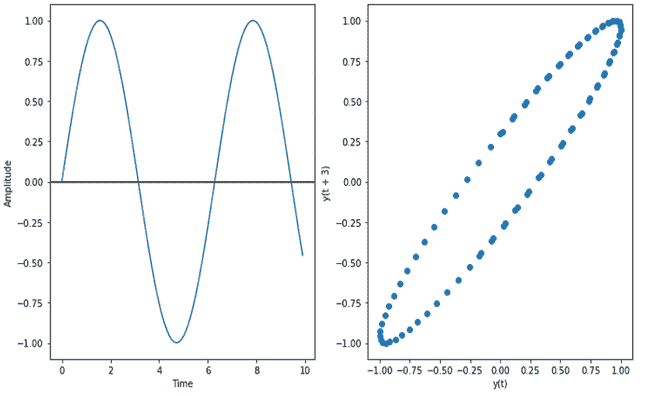
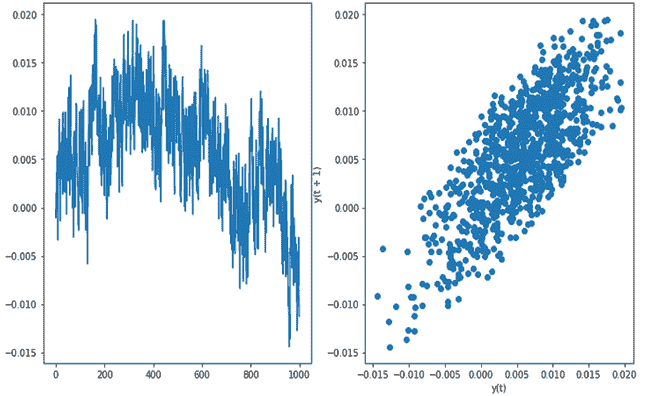

# 倒叙情节

> 原文:[https://www.geeksforgeeks.org/lag-plots/](https://www.geeksforgeeks.org/lag-plots/)

滞后图是一种特殊类型的散点图，其中 X 轴表示数据集，与 Y 轴相比，其时间单位落后或提前。这些时间单位之间的差异称为滞后或滞后，用 *k* 表示。

滞后图包含以下轴:

*   **纵轴** : Y <sub>i</sub> 为全 I
*   **横轴** : Y <sub>i-k</sub> 为所有 I，其中 k 为滞后值

滞后图用于回答以下问题:

*   **模型分布**:这里的模型分布是指根据滞后图决定数据的形状。以下是一些滞后情节及其原始情节的例子:
    *   如果滞后图是线性的，那么基础结构就是自回归模型。
    *   如果滞后图是椭圆形状，那么基础结构代表连续的周期函数，如正弦、余弦等。
*   **异常值**:异常值是一组代表分布中极值的数据点
*   **数据中的随机性**:滞后图对于检查给定数据集是否随机也很有用。如果数据中存在随机性，那么它将反映在滞后图中，如果滞后图中没有模式。
*   **季节性:**如果图中存在季节性，那么就会给出周期性的滞后图。
*   **自相关**:如果滞后图给出线性图，那么说明数据中存在自相关，是否存在正自相关还是负自相关取决于数据集直线的斜率。如果滞后图中更多的数据集中在对角线上，则意味着存在很强的自相关性。

#### **实施**

*   在这个实现中，我们将是 NumPy 和 SciPy 库，这些是在 Colab 中预安装的，但是可以使用 *pip install* 在本地环境中安装。我们将使用[谷歌股价](https://finance.yahoo.com/quote/GOOG/)数据和[闪烁数据](https://www.itl.nist.gov/div898/handbook/datasets/FLICKER.DAT)来实现。

## 蟒蛇 3

```
# Import Libraries
import pandas as pd
import numpy as np
import matplotlib.pyplot as plt
from scipy import stats as sc

# Sine graph and lag plot
time= np.arange(0, 10, 0.1);
amplitude=np.sin(time)
fig, ax = plt.subplots(1, 2, figsize=(12, 7))
ax[0].plot(time, amplitude)
ax[0].set_xlabel('Time')
ax[0].set_ylabel('Amplitude')
ax[0].axhline(y=0, color='k')
amplitude_series = pd.Series(amplitude)
pd.plotting.lag_plot(amplitude_series, lag= 3, ax =ax[1])
plt.show()

# Random and Lag Plot
sample_size=1000
fig, ax = plt.subplots(1, 2, figsize=(12, 7))
random_series=  pd.Series(np.random.normal(size=sample_size))
random=random_series.reset_index(inplace=True)
ax[0].plot(random['index'],random[0])
pd.plotting.lag_plot(random[0],lag=1)
plt.show()

# Google Stock and Lag Plot (Strong Autocorrelation)
google_stock_data = pd.read_csv('GOOG.csv')
google_stock_data.reset_index(inplace=True)
fig, ax = plt.subplots(1, 2, figsize=(12, 7))
ax[0].plot(google_stock_data['Adj Close'], google_stock_data['index'])
pd.plotting.lag_plot(google_stock_data['Adj Close'], lag=1,ax=ax[1])
plt.show()

# FLicker Data (Weak Autocorrelation)
df  =pd.read_csv('Flicker.DAT', header=None)
df.reset_index(inplace=True)
fig, ax = plt.subplots(1, 2, figsize=(12, 7))
ax[0].plot(df['index'],df[0])
pd.plotting.lag_plot(df[0],lag=1,ax =ax[1])
plt.show()
```



随机图(无自相关)



谷歌股票数据(强自相关)



正弦图(椭圆曲线)



闪烁数据(中等自相关)

#### 参考文献:

*   [NIST 手册](http://atomic.phys.uni-sofia.bg/local/nist-e-handbook/e-handbook/eda/section3/lagplot.htm)