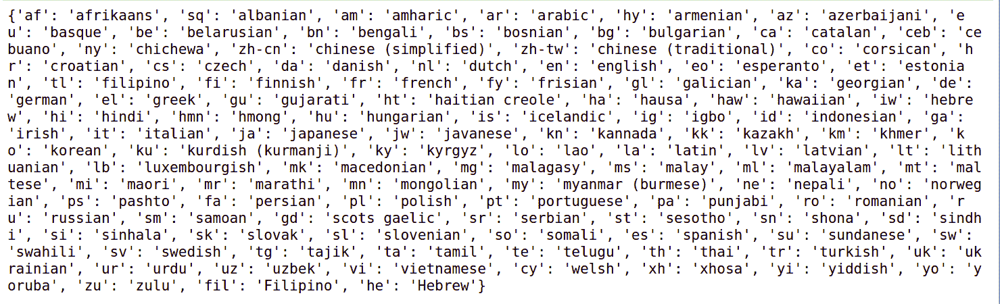

# Python 中使用谷歌 API 的语言翻译器

> 原文:[https://www . geesforgeks . org/language-translator-use-Google-API-in-python/](https://www.geeksforgeeks.org/language-translator-using-google-api-in-python/)

**API** 代表**应用编程接口**。它充当两个应用程序或软件之间的中介。简单来说，API 就像一个信使，将您的请求带到目的地，然后为您带回响应。谷歌应用编程接口是由谷歌开发的，允许与他们的服务器通信，并使用他们的应用编程接口密钥来开发项目。

在本教程中，我们将使用谷歌应用编程接口来构建一个语言翻译器，可以将一种语言翻译成另一种语言。在互联网上，我们可以看到很多关于语音识别、语音到文本、文本到语音等的项目。但是在这个项目中，我们要建造比这更先进的东西。

让我们假设一个场景，我们在西班牙旅行，我们不知道如何说西班牙语，或者我们在任何其他国家，我们不知道他们的母语，然后我们可以使用这个工具来克服这个问题。我们可以在所有存在于**谷歌翻译器**中的语言之间进行翻译。

### 装置

现在要检查它支持什么语言，我们必须使用谷歌翻译库。我们可以用 pip 来安装它。

```
pip install googletrans
```

现在检查它支持哪些语言来运行下面的代码。

## 蟒蛇 3

```
# To Print all the languages that google
# translator supports
import googletrans

print(googletrans.LANGUAGES)
```

**输出:**



现在让我们开始构建语言翻译器。从编码部分开始，我们需要安装一些依赖项。安装 Pyaudio 时，您可能会遇到 portaudio 错误。pyaudio [安装详情点击此处](https://people.csail.mit.edu/hubert/pyaudio/)。

```
pip install pyaudio
pip install SpeechRecognition
pip install gtts
```

下面是实现。

## 蟒蛇 3

```
# Importing necessary modules required
import speech_recognition as spr
from googletrans import Translator
from gtts import gTTS
import os

# Creating Recogniser() class object
recog1 = spr.Recognizer()

# Creating microphone instance
mc = spr.Microphone()

# Capture Voice
with mc as source:
    print("Speak 'hello' to initiate the Translation !")
    print("~~~~~~~~~~~~~~~~~~~~~~~~~~~~~~~~~~~~~~~~~~~~")
    recog1.adjust_for_ambient_noise(source, duration=0.2)
    audio = recog1.listen(source)
    MyText = recog1.recognize_google(audio)
    MyText = MyText.lower()

# Here initialising the recorder with
# hello, whatever after that hello it
# will recognise it.
if 'hello' in MyText:

    # Translator method for translation
    translator = Translator()

    # short form of english in which
    # you will speak
    from_lang = 'en'

    # In which we want to convert, short
    # form of hindi
    to_lang = 'hi'

    with mc as source:

        print("Speak a stentence...")
        recog1.adjust_for_ambient_noise(source, duration=0.2)

        # Storing the speech into audio variable
        audio = recog1.listen(source)

        # Using recognize.google() method to
        # convert audio into text
        get_sentence = recog1.recognize_google(audio)

        # Using try and except block to improve
        # its efficiency.
        try:

            # Printing Speech which need to
            # be translated.
            print("Phase to be Translated :"+ get_sentence)

            # Using translate() method which requires
            # three arguments, 1st the sentence which
            # needs to be translated 2nd source language
            # and 3rd to which we need to translate in
            text_to_translate = translator.translate(get_sentence,
                                                     src= from_lang,
                                                     dest= to_lang)

            # Storing the translated text in text
            # variable
            text = text_to_translate.text

            # Using Google-Text-to-Speech ie, gTTS() method
            # to speak the translated text into the
            # destination language which is stored in to_lang.
            # Also, we have given 3rd argument as False because
            # by default it speaks very slowly
            speak = gTTS(text=text, lang=to_lang, slow= False)

            # Using save() method to save the translated
            # speech in capture_voice.mp3
            speak.save("captured_voice.mp3")    

            # Using OS module to run the translated voice.
            os.system("start captured_voice.mp3")

        # Here we are using except block for UnknownValue
        # and Request Error and printing the same to
        # provide better service to the user.
        except spr.UnknownValueError:
            print("Unable to Understand the Input")

        except spr.RequestError as e:
            print("Unable to provide Required Output".format(e))
```

**输出:**

```
Speak 'hello' to initiate the Translation !
~~~~~~~~~~~~~~~~~~~~~~~~~~~~~~~~~~~~~~~~~~~~
Speak a stentence...
Phase to be Translated :what are you doing
```

<audio class="wp-audio-shortcode" id="audio-405554-1" preload="none" style="width:100%" controls=""><source type="audio/mpeg" src="https://media.geeksforgeeks.org/wp-content/cdn-uploads/20200430164710/captured_voice.mp3?_=1">[https://media.geeksforgeeks.org/wp-content/cdn-uploads/20200430164710/captured_voice.mp3](https://media.geeksforgeeks.org/wp-content/cdn-uploads/20200430164710/captured_voice.mp3)</audio>