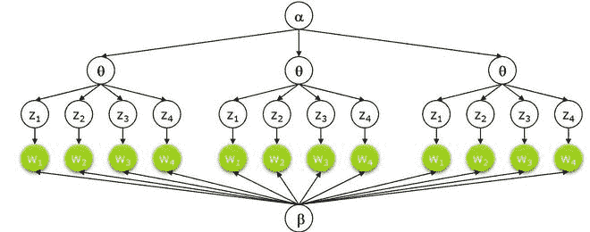
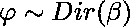
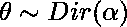
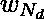
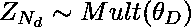
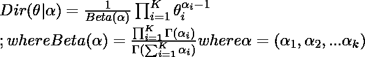
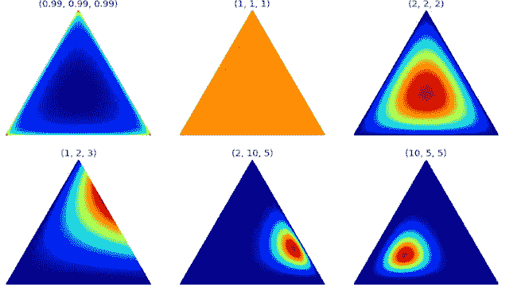
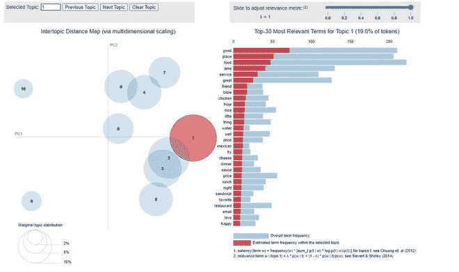

# 潜在狄利克雷分配

> 原文:[https://www.geeksforgeeks.org/latent-dirichlet-allocation/](https://www.geeksforgeeks.org/latent-dirichlet-allocation/)

### 主题建模:

主题建模是一种抽象建模方法，用于发现文档集合中出现的抽象“主题”。这个想法是我们将对不同的文档进行无监督分类，这些文档在主题中找到一些自然的组。我们可以使用主题建模来回答以下问题。

*   文件的主题/主旨是什么？
*   给定一个文档，我们能找到另一个主题相似的文档吗？
*   主题字段如何随时间变化？

主题建模有助于优化搜索过程。在本文中，我们将讨论潜在狄利克雷分配，一个主题建模过程。

## 潜在狄利克雷分配

潜在狄利克雷分配是执行主题建模的最流行的方法之一。每个文档由不同的单词组成，每个主题可以与一些单词相关联。LDA 背后的目标是根据文档中包含的单词找到文档所属的主题。它假设具有相似主题的文档将使用相似的一组单词。这使得文档能够映射潜在主题的概率分布，并且主题是概率分布。

### 设置创成式模型:



*   假设我们有使用 V 字类型词汇的 D 文档。每个文档包含一个 N 字标记(可以移除或填充)。现在，我们假设 K 个主题，这需要一个代表文档主题分布的 K 维向量。
*   每个主题在具有公共对称先验的单词上有一个 V 维多项式β_ k。
*   对于每个主题 1…k:
    *   在单词上画一个多项式。
*   对于每个文档 1…d:
    *   在题目上画一个多项式
    *   对于每个单词:
        *   用![Z_{N_d} \epsilon [1..K]](img/6b97eda423881f32302c8a2e372c34fe.png "Rendered by QuickLaTeX.com")画一个题目
        *   绘制文字 W_{N_d} \sim Mult(\varphi)。

### 线性判别分析的图形模型；


*   在上面的等式中，LHS 表示从 LDA 机器生成原始文档的概率。
*   在方程的右边，有 4 个概率项，前两个项代表狄利克雷分布，另外两个项代表多项式分布。第一个和第三个术语代表主题的分布，而第二个和第四个术语代表单词分布。我们将首先讨论狄利克雷分布。

**狄利克雷分布**

*   狄利克雷分布可以定义为向量值输入的概率密度，该向量值输入具有与我们的多项式参数相同的特征。它具有非零值，例如:




*   狄利克雷分布由向量 *α* 参数化，该向量具有与多项式参数 *θ* 相同数量的元素 *K* 。
*   我们可以将*p*(*θ|α*)解释为回答“假设我们的狄利克雷分布有参数 *α，那么与多项式分布 *θ* 相关的概率密度是多少？”。*



狄利克雷分布

*   以上是狄利克雷分布的可视化，出于我们的目的，我们可以假设角/顶点用三角形内的单词表示主题(如果单词经常与其相关，则该单词更接近主题。)或反之亦然。
*   这种分布可以扩展到三维以上。对于四维，我们可以使用四面体，对于更进一步的维度。我们可以使用 k-1 维单纯形。

### 推论:

*   LDA 中的推理问题，计算给定文档和语料库参数α和β的隐藏变量的后验值。也就是计算 P(

### **示例:**

*   让我们考虑我们有两类主题，我们有一个单词向量，每个主题由一些单词组成。以下是代表不同主题的单词:

<figure class="table">

| 话 | p(字数&#124;题目=1) | p(字数&#124;题目=2) |
| --- | --- | --- |
| **心脏** | Zero point two | Zero |
| **爱情** | Zero point two | Zero |
| **灵魂** | Zero point two | Zero |
| **流泪** | Zero point two | Zero |
| **欢乐** | Zero point two | Zero |
| **科学** | Zero | Zero point two |
| **知识** | Zero | Zero point two |
| **工作** | Zero | Zero point two |
| **研究** | Zero | Zero point two |
| **数学** | Zero | Zero point two |

</figure>

*   现在，我们有一些文档，我们扫描一些文档来查找这些单词:

<figure class="table">

| 文档中的单词 | {主题=1，主题= 2 } |
| --- | --- |
| 数学知识研究工作数学研究工作科学数学工作 | {1,0} |
| 科学知识数学科学心灵爱眼泪知识心灵 | {0.25, 0.75} |
| 数学心研究热爱数学工作眼泪灵魂知识心 | {0.5, 0.5} |
| 工作快乐灵魂流泪数学眼泪爱爱爱灵魂 | {0.75, 0.25} |
| 眼泪爱快乐灵魂爱眼泪灵魂眼泪爱快乐灵魂 | {1,0} |

</figure>

*   现在，我们使用下面文档矩阵中的概率将上面的单词更新为主题矩阵。

#### 履行

在这个实现中，我们使用 scikit-learn 和 pyLDAvis。对于数据集，我们使用可以在 yelp 网站上找到的 Yelp 评论数据集。

## 蟒蛇 3

```
# install pyldavis
!pip install pyldavis
# imports
!pip install gensim pyLDAvis
! python3 -m spacy download en_core_web_sm

import pandas as pd
import numpy as np

import string
import spacy
import nltk

import gensim
from gensim import corpora

import matplotlib.pyplot as plt

import pyLDAvis
import pyLDAvis.gensim_models

nltk.download('wordnet')
from nltk.corpus import wordnet as wn
nltk.download('stopwords')
from nltk.corpus import stopwords
import spacy.cli
spacy.cli.download("en_core_web_md")
import en_core_web_md
# fetch yelp review dataset and clean it
yelp_review = pd.read_csv('/content/yelp.csv')
yelp_review.head()
# print number of document and topics
print(len(yelp_review))
print("Unique Business")
print(len(yelp_review.groupby('business_id')))
print("Unique User")
print(len(yelp_review.groupby('user_id')))

# clean the document and remove punctuation
def clean_text(text):
  delete_dict = {sp_char: '' for sp_char in string.punctuation}
  delete_dict[' '] =' '
  table = str.maketrans(delete_dict)
  text1 = text.translate(table)
  textArr= text1.split()
  text2 = ' '.join([w for w in textArr if ( not w.isdigit() and
                                           ( not w.isdigit() and len(w)>3))])
  return text2.lower()

yelp_review['text'] = yelp_review['text'].apply(clean_text)
yelp_review['Num_words_text'] = yelp_review['text'].apply(lambda x:len(str(x).split()))

print('-------Reviews By Stars --------')
print(yelp_review['stars'].value_counts())
print(len(yelp_review))
print('-------------------------')
max_review_data_sentence_length  = yelp_review['Num_words_text'].max()

# print short review (
mask = (yelp_review['Num_words_text'] < 100) & (yelp_review['Num_words_text'] >=20)
df_short_reviews = yelp_review[mask]
df_sampled = df_short_reviews.groupby('stars')
    .apply(lambda x: x.sample(n=100)).reset_index(drop = True)

print('No of Short reviews')
print(len(df_short_reviews))

# function to remove stopwords
def remove_stopwords(text):
    textArr = text.split(' ')
    rem_text = " ".join([i for i in textArr if i not in stop_words])
    return rem_text

# remove stopwords from the text
stop_words = stopwords.words('english')
df_sampled['text']=df_sampled['text'].apply(remove_stopwords)

# perform Lemmatization
lp = en_core_web_md.load(disable=['parser', 'ner'])
def lemmatization(texts,allowed_postags=['NOUN', 'ADJ']):
       output = []
       for sent in texts:
             doc = nlp(sent)
             output.append([token.lemma_
                            for token in doc if token.pos_ in allowed_postags ])
      return output
text_list=df_sampled['text'].tolist()
print(text_list[2])
tokenized_reviews = lemmatization(text_list)
print(tokenized_reviews[2])

# convert to document term frequency:
dictionary = corpora.Dictionary(tokenized_reviews)
doc_term_matrix = [dictionary.doc2bow(rev) for rev in tokenized_reviews]

# Creating the object for LDA model using gensim library
LDA = gensim.models.ldamodel.LdaModel

# Build LDA model
lda_model = LDA(corpus=doc_term_matrix, id2word=dictionary,
                num_topics=10, random_state=100,
                chunksize=1000, passes=50,iterations=100)
# print lda topics with respect to each word of document
lda_model.print_topics()

# calculate perplexity and coherence
print('\Perplexity: ', lda_model.log_perplexity(doc_term_matrix,
                                                total_docs=10000)) 

# calculate coherence
coherence_model_lda = CoherenceModel(model=lda_model,
                                     texts=tokenized_reviews, dictionary=dictionary ,
                                     coherence='c_v')
coherence_lda = coherence_model_lda.get_coherence()
print('Coherence: ', coherence_lda)

# Now, we use pyLDA vis to visualize it
pyLDAvis.sklearn.prepare(lda_tf, dtm_tf, tf_vectorizer)
```

```
Total reviews
10000
Unique Business
4174
Unique User
6403
--------------
-------Reviews by stars --------
4    3526
5    3337
3    1461
2     927
1     749
Name: stars, dtype: int64
10000
-------------------------
No of Short reviews
6276
-------------------------
# review and tokenized version
decided completely write place three times tried closed website posted hours open wants drive suburbs
 youd better call first place cannot trusted wasted time spent hungry minutes walking disappointed vitamin
 fail said

['place', 'time', 'closed', 'website', 'hour', 'open', 'drive', 'suburb', 'first', 'place', 'time', 'hungry', 
'minute', 'vitamin']
---------------------------
# LDA print topics
[(0,
  '0.015*"food" + 0.013*"good" + 0.010*"gelato" + 0.008*"sandwich" + 0.008*"chocolate" + 0.005*"wife" + 0.005*"next" + 0.005*"bad" + 0.005*"night" + 0.005*"sauce"'),
 (1,
  '0.030*"food" + 0.021*"great" + 0.019*"place" + 0.019*"good" + 0.016*"service" + 0.011*"time" + 0.011*"nice" + 0.008*"lunch" + 0.008*"dish" + 0.007*"staff"'),
 (2,
  '0.023*"food" + 0.023*"good" + 0.018*"place" + 0.014*"great" + 0.009*"star" + 0.009*"service" + 0.008*"store" + 0.007*"salad" + 0.007*"well" + 0.006*"pizza"'),
 (3,
  '0.035*"good" + 0.025*"place" + 0.023*"food" + 0.020*"time" + 0.015*"service" + 0.012*"great" + 0.009*"friend" + 0.008*"table" + 0.008*"chicken" + 0.007*"hour"'),
 (4,
  '0.020*"food" + 0.019*"time" + 0.012*"good" + 0.009*"restaurant" + 0.009*"great" + 0.008*"service" + 0.007*"order" + 0.006*"small" + 0.006*"hour" + 0.006*"next"'),
 (5,
  '0.012*"drink" + 0.009*"star" + 0.006*"worth" + 0.006*"place" + 0.006*"friend" + 0.005*"great" + 0.005*"kid" + 0.005*"drive" + 0.005*"simple" + 0.005*"experience"'),
 (6,
  '0.024*"place" + 0.015*"time" + 0.012*"food" + 0.011*"price" + 0.009*"good" + 0.009*"great" + 0.009*"kid" + 0.008*"staff" + 0.008*"nice" + 0.007*"happy"'),
 (7,
  '0.028*"place" + 0.019*"service" + 0.015*"good" + 0.014*"pizza" + 0.014*"time" + 0.013*"food" + 0.013*"great" + 0.011*"well" + 0.009*"order" + 0.007*"price"'),
 (8,
  '0.032*"food" + 0.026*"good" + 0.026*"place" + 0.015*"great" + 0.009*"service" + 0.008*"time" + 0.006*"price" + 0.006*"meal" + 0.006*"shop" + 0.006*"coffee"'),
 (9,
  '0.020*"food" + 0.014*"place" + 0.011*"meat" + 0.010*"line" + 0.009*"good" + 0.009*"minute" + 0.008*"time" + 0.008*"chicken" + 0.008*"wing" + 0.007*"hour"')]
------------------------------
```



PyLDAvis 可视化