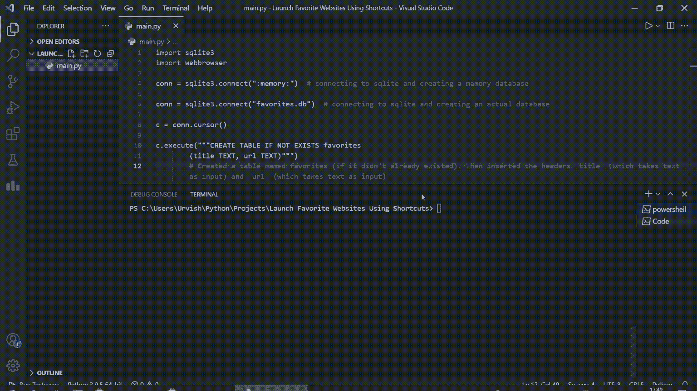

# 使用 Python 启动网站 URL 快捷方式

> 原文:[https://www . geesforgeks . org/launch-网站-URL-快捷方式-使用-python/](https://www.geeksforgeeks.org/launch-website-url-shortcut-using-python/)

在这篇文章中，我们将使用快捷方式启动您喜欢的网站，为此，我们将使用 Python 的 ***sqlite3*** 和 ***网络浏览器*** 模块使用快捷方式启动您喜欢的网站。

***sqlite3*** 和 ***webbrowser*** 都是 python 标准库的一部分，所以我们不需要单独安装任何东西。

最棒的是，因为我们使用数据库来存储网站及其快捷方式，所以即使我们关闭终端或电脑，您最喜欢的网站也会保存在数据库中。因此，您不需要在每次执行脚本时都将您喜欢的网站添加到数据库中。

### 方法:

*   如果新数据库还不存在，我们就创建一个新数据库，并将其连接到我们的数据库。
*   我们创建不同的函数来从数据库中获取数据、打开网站、向数据库中添加新网站以及从数据库中删除网站
*   我们调用一个 while 循环，这样我们的程序就可以监听用户的命令，直到他们退出
*   我们要求用户做出响应来执行特定的任务

#### 下面是实现:

## 蟒蛇 3

```
import webbrowser  
import sqlite3        

# connecting to sqlite and creating
# an actual database
conn = sqlite3.connect("favorites.db")

c = conn.cursor()

c.execute("""CREATE TABLE IF NOT EXISTS favorites
        (title TEXT, url TEXT)""")

# Created a table named favorites
# (if it didn't already existed).
# Then inserted the headers  title 
# (which takes text as input)
# and  url  (which takes text as input)
def get_data():
    """
    Used to extract data from our database
    """

    c.execute('''SELECT * FROM favorites''')
    results = c.fetchall()
    return results

def get_fav(titl):
    """
    Used to extract the favorite website
    """

    c.execute('''SELECT * FROM favorites WHERE title=?''',
              (titl, ))
    return c.fetchone()

def add_fav(titl, url):
    """
    Used to add a new favorite website
    """

    c.execute("""INSERT INTO favorites (title, url) VALUES (?, ?)""",
              (titl, url))
    conn.commit()

def remove_fav(titl):
    """
    Used to remove a favorite website from the database
    """

    c.execute('''DELETE FROM favorites WHERE title=?''',
              (titl, ))
    conn.commit()

# A loop to listen to commands from the user
while True:
    print()

    # printing each statement like 
    # this to keep the code clean
    print("Press v to visit a favorite,", end=" ")
    print("ls for list,", end=" ")
    print("add to add a new item,", end=" ")
    print("rm to delete,", end=" ")
    print("q to quit:", end=" ")

    # taking input command from the user
    response = input("")

    if response.lower() == "v":
        shortcut = input("Enter the shortcut for the website: ")
        record = get_fav(shortcut)

        try:
            # opening the selected website in the browser
            webbrowser.open(record[1])

        except TypeError:
            # if we don't have the shortcut 
            # in the database, print this:
            print('This shortcut does not exist in the database')

    elif response.lower() == "ls":
        # printing the items in the database
        print(get_data())

    elif response.lower() == "add":
        # adding a new website to the database
        destination = input(
            "Enter URL for the shortcut (Example -> https://xyz.com): ")

        # adding the shortcut to the above website in
        # the database
        shortcut = input("Enter the shortcut for the URL: ")

        add_fav(shortcut, destination)

    elif response.lower() == "rm":

        # removing an item from the database
        shortcut = input(
            "Enter the shortcut for the URL you want to remove: ")
        remove_fav(shortcut)
        print("Removed Successfully")

    elif response.lower() == "q":
        break

    else:
        print("Enter a valid command")
```

**输出:**



代码执行