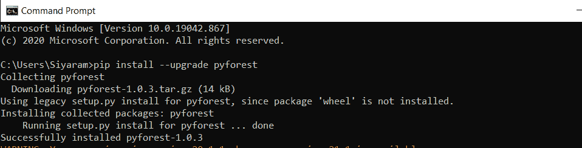
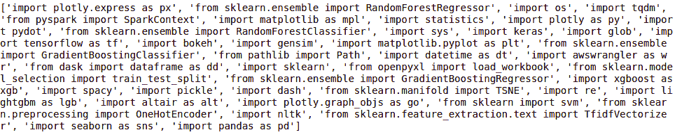
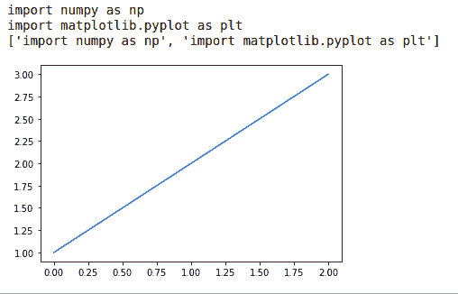

# Python 中的惰性导入

> 原文:[https://www.geeksforgeeks.org/lazy-import-in-python/](https://www.geeksforgeeks.org/lazy-import-in-python/)

在本文中，我们将学习如何在 Python 中进行 Lazy 导入。为此，我们先来了解一下懒导入。

## **什么是懒导入？**

这是 [**Pyforest 模块**](https://www.geeksforgeeks.org/python-pyforest-library/) 的一个特性，它允许用户执行任务，而无需向代码片段添加库，因为该功能的任务是将那些库本身添加到代码片段中。它是为那些厌倦了在程序中编写那些导入语句的用户设计的。对于需要编写长代码的开发人员来说，这非常有用，因为它为他们提供了优势。

## **为什么我们需要懒导入？**

作为一个 Python 用户，我们经常会面临每次在每个程序中导入多个模块的问题，比如 NumPy、pandas、sklearn、nltk、os、sys、pickle 以及许多其他模块，这实际上是令人讨厌和恼火的，因为我们正在做一些没有任何好处的工作，而是浪费时间，如果任何时候我们忘记导入程序中的任何模块，那么程序就会出错，我们不希望我们的程序仅仅因为模块而崩溃。

所以 Pyforest 针对这个问题做了一个解决方案，创建了一个内置函数，它包含了几乎 99%的 Python 流行模块的详细信息，它可以识别我们正在使用的导入，并自动为程序添加模块，这样我们就不需要一次又一次地这样做了。这样做更容易更快，因为我们可以使用预安装的模块，而无需将它们导入不同的程序，而且它也不会添加所有的模块，它会检查程序，并且只会添加使用过的模块，因此不存在这样的缺点，即我们不需要添加那些模块，一次又一次，我们的工作只需添加单个模块即可完成。

**示例:**

让我们写一些代码行，我们不导入所需的模块。这是我们简单而持续的习惯。

## 蟒蛇 3

```
# forget to import numpy

# using numpy
array = np.array([1, 2, 3])
print(array)
```

如果我们运行上面这段代码，我们将得到以下错误:


现在，我们得到了错误，因为模块没有被导入。以这种类似的方式，我们忘记了用大行代码导入所需的模块。为了导入，我们必须为代码中使用的每个模块编写导入语句。因此，在一行中，我们使用 pyforest 模块中的 lazy_import。

### **py forest 模块的安装**

为了开始安装过程，我们需要在我们的设备上安装 python，然后我们需要打开命令提示符，并在提示符中编写以下命令来安装“pyforest”模块，该模块为我们提供了 lazy_module()的功能。

```
Installation: 
pip install pyforest

Installation/Upgradation: 
pip install --upgrade pyforest
```



## 导入和惰性导入

要查看 pyforest 模块中的导入函数，我们可以打印 lazy_modules()函数:

## 蟒蛇 3

```
import pyforest

print(lazy_imports())
```

**输出:**



因此，我们可以在上面的输出中看到 pyforest 库中存在哪些模块，这些模块无需多次导入即可使用。

这只是一行，但如果我们必须导入大量模块，我们将不得不更多地专注于导入模块，而不是编写代码。所以这里 Pyforest 解决了这个问题。只需添加一个模块“import pyforest”，我们就可以开始了。

**例 1:**

## 蟒蛇 3

```
# forget to import numpy
# nut importing pyforest
import pyforest

# using numpy
array = np.array([1, 2, 3])
print(array)

print(active_imports())
```

**输出:**

```
[1 2 3]
import numpy as np
['import numpy as np']
```

**例 2:**

## 蟒蛇 3

```
# forget to import numpy, matplotlib
# but importing pyforest
import pyforest

# using numpy
array = np.array([1, 2, 3])

# using matplotlib.pyplot
plt.plot(array)

print(active_imports())
```

**输出:**



惰性导入是 Pyforest 库的一个非常有用的特性，因为这个特性会自动为我们导入库，如果我们不使用库，它就不会被添加。对于那些不想在代码中反复编写导入语句的人来说，这个特性非常有用。这个库的主要好处是它包含了大部分的库，我们可以在任何时候随意使用这个库，而不需要导入那个库，因为惰性导入特性会为我们做这件事。

### **lazy _ import()的优势:**

*   它解决了在代码片段中导入库的问题。
*   它会根据用法自动设置变量名，以避免库出现任何错误。
*   库只会在您使用时导入，不会添加额外的库来减少编译时间。
*   它包含近 99%的可用 Python 库，这使得它更容易使用，因为不需要额外的库。
*   它的实现很简单，其余的都是自动完成的