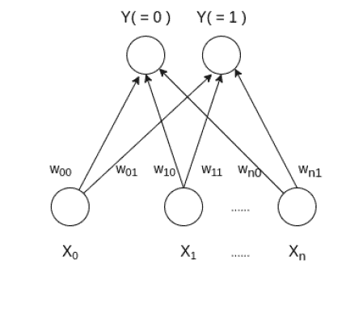

# 学习矢量量化

> 原文:[https://www.geeksforgeeks.org/learning-vector-quantization/](https://www.geeksforgeeks.org/learning-vector-quantization/)

**学习矢量量化(或 LVQ )** 是一种人工神经网络，其灵感也来自神经系统的生物模型。它基于原型监督学习分类算法，通过类似自组织映射的竞争学习算法训练网络。它还可以处理多类分类问题。LVQ 有两层，一层是输入层，另一层是输出层。下面给出了学习矢量量化的体系结构，该体系结构具有输入数据中的类别数和任意样本的 n 个输入特征:


### 学习矢量量化是如何工作的？

假设一个大小为(m，n)的输入数据，其中 m 是训练示例的数量，n 是每个示例中的特征数量和大小为(m，1)的标签向量。首先，它用不同的标签从第一个 c 数量的训练样本初始化大小(n，c)的权重，并且应该从所有训练样本中丢弃。这里，c 是类的数量。然后迭代剩余的输入数据，对于每个训练示例，它更新获胜向量(距离训练示例最短的权重向量(例如欧几里德距离))。权重上升规则由下式给出:

```py
wij = wij(old) - alpha(t) * (xik - wij(old))
```

其中α是在时间 t 的学习率，j 表示获胜向量，I 表示训练示例的第 i <sup>个</sup>特征，k 表示来自输入数据的第 k <sup>个</sup>训练示例。在训练 LVQ 网络之后，训练的权重被用于分类新的例子。一个标有获胜向量类的新例子。

### 算法

涉及的步骤有:

*   重量初始化
*   对于 1 到 N 个时代
*   选择一个培训示例
*   计算获胜向量
*   更新获胜向量
*   对所有训练示例重复步骤 3、4、5。
*   对测试样品进行分类

下面是实现。

```py
import math

class LVQ :

    # Function here computes the winning vector
    # by Euclidean distance
    def winner( self, weights, sample ) :

        D0 = 0
        D1 = 0

        for i  in range( len( sample ) ) :
            D0 = D0 + math.pow( ( sample[i] - weights[0][i] ), 2 )
            D1 = D1 + math.pow( ( sample[i] - weights[1][i] ), 2 )

            if D0 > D1 :
                return 0
            else : 
                return 1

    # Function here updates the winning vector     
    def update( self, weights, sample, J, alpha ) :
        for i in range(len(weights)) :
            weights[J][i] = weights[J][i] + alpha * ( sample[i] - weights[J][i] ) 

# Driver code
def main() :

    # Training Samples ( m, n ) with their class vector
    X =  [[ 0, 0, 1, 1 ],  [ 1, 0, 0, 0 ], 
          [ 0, 0, 0, 1 ], [ 0, 1, 1, 0 ],
          [ 1, 1, 0, 0 ], [ 1, 1, 1, 0 ],] 

    Y = [ 0, 1, 0, 1, 1, 1 ]
    m, n = len( X ), len( X[0] )

    # weight initialization ( n, c )
    weights = []
    weights.append( X.pop( 0 ) )
    weights.append( X.pop( 1 ) )

    # Samples used in weight initialization will
    # not use in training
    m = m - 2

    # training
    ob = LVQ()
    epochs = 3
    alpha = 0.1

    for i in range( epochs ) :
        for j in range( m ) :

            # Sample selection
            T = X[j]

            # Compute winner
            J = ob.winner( weights, T )

            # Update weights
            ob.update( weights, T, J, alpha )

    # classify new input sample
    T = [ 0, 0, 1, 0 ]
    J = ob.winner( weights, T )
    print( "Sample T belongs to class : ", J )
    print( "Trained weights : ", weights )

if __name__ == "__main__":
    main()
```

**Output:**

> 样本 T 属于类别:0
> 训练权重:[[0.3660931，0.3816541000000005，1，1]，[0.33661，0.34390000000000004，0，1]]