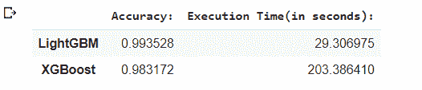
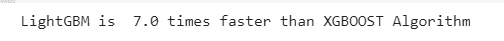

# LightGBM vs . xboost–哪种算法更好

> 原文:[https://www . geesforgeks . org/light GBM-vs-xboost-哪个算法更好/](https://www.geeksforgeeks.org/lightgbm-vs-xgboost-which-algorithm-is-better/)

有很多数据爱好者正在参加机器学习领域的一些在线竞争比赛。每个人都有自己独特的独立方法来确定最佳模型，并预测给定问题陈述的准确输出。在机器学习中，特征工程是这个过程不可或缺的一部分，也消耗了大部分时间。另一方面，建模成为一个重要的部分，在这里你不能有太多的预处理或对特征有一定的约束。有不同的集成方法，有助于建立强大的稳健模型，可以给出非常准确的预测。但是“合奏”这个词到底是什么意思呢？让我们详细了解术语“集合”的含义。

**合奏:**在直接进入技术定义之前，让我们举一个简单的现实例子来理解它。让我们假设你想买一个电子设备——手机。你的第一种方法是在互联网上搜索不同的最新智能手机，并比较不同公司的费率。您还将看到不同型号的功能。完成第一步后，你会询问你的朋友对你短名单中的手机的看法。以这种方式，你会接受几个人的意见和建议。一旦你得到了一些关于某款手机的正面评价，你就会去买那款手机。这就是术语“集合”的确切概念。集成方法是一种机器学习技术，其中几个基础模型(弱学习者)被组合以产生一个强大的模型。现在让我们更深入地了解助推法。

**增强:**增强是顺序集成技术之一。这种技术通常应用于具有高偏差和低方差的数据。这里我们有一个包含 n 条记录的数据集“D”。我们从数据集中随机抽取 5 条记录。这里所有记录被选择的概率相等。所以，通过随机抽样，我们选择了 1，3，5，7，25 条记录。我们在这个样本数据上训练一个模型(比如决策树)。之后，我们将 D 数据集的所有记录提供给这个模型进行分类。可能会有一些记录被错误分类，因为模型 1 是一个弱学习者。被错误分类的记录在下一次抽样选择中被赋予更多的权重。因此，这些错误分类的记录比数据集中的其他记录具有更高的选择概率。这里记录 2、8、1、16 被错误分类，记录 5 也有选择的概率，因此它被选择。现在我们再次训练模型 2，然后向第二个模型提供完整的数据。对 n 个模型重复这个过程。这些模型都是弱学习者。最后，这些模型被聚集，并且最终的 M*模型被建立，这是一个性能更好的模型，因为错误分类误差已经被最小化。下图简洁地展示了整个过程:


那么，了解了什么是 boosting 之后，让我们来讨论一下两种流行的 Boosting 算法之间的竞争，这两种算法是轻梯度 Boosting Machine 和极限梯度 Boosting(xboost)。这些算法在多个平台上举办的许多比赛和黑客马拉松中产生最佳结果。现在让我们深入了解算法，并对其进行比较研究。

## **光梯度增力机:**

LGBM 是一个快速、分布式、高性能的梯度提升框架，它基于一种流行的机器学习算法——决策树。它可以用于分类、回归和更多的机器学习任务。该算法逐叶生长，并选择最大增量值进行生长。LightGBM 使用基于直方图的算法。这样做的优点如下:

*   较少的内存使用
*   降低并行学习的通信成本
*   为决策树中的每个分割计算增益的成本降低。

因此，随着 LightGBM 的训练速度越来越快，有时也会导致过拟合的情况。因此，让我们看看可以调整哪些参数来获得更好的优化模型。

为了获得最佳拟合，必须调整以下参数:

1.  **num_leaves:** 由于 LightGBM 按叶生长，因此该值必须小于 2^(max_depth)，以避免过度拟合的情况。
2.  **min_data_in_leaf:** 对于大型数据集，其值应该设置为几百到几千。
3.  **max_depth:** 一个关键参数，其值应相应设置，以避免过拟合。

为了获得更好的精度，必须调整以下参数:

1.  向模型中添加更多的训练数据可以提高准确性。(也可以是外部看不见的数据)
2.  **叶片数:**增加其值将提高精度，因为分裂是按叶片方式进行的，但也可能出现过拟合。
3.  **max_bin:** 高值会对精度造成较大影响，但最终会走向过拟合。

## XGBOOST 算法:

一种非常流行的点播算法，通常被称为不同平台上各种比赛的获胜算法。XGBOOST 代表极端梯度增强。该算法是梯度增强算法的改进版本。基本算法是梯度增强决策树算法。其强大的预测能力和易于实施的方法使其在许多机器学习笔记本中广泛传播。该算法的一些要点如下:

1.  它不会建造完整的树形结构，而是贪婪地建造。
2.  与 LightGBM 相比，它是水平分割而不是分叶分割。
3.  在梯度增强中，负梯度被考虑来优化损失函数，但是这里泰勒展开被考虑。
4.  正则化项不利于构建复杂的树模型。

可以调整以提高性能的一些参数如下:

常规参数包括以下内容:

1.  **助推器:**有 2 个选项——*gbtree*和 *gblinear* 。
2.  **静默:**如果保持为 1，则在代码执行时不会显示运行消息。
3.  **nthread:** 主要用于并行处理。此处指定了核心数量。

助推器参数包括以下内容:

1.  **eta:** 通过每一步的权重收缩，使模型稳健。
2.  **最大 _ 深度:**应相应设置，避免过拟合。
3.  **最大叶节点:**如果定义了该参数，则模型将忽略*最大深度*。
4.  **γ:**指定进行分割所需的最小损失减少量。
5.  **λ:**权重上的 L2 正则项。

学习任务参数包括以下内容:

1) **目标:**这将定义要使用的损失函数。

*   **二进制:**逻辑回归–二进制分类的逻辑回归，返回预测概率(不是类别)
*   **multi:**softmax–使用 soft max 目标的多类别分类，返回预测类别(不是概率)

2) **种子:**为此设置的默认值为零。可用于参数调整。

因此，我们已经学习了算法的基础知识以及需要针对相应算法进行调整的参数。现在，我们将获取一个数据集，然后在准确性和执行时间的基础上比较两种算法。下面是我们将要使用的数据集描述:

**数据集描述:**

这些实验是在 19-48 岁年龄段的 30 名志愿者中进行的。每人腰部佩戴智能手机(三星 Galaxy S II)进行六项活动(步行、步行 _ 上楼、步行 _ 下楼、坐着、站着、躺着)。利用其嵌入式加速度计和陀螺仪，我们以 50Hz 的恒定速率捕获了 3 轴线性加速度和 3 轴角速度。这些实验已经被录像，以便人工标记数据。获得的数据集被随机分成两组，其中 70%的志愿者被选来生成训练数据，30%的志愿者被选来生成测试数据。

传感器信号(加速度计和陀螺仪)通过应用噪声滤波器进行预处理，然后在 2.56 秒的固定宽度滑动窗口和 50%的重叠(128 个读数/窗口)中进行采样。传感器加速度信号包含重力和身体运动分量，使用巴特沃斯低通滤波器将其分离为身体加速度和重力。假设重力只有低频分量，因此使用截止频率为 0.3 赫兹的滤波器。通过计算时域和频域的变量，从每个窗口获得特征向量。

**数据链接:**

**Python 代码实现:**

## 蟒蛇 3

```
# Importing the basic libraries
pip install pandas
import time
import pandas as pd
import numpy as np
import seaborn as sns
import matplotlib.pyplot as plt
%matplotlib inline
import gc

gc.enable()

# Importing LGBM and XGBOOST
import lightgbm as lgb
import xgboost as xgb

# Reading the Data and Inspecting it
data=pd.read_csv('/content/drive/MyDrive/GeeksforGeeks_Datasets/smartphone_activity_dataset.csv')
data
```

## 蟒蛇 3

```
# Checking for missing values across the 562 features of the dataset
data.isna().sum()*100/len(data)

# Checking for Target Distribution
sns.countplot(data['activity'])
plt.show()
```

## 蟒蛇 3

```
# Saving the target variable(dependent variable) to target 
# variable and dropping it from the original "data" dataframe
target=data['activity']
data.drop(columns={'activity'},inplace=True)

# As the dataset contains all numerical features and also 
# the target classes are also encoded there is no more preprocessing
# needed at this stage. There are no missing values in the 
# dataset hence no missing data imputation is being needed. 
# Let us split the dataset and move to the modeling part. 

# Splitting the Dataset into Training and Testing Dataset
from sklearn.model_selection import train_test_split
X_train,X_test,y_train,y_test=train_test_split(
  data,target,test_size=0.15,random_state=100)

# Applying the XGBOOST Model
# Setting Parameters required for XGBOOST Model 
# and Training the Model 

# Starting to track the Time
start = time.time()   
xg=xgb.XGBClassifier(max_depth=7,learning_rate=0.05,
                     silent=1,eta=1,objective='multi:softprob',
                     num_round=50,num_classes=6) 

# Setting the Parameters. More parameters can be set
# according to the requirement. 
# Here we have set the main parameters.

# Fitting the Model
xg.fit(X_train,y_train) 

# Stopping the tracking of time  
stop = time.time()    
exec_time_xgb=stop-start

# Measuring the time taken for the model to build 
exec_time_xgb              

# Predicting the Output Class
ypred_xgb=xg.predict(X_test) 
ypred_xgb

# Getting the Accuracy Score for the XGBOOST Model
from sklearn.metrics import accuracy_score
accuracy_xgb = accuracy_score(y_test,ypred_xgb)

# Setting the Parameters and Training data for LightGBM Model
data_train = lgb.Dataset(X_train,label = y_train)
params= {}

# Usually set between 0 to 1.
params['learning_rate']=0.5 

# GradientBoostingDecisionTree
params['boosting_type']='gbdt' 

# Multi-class since the target class has 6 classes.
params['objective']='multiclass' 

# Metric for multi-class
params['metric']='multi_logloss' 
params['max_depth']=7
params['num_class']=7 

# This value is not inclusive of the end value.
# Hence we have 6 classes the value is set to 7.

# Training the LightGBM Model
num_round =50
start = time.time()
lgbm = lgb.train(params,data_train,num_round)
stop = time.time()

#Execution time of the LightGBM Model
exec_time_lgbm = stop-start
exec_time_lgbm

# Predicting the output on the Test Dataset 
ypred_lgbm = lgbm.predict(X_test)
ypred_lgbm
y_pred_lgbm_class = [np.argmax(line) for line in ypred_lgbm]
```

## 蟒蛇 3

```
# Accuracy Score for the LightGBM Model
from sklearn.metrics import accuracy_score
accuracy_lgbm=accuracy_score(y_test,y_pred_lgbm_class)

# Comparing the Accuracy and Execution Time for both the Algorithms
comparison = {'Accuracy:':(accuracy_lgbm,accuracy_xgb),\
              'Execution Time(in seconds):':(exec_time_lgbm,exec_time_xgb)}
LGBM_XGB = pd.DataFrame(comparison)
LGBM_XGB .index = ['LightGBM','XGBoost']
LGBM_XGB

# On comparison we notice that LightGBM is 
# faster and gives better accuracy.
comp_ratio=(203.594708/29.443264)
comp_ratio
print("LightGBM is "+" "+str(np.ceil(comp_ratio))+" "+\
      str("times")+" "+"faster than XGBOOST Algorithm")
```

**最终输出:**

<center>
</center>