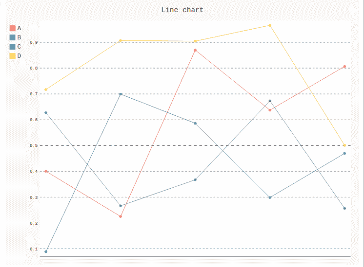
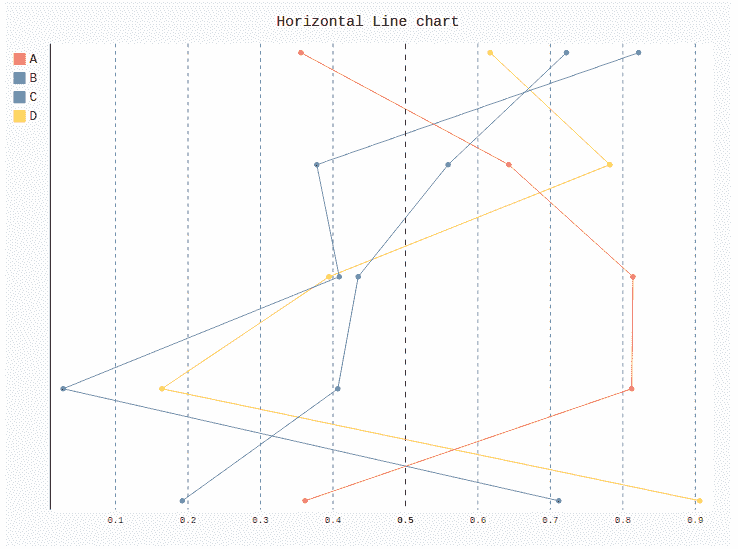

# Pygal 中的折线图

> 原文:[https://www.geeksforgeeks.org/line-chart-in-pygal/](https://www.geeksforgeeks.org/line-chart-in-pygal/)

**折线图**或**折线图**是一种图表类型，有助于将信息显示为一系列称为“标记”的所有数据点，这些标记通过线段直接连接。这是一种基本类型的图表，常见于许多显示图表升序或降序的领域。折线图通常用于可视化数据在时间间隔内的趋势，这有助于更有效地表示图表。数据中的尺寸通常显示在 x 轴和 y 轴上。

## 创建折线图

**1)简单折线图:**简单的基本折线图用于以垂直形式显示两个变量之间的关系。Line()方法用于在 Pygal 中创建简单的折线图。

**语法:**

```py
line_chart = pygal.Line()
```

**示例:**

```py
# importing pygal
import pygal
import numpy

# creating line chart object
line_chart = pygal.Line()

# naming the title
line_chart.title = 'Line chart'

# adding lines
line_chart.add('A', numpy.random.rand(5))
line_chart.add('B', numpy.random.rand(5))
line_chart.add('C', numpy.random.rand(5))
line_chart.add('D', numpy.random.rand(5))

line_chart
```

**输出:**



**2)水平折线图:**水平折线图与基本折线图相同，但不同之处在于它从 x 轴到 y 轴水平显示线条。两个变量都水平显示。

**语法:**

```py
line_chart = pygal.HorizontalLine()
```

**示例:**

```py
# importing pygal
import pygal
import numpy

# creating line chart object
line_chart = pygal.HorizontalLine()

# naming the title
line_chart.title = 'Horizontal Line chart'

# adding lines
line_chart.add('A', numpy.random.rand(5))
line_chart.add('B', numpy.random.rand(5))
line_chart.add('C', numpy.random.rand(5))
line_chart.add('D', numpy.random.rand(5))

line_chart
```

**输出:**

