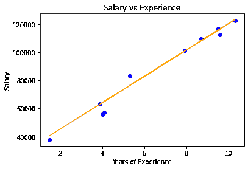

# 使用 Python 从头开始实现线性回归

> 原文:[https://www . geesforgeks . org/线性回归-实现-从头开始-使用-python/](https://www.geeksforgeeks.org/linear-regression-implementation-from-scratch-using-python/)

线性回归是一种监督学习算法，它既是一种统计学习算法，也是一种机器学习算法。用于根据给定的输入值 x 预测实值输出 y，描述因变量 y 与自变量 x <sub>i</sub> 之间的关系(或特征)。用于预测的假设函数用 h( x)表示。

```py
  h( x ) = w * x + b  

  here, b is the bias.
  x represents the feature vector
  w represents the weight vector.

```

单变量线性回归也称为单变量线性回归。初始化权重向量后，可以通过普通最小二乘法或梯度下降学习找到最适合模型的权重向量。

**数学直觉:**成本函数(或损失函数)用于衡量机器学习模型的性能，或者量化期望值和我们假设函数预测的值之间的误差。线性回归的成本函数用 j 表示

<center></center>

```py
Here, m is the total number of training examples in the dataset.
y(i) represents the value of target variable for ith training example.

```

所以，我们的目标是最小化成本函数 ***J** (* 或提高我们的机器学习模型的性能)。为此，我们必须找到 ***J*** 最小的权重。一种可以用来最小化任何可微函数的算法是梯度下降。它是一种一阶迭代优化算法，将我们带到函数的最小值。

#### 梯度下降:

伪代码:

1.  从一些 w 开始
2.  不断改变 w 来减少 J( w)，直到我们有希望达到最小值。

算法:

```py
repeat until convergence  {
       tmpi = wi - alpha * dwi 
       wi = tmpi              
}
where alpha is the learning rate.

```

#### 实施:

本实现使用的数据集可以从[链接](https://github.com/mohit-baliyan/References)下载。

它有两栏—“T0”年经验“T2】工资”一个公司 30 个员工。所以在这里，我们将训练一个线性回归模型来学习每个员工的经验年限和他们各自的工资之间的相关性。一旦模型经过训练，我们就能够根据员工多年的经验来预测他的工资。

## 蟒蛇 3

```py
# Importing libraries

import numpy as np

import pandas as pd

from sklearn.model_selection import train_test_split

import matplotlib.pyplot as plt

# Linear Regression

class LinearRegression() :

    def __init__( self, learning_rate, iterations ) :

        self.learning_rate = learning_rate

        self.iterations = iterations

    # Function for model training

    def fit( self, X, Y ) :

        # no_of_training_examples, no_of_features

        self.m, self.n = X.shape

        # weight initialization

        self.W = np.zeros( self.n )

        self.b = 0

        self.X = X

        self.Y = Y

        # gradient descent learning

        for i in range( self.iterations ) :

            self.update_weights()

        return self

    # Helper function to update weights in gradient descent

    def update_weights( self ) :

        Y_pred = self.predict( self.X )

        # calculate gradients  

        dW = - ( 2 * ( self.X.T ).dot( self.Y - Y_pred )  ) / self.m

        db = - 2 * np.sum( self.Y - Y_pred ) / self.m 

        # update weights

        self.W = self.W - self.learning_rate * dW

        self.b = self.b - self.learning_rate * db

        return self

    # Hypothetical function  h( x ) 

    def predict( self, X ) :

        return X.dot( self.W ) + self.b

# driver code

def main() :

    # Importing dataset

    df = pd.read_csv( "salary_data.csv" )

    X = df.iloc[:,:-1].values

    Y = df.iloc[:,1].values

    # Splitting dataset into train and test set

    X_train, X_test, Y_train, Y_test = train_test_split( 
      X, Y, test_size = 1/3, random_state = 0 )

    # Model training

    model = LinearRegression( iterations = 1000, learning_rate = 0.01 )

    model.fit( X_train, Y_train )

    # Prediction on test set

    Y_pred = model.predict( X_test )

    print( "Predicted values ", np.round( Y_pred[:3], 2 ) ) 

    print( "Real values      ", Y_test[:3] )

    print( "Trained W        ", round( model.W[0], 2 ) )

    print( "Trained b        ", round( model.b, 2 ) )

    # Visualization on test set 

    plt.scatter( X_test, Y_test, color = 'blue' )

    plt.plot( X_test, Y_pred, color = 'orange' )

    plt.title( 'Salary vs Experience' )

    plt.xlabel( 'Years of Experience' )

    plt.ylabel( 'Salary' )

    plt.show()

if __name__ == "__main__" : 

    main()
```

#### 输出:

```py
Predicted values  [ 40594.69 123305.18  65031.88]
Real values       [ 37731 122391  57081]
Trained W         9398.92
Trained b         26496.31

```

<center>

线性回归可视化

</center>