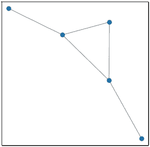
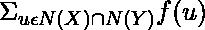
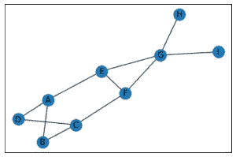

# 链路预测–使用网络预测网络中的边缘

> 原文:[https://www . geesforgeks . org/link-predict-predict-edges-in-a-network-use-networkx/](https://www.geeksforgeeks.org/link-prediction-predict-edges-in-a-network-using-networkx/)

链路预测用于预测网络中未来可能的链路。链接预测是脸书推荐你可能认识的人的算法，亚马逊预测你可能会感兴趣的项目，佐马托推荐你可能会点的食物。

对于本文，我们将考虑如下构建的图表:

```
import networkx as nx
import matplotlib.pyplot as plt

G = nx.Graph()
G.add_edges_from([(1, 2), (1, 3), (1, 4), (3, 4), (4, 5)])

plt.figure(figsize =(10, 10))
nx.draw_networkx(G, with_labels = True)
```

**输出:**


为了成功预测网络中的边，可以采用以下方法:

*   **三元闭合***   **雅克卡系数***   **资源分配指数***   **Adamic Adar 指数***   **优先附件***   **社区共同邻居***   **Community Resource Allocation

    ## 三元闭合:

    如果两个顶点连接到相同的第三个顶点，它们共享一个连接的趋势是三元闭包。

    > **comm _ masseb(X，Y) =** |N(X)  N(Y)|，其中 N(X)是 X 的所有邻居的集合

    ```
    import networkx as nx

    G = nx.Graph()
    G.add_edges_from([(1, 2), (1, 3), (1, 4), (3, 4), (4, 5)])
    e = list(G.edges())

    def triadic(e):
      new_edges = []

      for i in e:
        a, b = i

        for j in e:
          x, y = j

          if i != j:
            if a == x and (b, y) not in e and (y, b) not in e:
              new_edges.append((b, y))
            if a == y and (b, x) not in e and (x, b) not in e:
              new_edges.append((b, x))
            if b == x and (a, y) not in e and (y, a) not in e:
              new_edges.append((a, y))
            if b == y and (a, x) not in e and (x, a) not in e:
              new_edges.append((a, x))

      return new_edges

    print("The possible new edges according to Triadic closure are :")
    print(triadic(e))
    ```

    **输出:**

    ```
    The possible new edges according to Triadic closure are :
    [(2, 3), (2, 4), (3, 2), (4, 2), (1, 5), (3, 5), (5, 1), (5, 3)]

    ```

    ## 雅克卡系数:

    它是通过邻居总数归一化的公共邻居数来计算的。它用于度量两个有限样本集之间的相似性，定义为交集的大小除以样本集并集的大小。

    ```
    Jaccard Coefficient(X, Y) = 
    ```

    ```
    import networkx as nx

    G = nx.Graph()
    G.add_edges_from([(1, 2), (1, 3), (1, 4), (3, 4), (4, 5)])

    print(list(nx.jaccard_coefficient(G))
    ```

    **输出:**

    > [(1, 5, 0.3333333333333333), (2, 3, 0.5), (2, 4, 0.3333333333333333), (2, 5, 0.0), (3, 5, 0.5)]

    Networkx 的`jaccard_coefficient`内置函数必然会返回一个 3 元组(u，v，p)的列表，其中 u，v 是下一个添加概率测度为 p (p 是节点 u 和 v 的 Jaccard 系数)的新边。

    ## 资源分配指数:

    在许多基于相似性的方法中，研究分配指数以较低的时间复杂度来预测复杂网络中的缺失链路。它被定义为一个节点可以通过其公共邻居发送给另一个节点的资源的一部分。

    ```
    Research Allocation Index(X, Y) = 
    ```

    ```
    import networkx as nx

    G = nx.Graph()
    G.add_edges_from([(1, 2), (1, 3), (1, 4), (3, 4), (4, 5)])

    print(list(nx.resource_allocation_index(G)))
    ```

    **输出:**

    > [(1, 5, 0.3333333333333333), (2, 3, 0.3333333333333333), (2, 4, 0.3333333333333333), (2, 5, 0), (3, 5, 0.3333333333333333)]

    networkx 包提供了`resource_allocation_index`的内置函数，它提供了一个 3 元组(u，v，p)的列表，其中 u，v 是新边，p 是新边 u，v 的资源分配索引。

    ## Adamic Adar 指数:

    这项措施是在 2003 年推出的，根据两个节点之间共享的链路数量来预测网络中缺失的链路。计算如下:

    ```
    Adamic Adar Index(X, Y) = 
    ```

    ```
    import networkx as nx

    G = nx.Graph()
    G.add_edges_from([(1, 2), (1, 3), (1, 4), (3, 4), (4, 5)])

    print(list(nx.adamic_adar_index(G)))
    ```

    **输出:**

    > [(1, 5, 0.9102392266268373), (2, 3, 0.9102392266268373), (2, 4, 0.9102392266268373), (2, 5, 0), (3, 5, 0.9102392266268373)]

    networkx 包提供了一个内置函数`adamic_adar_index`，它提供了一个 3 元组(u，v，p)的列表，其中 u，v 是新边，p 是新边 u，v 的 adamic adar 索引。

    ## 优先附件:

    优先连接意味着节点连接越多，接收新链接的可能性就越大(参考[这篇](https://www.geeksforgeeks.org/operations-on-graph-and-special-graphs-using-networkx-module-python/)文章参考基于优先连接概念形成的 Barabasi Albert 图)程度越高的节点得到的邻居就越多。

    ```
    Preferential Attachment(X, Y) = |N(X)|.|N(Y)|
    ```

    ```
    import networkx as nx

    G = nx.Graph()
    G.add_edges_from([(1, 2), (1, 3), (1, 4), (3, 4), (4, 5)])

    print(list(nx.preferential_attachment(G)))
    ```

    **输出:**

    ```
    [(1, 5, 3), (2, 3, 2), (2, 4, 3), (2, 5, 1), (3, 5, 2)]

    ```

    networkx 包提供了`preferential_attachment`的内置功能，它提供了一个 3 元组(u，v，p)的列表，其中 u，v 是新边，p 是新边 u，v 的优先附着分数。

    ## 社区共同邻居:

    同一社区内有邻居奖励的共同邻居数量。为了应用这一点，我们必须指定所有节点的社区。

    > **社区共同邻居(X，Y) =** |N(X)  N(Y)| + ，
    > 其中 f(u) = 1，如果 u 在一个社区；否则为 0。

    ```
    import networkx as nx
    import matplotlib.pyplot as plt

    G = nx.Graph()
    G.add_node('A', community = 0)
    G.add_node('B', community = 0)
    G.add_node('C', community = 0)
    G.add_node('D', community = 0)
    G.add_node('E', community = 1)
    G.add_node('F', community = 1)
    G.add_node('G', community = 1)
    G.add_node('H', community = 1)
    G.add_node('I', community = 1)

    G.add_edges_from([('A', 'B'), ('A', 'D'), ('A', 'E'), ('B', 'C'),
                      ('C', 'D'), ('C', 'F'), ('E', 'F'), ('E', 'G'), 
                                 ('F', 'G'), ('G', 'H'), ('G', 'I')])

    nx.draw_networkx(G)
    print(list(nx.cn_soundarajan_hopcroft(G)))
    ```

    **输出:**
    

    ```
    [('I', 'A', 0),
     ('I', 'C', 0),
     ('I', 'D', 0),
     ('I', 'E', 2),
     ('I', 'H', 2),
     ('I', 'F', 2),
     ('I', 'B', 0),
     ('A', 'H', 0),
     ('A', 'C', 4),
     ('A', 'G', 1),
     ('A', 'F', 1),
     ('C', 'H', 0),
     ('C', 'G', 1),
     ('C', 'E', 1),
     ('D', 'G', 0),
     ('D', 'E', 1),
     ('D', 'H', 0),
     ('D', 'F', 1),
     ('D', 'B', 4),
     ('G', 'B', 0),
     ('E', 'H', 2),
     ('E', 'B', 1),
     ('H', 'F', 2),
     ('H', 'B', 0),
     ('F', 'B', 1)]

    ```

    networkx 包提供了一个内置函数`cn_soundarajan_hopcroft`，它提供了一个 3 元组(u，v，p)的列表，其中 u，v 是新边，p 是新边 u，v 的分数。

    ## 社区资源分配:

    使用社区信息计算所有节点对的资源分配指数。

    ```
    Community Resource Allocation(X, Y) = 
    ```

    ```
    import networkx as nx

    G = nx.Graph()

    G.add_node('A', community = 0)
    G.add_node('B', community = 0)
    G.add_node('C', community = 0)
    G.add_node('D', community = 0)
    G.add_node('E', community = 1)
    G.add_node('F', community = 1)
    G.add_node('G', community = 1)
    G.add_node('H', community = 1)
    G.add_node('I', community = 1)

    G.add_edges_from([('A', 'B'), ('A', 'D'), ('A', 'E'), ('B', 'C'),
                      ('C', 'D'), ('C', 'F'), ('E', 'F'), ('E', 'G'), 
                                 ('F', 'G'), ('G', 'H'), ('G', 'I')])

    print(list(nx.ra_index_soundarajan_hopcroft(G)))
    ```

    **输出:**

    ```
    [('I', 'A', 0),
     ('I', 'C', 0),
     ('I', 'D', 0),
     ('I', 'E', 0.25),
     ('I', 'H', 0.25),
     ('I', 'F', 0.25),
     ('I', 'B', 0),
     ('A', 'H', 0),
     ('A', 'C', 1.0),
     ('A', 'G', 0),
     ('A', 'F', 0),
     ('C', 'H', 0),
     ('C', 'G', 0),
     ('C', 'E', 0),
     ('D', 'G', 0),
     ('D', 'E', 0),
     ('D', 'H', 0),
     ('D', 'F', 0),
     ('D', 'B', 0.6666666666666666),
     ('G', 'B', 0),
     ('E', 'H', 0.25),
     ('E', 'B', 0),
     ('H', 'F', 0.25),
     ('H', 'B', 0),
     ('F', 'B', 0)]

    ```

    networkx 包提供了一个内置函数`ra_index_soundarajan_hopcroft`，它提供了一个 3 元组(u，v，p)的列表，其中 u，v 是新边，p 是新边 u，v 的分数。**