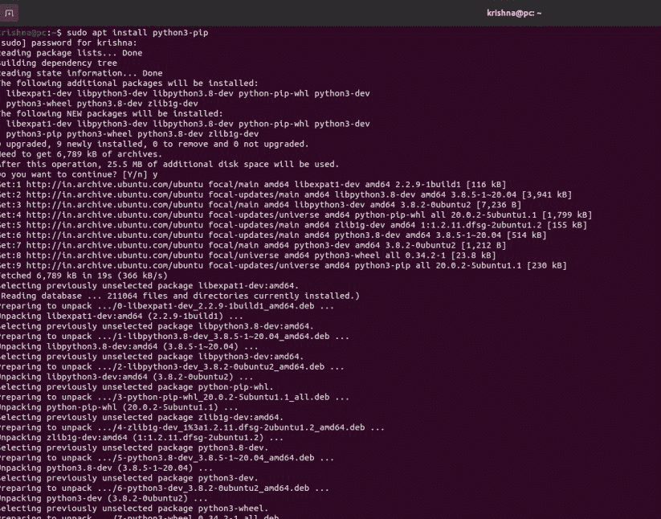
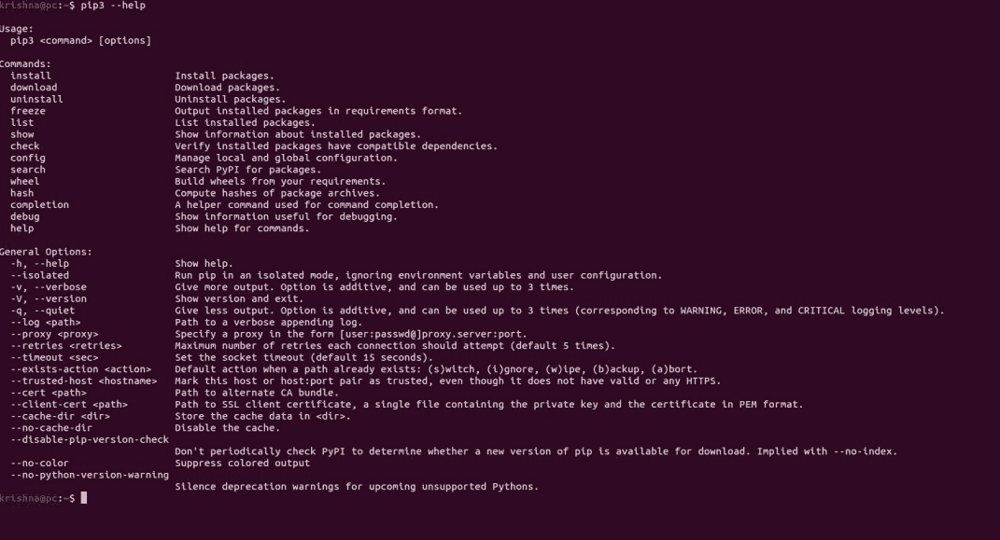
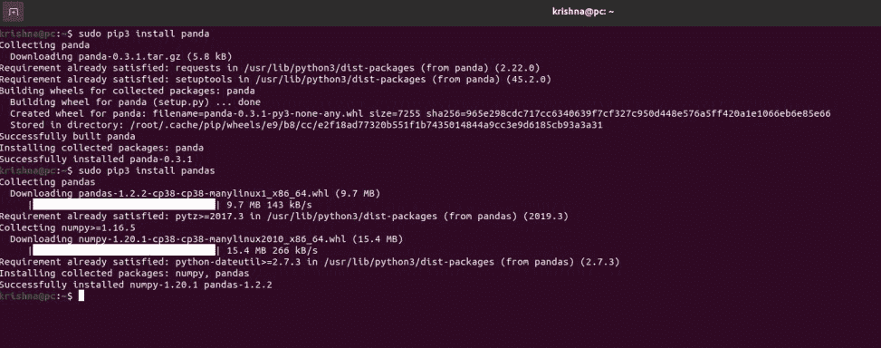
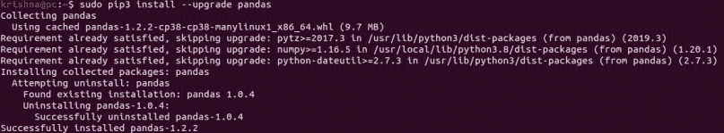
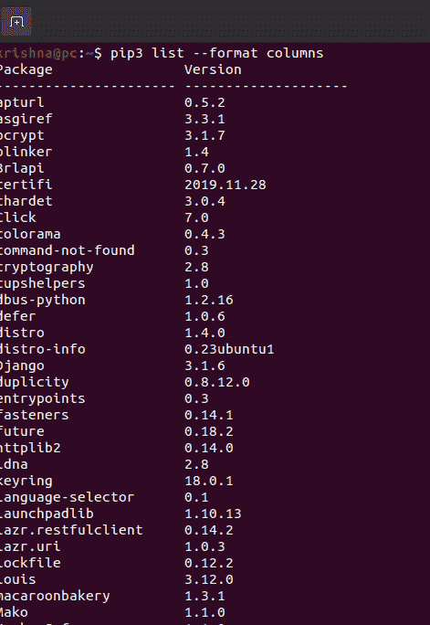

# Linux–安装 PIP 管理 Python 包

> 原文:[https://www . geesforgeks . org/Linux-installing-pip-to-manage-python-packages/](https://www.geeksforgeeks.org/linux-installing-pip-to-manage-python-packages/)

[Python](https://www.geeksforgeeks.org/python-language-introduction/) 是十年来最流行的语言，我们都知道 Python 拥有庞大的库支持，这些库被用于软件工程的不同领域。同时，在 Linux 和开发者社区中，PIP 也随着 python 而声名鹊起。PIP 是 python 的一个包管理器，用于处理使用 python 开发的软件包。PIP 帮助我们跟踪安装在您系统上的 python 包，当两个开源项目相遇时，即在 Linux 上安装和使用 [PIP 时，复杂性会增加。](https://www.geeksforgeeks.org/how-to-install-pip-in-linux/)

### 在 Linux 上安装画中画:

Linux 只是一个内核，现实中有很多发行版。基于所使用的包管理器，每个发行版都有自己的命令。以下是一些著名的发行版。

**德比安:**

对于 Python 2:

```py
$ sudo apt install python-pip python-setuptools
```

对于 Python 3:

```py
$ sudo apt install python3-pip
```

**Red Hat Linux:**

```py
$sudo yum install python-pip python-devel python-setuptools
```

**Arch Linux:**

```py
$ sudo pacman -S python-pip python3-setuptools
```

这些是大多数人使用的少数流行的 Linux 发行版，通过执行相应的命令，您的机器将在其上配备 pip 包管理器。



在 Linux 上安装画中画

### 从画中画中获得更多

PIP 就像是 python 的 appstore。使用这个强大的工具，你可以提高你作为 Python 程序员的使用率和能力。大多数库和框架，如 Pandas、Numpy、Django、Flask、Matplotlib，可以帮助您完成一些关键任务，如数据分析、数据可视化、构建响应性网站等，您可以通过将这些库导入到代码中来获得所有这些功能。所以 PIP 负责这些软件包。这些软件包的安装、更新、升级、降级可以在画中画的帮助下用一些简单的命令来处理。对于一个简短的概述，只需在您的终端中运行 **$ pip(版本号)–help**，这将显示一些简单的语法及其用法，如下所示。



这给出了命令的概述。

### 使用画中画管理软件包

现在，我们将看到一些简单的任务，如安装软件包，通过在您的终端上运行一些简单的命令来升级和卸载。

#### 安装软件包

安装最新版本:

```py
$ sudo pip install packageName.
```

安装特定版本:

```py
$ sudo pip install packageName==version number.
```

安装测试版:

```py
$ sudo pip install --pre packageName
```



使用画中画安装熊猫包

#### 升级软件包:

```py
$ sudo pip install --upgrade packageName
```



使用画中画升级软件包

#### 卸载软件包:

```py
$ sudo pip uninstall packageName
```


使用画中画卸载软件包

#### 列出一个包:

```py
$ pip list  --format columns
```



系统上安装的软件包列表。