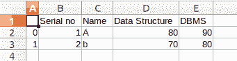
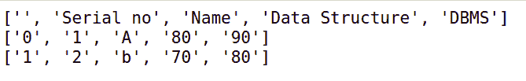
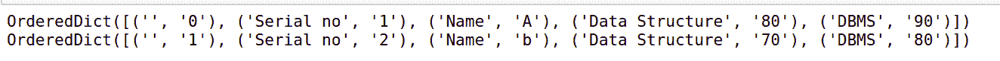

# 使用 Python 将 CSV 数据加载到列表和字典中

> 原文:[https://www . geesforgeks . org/load-CSV-data-to-list-and-dictionary-use-python/](https://www.geeksforgeeks.org/load-csv-data-into-list-and-dictionary-using-python/)

**先决条件:** [使用 Python 中的 csv 文件](http://geeksforgeeks.org/working-csv-files-python/)

**[CSV(逗号分隔值)](http://geeksforgeeks.org/working-csv-files-python/)** 是一种用于存储表格数据的简单文件格式，例如电子表格或数据库。CSV 文件以纯文本形式存储表格数据(数字和文本)。文件的每一行都是数据记录。每条记录由一个或多个字段组成，用逗号分隔。使用逗号作为字段分隔符是这种文件格式的名称来源。

CSV 原始数据是不可利用的，为了在我们的 Python 程序中使用它，如果我们能够读取和分隔逗号并将它们存储在数据结构中，它会更有好处。我们可以通过使用函数`csv.reader`和`csv.dictreader`或者直接手动
将数据转换成列表或字典或者两者的组合，在本文中，我们将借助代码看到它。

**示例 1:** 将 CSV 加载到列表中

**CSV 文件:**



```
# importing module 
import csv

# csv fileused id Geeks.csv
filename="Geeks.csv"

# opening the file using "with"
# statement
with open(filename,'r') as data:
   for line in csv.reader(data):
            print(line)

# then data is read line by line 
# using csv.reader the printed 
# result will be in a list format 
# which is easy to interpret
```

**输出:**



**示例 2:** 将 CSV 加载到字典

```
import csv

filename ="Geeks.csv"

# opening the file using "with" 
# statement
with open(filename, 'r') as data:

    for line in csv.DictReader(data):
        print(line)
```

**输出:**

