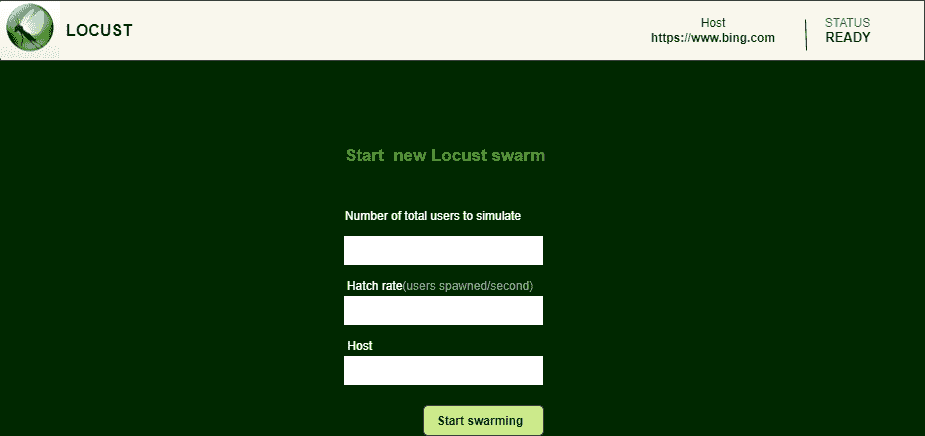

# 使用蝗虫

进行负载测试

> 原文:[https://www.geeksforgeeks.org/load-testing-using-locust/](https://www.geeksforgeeks.org/load-testing-using-locust/)

蝗虫是一个开源的负载测试工具。负载测试是一种软件测试，用于检查系统在特定预期负载下的容差/行为。蝗虫的目标是对网站进行负载测试，并检查系统可以处理的并发用户数量。
在蝗虫测试中，一群蝗虫会攻击目标即网站。每只蝗虫的行为都是可配置的，群集过程通过网络用户界面实时监控。

**蝗虫的特性:**

*   测试场景可以用 Python 编写
*   分布式和可扩展的
*   基于网络的用户界面
*   任何系统都可以使用这个工具进行测试

**安装:**

蝗虫可以安装 pip。

```py
pip install locust
```

一旦蝗虫成功安装，蝗虫命令应该可以在您的外壳中使用。
要查看更多可用选项:

```py
locust --help
```

**入门:**

```py
from locust import HttpLocust, TaskSet, task
from locust import ResponseError
import json

class UserBehavior(TaskSet):

    def __init__(self, parent):
        super(UserBehavior, self).__init__(parent)
        self.token = ""
        self.headers = {}

    def on_start(self):
        # The on_start method is called 
        # when a simulated user starts 
        # executing that TaskSet class
        self.token = self.login()
        self.headers = {'Authorization': 'Bearer {}'.format(self.token)}
        self.login()

    def login(self):
        # admin login  and retrieving it's access token
        response = self.client.post("/login/",
                                    data = {'username': 'admin',
                                          'password': 'ZYT5nsg3565!'})

        return json.loads(response._content)['access']

class WebsiteUser(HttpLocust):
    # The task_set attribute should point
    # to a TaskSet class which defines 
    # the behaviour of the user
    task_set = UserBehavior
    min_wait = 5000
    max_wait = 9000
```

**启动蝗虫:**
要运行上面的代码，创建一个名为`locustfile.py`的 Python 文件，并在上面创建的文件的目录中打开终端。然后在终端写下下面的命令。

```py
locust
```

**注意:**默认蝗虫搜索`locustfile.py`。

上述命令成功执行后，应打开浏览器，点击 **http://127.0.0.1:8089**

蝗虫用户界面将如下所示:

