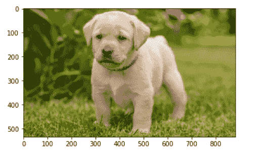

# 使用 Mahotas-Python 加载图像

> 原文:[https://www . geesforgeks . org/loading-image-use-maho tas-python/](https://www.geeksforgeeks.org/loading-image-using-mahotas-python/)

在本文中，我们将看到可以在 mahotas 中加载图像。 **Mahotas** 是一个针对 Python 的计算机视觉和图像处理与操作库。库是函数和方法的集合，允许您执行许多操作，而不必编写数百行代码。Mahotas 包括许多用数组操作的算法，mahotas 目前有 100 多个图像处理和计算机视觉功能，并且在不断增长。
为了做到这一点，我们将使用 mahotas.imread 方法

> **语法:**maho tas . imread(image _ name)
> **参数:**它以字符串作为参数，这是 image name
> **返回:**它返回 numpy.ndarray 对象

**例 1:**

## 蟒蛇 3

```
# importing required libraries
import numpy as np
import mahotas
from pylab import imshow, show

# loading image
img = mahotas.imread('dog_image.png')

# showing the original image
imshow(img)
show()
```

**输出:**



**例 2:**

## 蟒蛇 3

```
# importing required libraries
import numpy as np
import mahotas
from pylab import imshow, show

# loading image
img = mahotas.imread('wally.png')

# showing the image
imshow(img)
show()
```

**输出:**

