# 记录赔率

> 原文:[https://www.geeksforgeeks.org/log-odds/](https://www.geeksforgeeks.org/log-odds/)

**几率(成功几率):**定义为成功几率除以失败几率。比方说，有 90%的概率赢得赌注意味着*“赔率对我们有利”*，因为赢的赔率是 90%，而输的赔率只有 10%。它也以比率的形式被称为优势比。所以上面讨论的例子的奇数比率是:

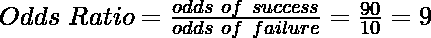

形式上，事件 A 的赔率定义为 A 发生的概率对 A 不发生的概率(即 A 的补数)。(如下式所示)

**赔率，不等于概率**

需要注意的是，事件发生的几率与其发生的概率不同。假设我的篮球队赢得锦标赛的概率是 1 比 5。

我的队伍获胜的概率= 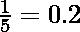但是，
我的队伍获胜的概率= 

然而，在数学上，两者的最终结果是一样的，因为在概率的情况下，分母被抵消了。(如下图所示)

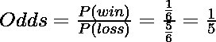

**赔率问题**

赔率的问题是由于赢的几率和输的几率之间存在不对称。让我们借助一个例子来试着理解这一点。72 个国家参加英联邦运动会。

考虑到每个国家都有相同的获胜机会，印度队赢得金牌的概率是相反的，1 比 71 或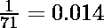
但是假设一个理想主义的场景，印度队赢得金牌的概率是有利的，71 比 1 或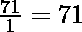

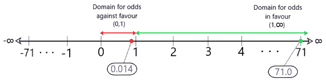

**图 1:有利对不利的领域**

如图 1 所示，当赔率对我们不利时，该值总是位于 0 和 1 之间，这是一个非常小的值。然而，如果赔率对我们有利，这个值可以在 1 到无穷大之间，这可能是一个非常大的值！为了解决这个问题，对数赔率的概念应运而生。

**对数赔率**:是赔率的对数。(如下式所示)

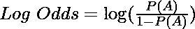

根据上述例子，

印度队赢得一枚金牌的赔率是 1 比 71 = 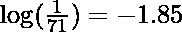

印度队赢得金牌的概率为 71 比 1 = 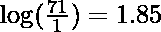

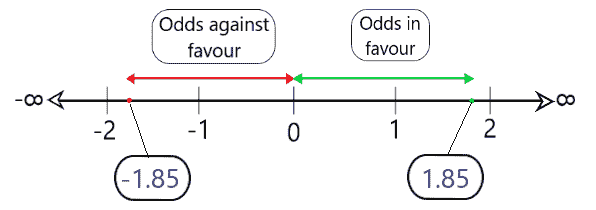

**图 2:对数赔率**

如图 2 所示，采用比值比的对数会使结果具有一定的对称性，从而更容易在各种统计中进行解释和使用。

> **有趣的注意:**当绘制在柱状图上时，某一事件的对数赔率给出了**正态分布**！这就是对数赔率如此有用的原因。

**真实例子**

对数赔率在医学研究中用于根据受试者以前的症状预测其可能出现的症状。考虑下面的例子。对 1000 名随机出现发热和咳嗽/感冒症状的受试者进行了医学研究。目的是找出咳嗽/感冒的人更有可能发烧或不发烧的可能性。(数据如下图 3 所示。)

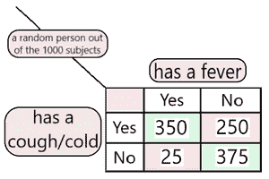

**图 3:样本研究数据**

**解决方案:**

一个人可能/感冒，也发烧的几率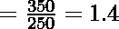

一个没有感冒的人也发烧的几率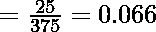

∴客观赔率

和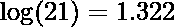，为可以从研究中获得的各种结果提供对称性。

这表明咳嗽/感冒的人也发烧的可能性**是不咳嗽/感冒的人的**的 21 倍。对数优势或优势比非常类似于 R 平方检验，因为它说明了两个因素之间的关系。所以，可以说，赔率值越高，这两个因素往往越相关。这就是对数优势比的力量。