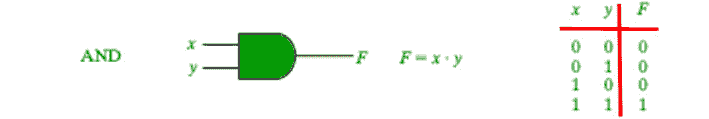
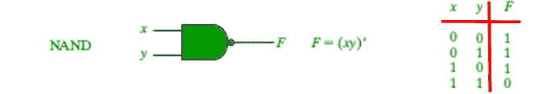
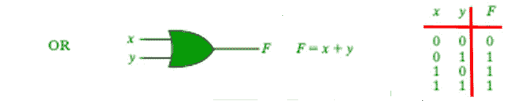
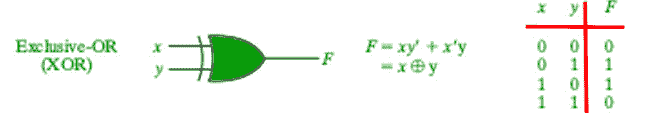
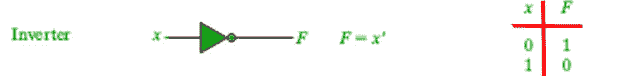
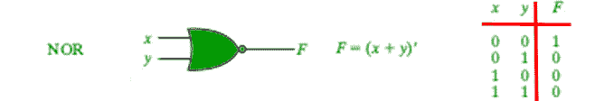
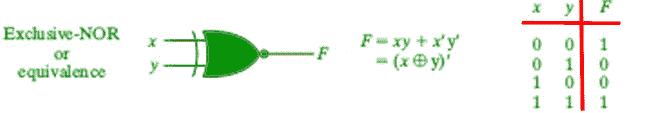

# Python 中的逻辑门

> 原文:[https://www.geeksforgeeks.org/logic-gates-in-python/](https://www.geeksforgeeks.org/logic-gates-in-python/)

逻辑门是任何数字电路的基本构件。它接受一两个输入，并根据这些输入产生输出。输出可以是高电平(1)或低电平(0)。逻辑门是用二极管或晶体管实现的。它也可以用真空管、光学、分子等电磁元件来构建。在计算机中，大多数电子电路是由逻辑门组成的。逻辑门用于执行计算、数据存储或展示面向对象编程(尤其是继承能力)的电路。

定义的基本逻辑门有七种:与门、或门、非门、与非门、或非门、异或门、或非门。

**1。“与”门**
如果两个输入都是 1，“与”门给出的输出为 1，否则为 0。



## 蟒蛇 3

```py
# Python3 program to illustrate
# working of AND gate

def AND (a, b):

    if a == 1 and b == 1:
        return True
    else:
        return False

# Driver code
if __name__=='__main__':
    print(AND(1, 1))

    print("+---------------+----------------+")
    print(" | AND Truth Table | Result |")
    print(" A = False, B = False | A AND B =",AND(False,False)," | ")
    print(" A = False, B = True | A AND B =",AND(False,True)," | ")
    print(" A = True, B = False | A AND B =",AND(True,False)," | ")
    print(" A = True, B = True | A AND B =",AND(True,True)," | ")
```

**输出:**

```py
True
+---------------+----------------
 | AND Truth Table |    Result |
 A = False, B = False | A AND B = False  | 
 A = False, B = True  | A AND B = False  | 
 A = True, B = False  | A AND B = False  | 
 A = True, B = True   | A AND B = True   | 
```

**2。与非门**
与非门(否定的“与”)给出 0 的输出，如果两个输入都是 1，则给出 1。



## 蟒蛇 3

```py
# Python3 program to illustrate
# working of NAND gate

def NAND (a, b):
    if a == 1 and b == 1:
        return False
    else:
        return True

# Driver code
if __name__=='__main__':
    print(NAND(1, 0))

    print("+---------------+----------------+")
    print(" | NAND Truth Table | Result |")
    print(" A = False, B = False | A AND B =",NAND(False,False)," | ")
    print(" A = False, B = True | A AND B =",NAND(False,True)," | ")
    print(" A = True, B = False | A AND B =",NAND(True,False)," | ")
    print(" A = True, B = True | A AND B =",NAND(True,True)," | ")
```

**输出:**

```py
True
+---------------+----------------
 | NAND Truth Table |    Result |
 A = False, B = False | A AND B = True  | 
 A = False, B = True  | A AND B = True  | 
 A = True, B = False  | A AND B = True  | 
 A = True, B = True   | A AND B = False | 
```

**3。“或”门**
如果两个输入中的任何一个为 1，则“或”门输出为 1，否则输出为 0。



## 蟒蛇 3

```py
# Python3 program to illustrate
# working of OR gate

def OR(a, b):
    if a == 1 or b ==1:
        return True
    else:
        return False

# Driver code
if __name__=='__main__':
    print(OR(0, 0))

    print("+---------------+----------------+")
    print(" | OR Truth Table | Result |")
    print(" A = False, B = False | A OR B =",OR(False,False)," | ")
    print(" A = False, B = True | A OR B =",OR(False,True)," | ")
    print(" A = True, B = False | A OR B =",OR(True,False)," | ")
    print(" A = True, B = True | A OR B =",OR(True,True)," | ")
```

**输出:**

```py
False
+---------------+----------------+
 | OR Truth Table |    Result |
 A = False, B = False | A OR B = False  | 
 A = False, B = True  | A OR B = True   | 
 A = True, B = False  | A OR B = True   | 
 A = True, B = True   | A OR B = True   | 
```

**4。异或门**
异或门的输出为 1，如果两个输入不同，则为 0。



## 蟒蛇 3

```py
# Python3 program to illustrate
# working of Xor gate

def XOR (a, b):
    if a != b:
        return 1
    else:
        return 0

# Driver code
if __name__=='__main__':
    print(XOR(5, 5))

    print("+---------------+----------------+")
    print(" | XOR Truth Table | Result |")
    print(" A = False, B = False | A XOR B =",XOR(False,False)," | ")
    print(" A = False, B = True | A XOR B =",XOR(False,True)," | ")
    print(" A = True, B = False | A XOR B =",XOR(True,False)," | ")
    print(" A = True, B = True | A XOR B =",XOR(True,True)," | ")
```

**输出:**

```py
0
+---------------+----------------+
 | XOR Truth Table | Result |
 A = False, B = False | A XOR B = 0  | 
 A = False, B = True  | A XOR B = 1  | 
 A = True, B = False  | A XOR B = 1  | 
 A = True, B = True   | A XOR B = 0  | 
```

**5。**非门
它充当逆变器。它只需要一个输入。如果输入为 1，它会将结果反转为 0，反之亦然。



## 蟒蛇 3

```py
# Python3 program to illustrate
# working of Not gate

def NOT(a):
    return not a
# Driver code
if __name__=='__main__':
    print(NOT(0))

    print("+---------------+----------------+")
    print(" | NOT Truth Table | Result |")
    print(" A = False | A NOT =",NOT(False)," | ")
    print(" A = True, | A NOT =",NOT(True)," | ")

```

**输出:**

```py
1
+---------------+----------------+
 | NOT Truth Table | Result |
 A = False | A NOT = 1  | 
 A = True, | A NOT = 0  | 
```

**6。或非门**
如果两个输入都为 0，或非门(求反或)给出 1 的输出，否则给出 1。



## 蟒蛇 3

```py
# Python3 program to illustrate
# working of NOR gate

def NOR(a, b):
    if(a == 0) and (b == 0):
        return 1
    elif(a == 0) and (b == 1):
        return 0
    elif(a == 1) and (b == 0):
        return 0
    elif(a == 1) and (b == 1):
        return 0

# Driver code
if __name__=='__main__':
    print(NOR(0, 0))

    print("+---------------+----------------+")
    print(" | NOR Truth Table | Result |")
    print(" A = False, B = False | A NOR B =",NOR(False,False)," | ")
    print(" A = False, B = True | A NOR B =",NOR(False,True)," | ")
    print(" A = True, B = False | A NOR B =",NOR(True,False)," | ")
    print(" A = True, B = True | A NOR B =",NOR(True,True)," | ")
```

**输出:**

```py
1
+---------------+----------------+
 | NOR Truth Table |   Result |
 A = False, B = False | A NOR B = 1  | 
 A = False, B = True  | A NOR B = 0  | 
 A = True, B = False  | A NOR B = 0  | 
 A = True, B = True   | A NOR B = 0  | 
```

**7。XNOR 门**
XNOR 门(求反异或)给出 1 的输出，如果两个输入相同，则为 0。



## 蟒蛇 3

```py
# Python3 program to illustrate
# working of Not gate

def XNOR(a,b):
    if(a == b):
        return 1
    else:
        return 0
# Driver code
if __name__=='__main__':
    print(XNOR(1,1))

    print("+---------------+----------------+")
    print(" | XNOR Truth Table | Result |")
    print(" A = False, B = False | A XNOR B =",XNOR(False,False)," | ")
    print(" A = False, B = True | A XNOR B =",XNOR(False,True)," | ")
    print(" A = True, B = False | A XNOR B =",XNOR(True,False)," | ")
    print(" A = True, B = True | A XNOR B =",XNOR(True,True)," | ")
```

**输出:**

```py
1
+---------------+----------------+
 | XNOR Truth Table |  Result |
 A = False, B = False | A XNOR B = 1  | 
 A = False, B = True  | A XNOR B = 0  | 
 A = True, B = False  | A XNOR B = 0  | 
 A = True, B = True   | A XNOR B = 1  | 
```