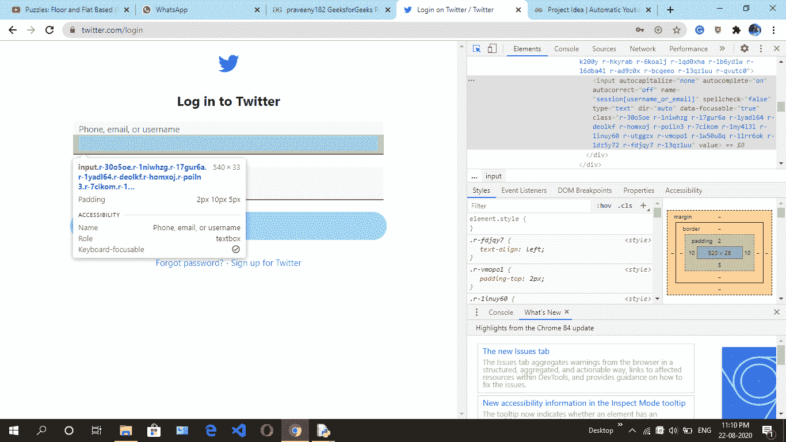
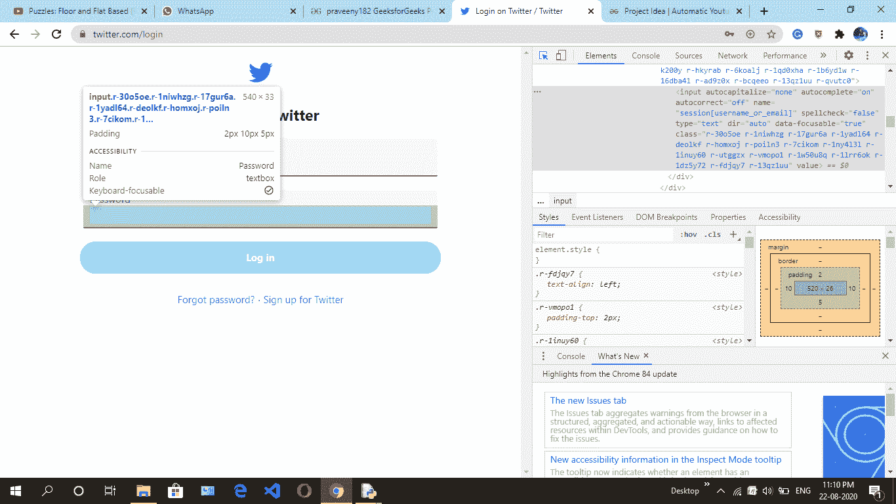

# 使用 Python Selenium 登录 Twitter】

> 原文:[https://www . geesforgeks . org/log in-Twitter-using-python-selenium/](https://www.geeksforgeeks.org/login-twitter-using-python-selenium/)

**项目描述:-** 在这里，我们将学习一个简单的如何通过 selenium 登录 twitter 的方法。Selenium 是一个免费工具，可以在不同的浏览器上自动试用。

**<u>要求:</u>**

*   **硒**–[硒蟒介绍及安装](https://www.geeksforgeeks.org/selenium-python-introduction-and-installation/)

**<u>下面是步骤:</u>**

*   首先，使用这个 [***<u>链接</u>***](https://twitter.com/login) 去推特网站。
*   然后通过紧急 ctrl + shift + i 或进入浏览器设置并手动点击调查细节来点击调查元素。
*   Then navigate box where **Phone, email, or username** are filled then copy the x_path.

    

*   Then navigate the **Password** then copy the x_path.

    

*   然后导航登录按钮，然后复制 x_path。
    

**<u>下面是实现:</u>**

您可以替换用户名和密码，以便帐户成功登录。这里的代码仅供演示。

```py
from selenium import webdriver
from selenium.webdriver.common.keys import Keys
import time

# create instance of Chrome webdriver
driver = webdriver.Chrome() 
driver.get("https://twitter.com/login")

# find the element where we have to 
# enter the xpath
# fill the number or mail
driver.find_element_by_xpath('//*[@id ="react-root"]/div/div/div[2]/main/div/div/div[1]/form/div/div[1]/label/div/div[2]/div/input').send_keys('XXXXXX0418')

# find the element where we have to 
# enter the xpath
# fill the password
driver.find_element_by_xpath('//*[@id ="react-root"]/div/div/div[2]/main/div/div/div[1]/form/div/div[2]/label/div/div[2]/div/input').send_keys('PrXXXXXXXXX9')

# find the element log in 
# request using xpath 
# clicking on that element 
driver.find_element_by_xpath('//*[@id ="react-root"]/div/div/div[2]/main/div/div/div[1]/form/div/div[3]/div/div').click()
```

**输出–**
你将在浏览器硒已自动打开的情况下登录推特。