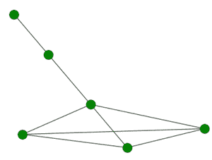
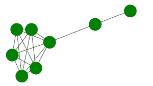
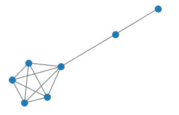

# 使用 Networkx 模块的 Python 棒棒糖图

> 原文:[https://www . geesforgeks . org/棒棒糖-python 中的 graph-use-networkx-module/](https://www.geeksforgeeks.org/lollipop-graph-in-python-using-networkx-module/)

棒棒糖图由两部分组成一个完整的称为团的图和一个路径图。更准确地说，L <sub>(m，n)</sub> 是具有 m 节点完全图和 n 节点路径图的图。

**L <sub>(4，2)</sub>****【lol lipo 图形:**



L <sub>(4，2)</sub> 图

**下面我们来看看这个图的属性:**

<figure class="table">

| 

So.no

 | 

**棒棒糖图的属性:**

 |
| --- | --- |
| one | 它是一个由两个成分团和路径图组成的连通图。 |
| Two | 顶点数为 m + n。 |
| three | 边数=完全图的边数+路径图的边数。 |
| four | 边数=m(m-1)/2 + n。 |
| five | 棒棒糖图的直径= n+1。 |
| six

 | 它是一个循环图，因为循环包含在棒棒糖图的团中。 |
| seven | 它就像一个没有杠铃的杠铃图。 |
| eight | 对于完整的图，节点被标记为从 0 到 m-1。 |
| nine | 路径图的 m 到 m+n-1。 |
| Ten | 完全图和路径图通过一条边(m–1，m)连接。 |

</figure>

我们将使用**网络**模块来实现棒棒糖图。它带有一个内置函数 networkx .棒棒糖 _graph()，可以使用 networkx.draw()方法进行说明。Python 中的这个模块用于可视化和分析不同类型的图形。

> **语法:** networkx .棒棒糖 _graph(m，n)
> 
> **参数:**
> 
> *   m:完全图(团)中的节点数
> *   n:路径图中的节点数。
> 
> **networkx.draw(G，node_size，node_color)**
> 
> *   **用于通过传递图形对象来实现图形。**
> *   g:指的是图图对象
> *   node_size:指节点的大小。
> *   node_color:指节点的颜色。

**示例 1:创建一个简单的棒棒糖图**

**进场:**

*   我们将导入所需的模块网络
*   然后我们将使用 networkx .棒棒糖 _graph(m，n)创建一个 graph 对象。
*   为了实现图形，我们将使用 networkx.draw(G，node_color='green ')
*   有三个参数，第一个是图形对象，另外两个用于设置节点的颜色和大小。

**代码:**

## 蟒蛇 3

```
# import required module
import networkx

# create object
G = networkx.lollipop_graph(4, 2)

# illustrate graph
networkx.draw(G, node_color='green')
```

**输出:**


**示例 2:更改** **节点的大小。**

**进场:**

*   我们将导入所需的模块网络。
*   然后我们将使用 networkx .棒棒糖 _graph(m，n)创建一个 graph 对象。
*   为了实现图形，我们将使用 networkx.draw(G，node_color='green '，node_size=1500)
*   请注意，这里我们在 draw 函数中传递了一个额外的参数，即 node_size。
*   这个额外的参数决定了节点的相对大小。

**代码:**

## 蟒蛇 3

```
# import required module
import networkx

# create object
G = networkx.lollipop_graph(6, 2)

# illustrate graph
networkx.draw(G, node_color='green',
              node_size=1500)
```

**输出:**



**示例 3:不使用棒棒糖 _graph()函数创建棒棒糖图。**

**进场:**

*   我们将把所需的模块 networkx 导入为 nx。
*   然后我们将手动定义棒棒糖 _graph 函数。
*   我们将首先使用 complete_graph 函数创建完整的图形。
*   然后我们将从 m 到 m+n-1 编号的 n 个节点，这些节点将来自棒棒糖的直的部分
*   然后我们将相邻的节点连接起来，完成棒棒糖的路径图部分。
*   最后，我们将连接这两个不相交的部分，以获得最终结果。
*   请注意，两个 if 条件用于检查是需要添加任一部分中的节点数，还是保持该部分为空。

**代码:**

## 蟒蛇 3

```
# importing networkx
import networkx as nx

def lollipop_graph(m, n):

    # the complete graph part.
    G = nx.complete_graph(m)

    # adding path graph edges.
    G.add_nodes_from([v for v in range(m, m+n)])
    if n > 1:

        # joining adjacent path graph edges.
        G.add_edges_from([(v, v+1) for v in range(m, m + n - 1)])

    # connect complete graph to path graph
    if m > 0:
        G.add_edge(m - 1, m)
    return G

# invoking the function defined.
G = lollipop_graph(5, 2)
nx.draw(G)
```

**输出:**

