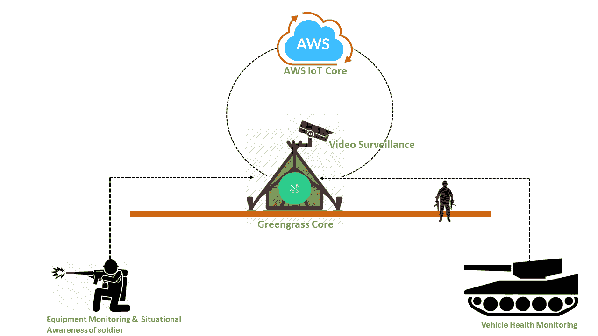
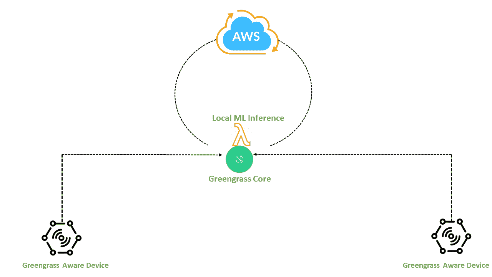
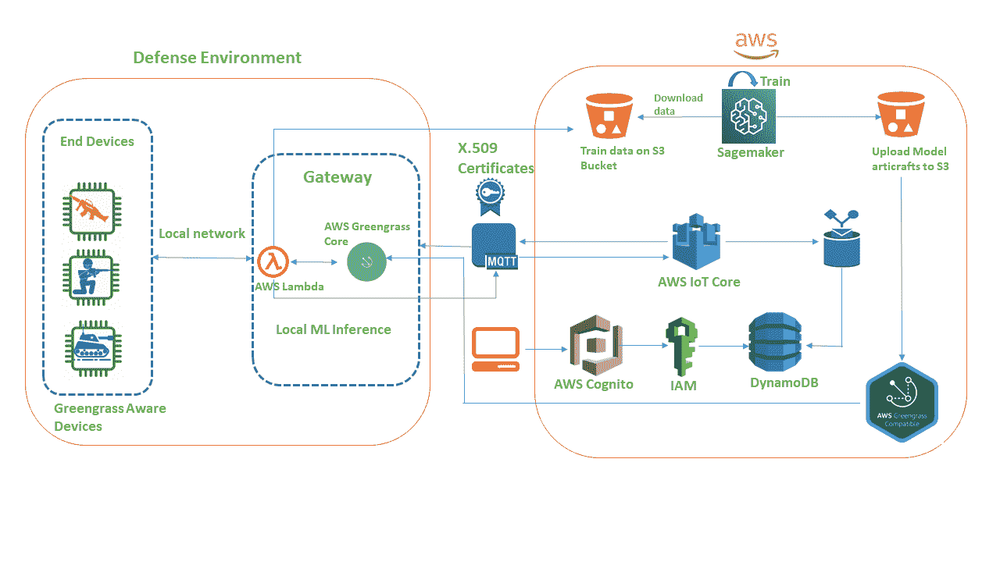

# 在边缘使用模型工件进行机器学习计算

> 原文:[https://www . geeksforgeeks . org/机器学习-边缘计算-使用模型-工件/](https://www.geeksforgeeks.org/machine-learning-computing-at-the-edge-using-model-artifacts/)

在移动电话、个人电脑、嵌入式处理器等资源受限且依赖电池的设备上执行计算密集型任务是一项具有挑战性的任务，尤其是当一个人打算运行机器学习模型时，因为这些模型占用了大量内存和图形处理器，而它们无法做到这一点。对于这些计算密集型任务，企业和开发人员在很大程度上依赖于各种云提供商，如亚马逊网络服务、微软 Azure、谷歌云等，因为他们将现场生成的数据重定向到云中的模型，从而进行过滤、处理，并将结果再次传递回设备。但这是以面临挑战性问题为代价的，例如:

*   潜伏
*   裁员
*   间歇性网络连接

**延迟**
它被定义为数据到达云、处理然后回到之前生成的位置所需的时间。在需要做出快速决策并做出相应响应的情况下，延迟是一个关键问题。防御设备监控、联网车辆、气旋监控等场景。，容易出现延迟问题。
**冗余**
到 2025 年，预计有超过 750 亿台设备连接到互联网，冗余发挥着毁灭性的作用，如果不在边缘过滤，就会将不必要的数据存放在云中，增加互联网成本。
**间歇性网络连接**
在偏远地区，互联网几乎不可用，或者即使可用，也是间歇性的，从而使设备无法正常工作。这三个因素的存在为引入“边缘计算”或“边缘计算”的概念铺平了道路。这给我们带来了两个问题:

**1)如何在边缘执行 ML 计算？**
**2)有没有云提供商提供这项服务来尝试做项目？**

为了回答第一个问题，ML 计算可以通过使用“模型工件”来执行，我们将通过选取一个真实世界的例子来探索它。对于第二个问题，目前有三家云提供商提供这项服务，即 AWS 物联网 Greengrass、谷歌云物联网和微软 Azure Edge 物联网。人们可以尝试这些服务中的任何一种来弄脏自己的手！现在，让我们通过考虑一个真实的场景来理解边缘处的 ML Computing 概念和模型工件，该场景是“防御设备的监控”，其中涉及到使用 AWS IoT Greengrass 和 Amazon Sagemaker 的延迟、冗余和间歇性连接问题。

**AWS 绿草物联网需要两台设备**
1)绿草核心，运行在 rasbian OS、Ubuntu 上，也支持 arm x86 处理器。
2)绿草感知设备，如运行在 AWS FreeRTOS SDK 上的微控制器。

**流程图**

*   该图显示了实施 AWS 物联网绿草的总体架构，其中节点“A”和“B”充当监控设备(绿草感知设备)，节点“C”充当绿草核心。
*   监控现场的硬件是连接有传感器的微控制器/微处理器，用于监控设备状态的实时数据。微控制器/微处理器必须需要一个与绿草核心形成本地网络的通信设备，从而与核心通信测量的信息。
*   Apart from hardware implementation, at the greengrass core device, the pre-trained model artifacts and local lambda functions has to be run to take decisions at the edge whenever the data from the monitoring equipment arrives without depending upon the cloud as shown in the figure below.

    **提议模型的架构**

    

*   模型工件是通过在 amazon sagemaker notebook 实例中将数据集训练为所选算法而生成的。一般来说，模型工件由给定数据集上训练模型的权重组成，大小从几兆字节到几千兆字节不等。因此，一旦这些工件被部署到 greengrass 核心(资源受限的设备)，它们就像是在处理云中的信息一样。
*   The below picture shows the architecture of the whole system.

    

该架构概述了从一个服务到另一个服务的后台流程。

*   在防御环境中，本地设备充当绿草感知设备，与由本地 lambda 和模型工件组成的绿草核心设备形成本地网络。
*   在图片的右边面板，我们可以看到所有涉及的 AWS 服务。数据集存储在 S3 桶中，然后传输到 sagemaker 来训练模型，一旦完成，模型工件就存储在 S3 桶中。
*   这些人工制品和 lambdas 一起被附着在绿草核心上，使其能够部署在防御环境中。来自环境的数据定期存储在 dynamodb 中，防御用户/技术人员可以访问 dats，通过 web 应用程序检查任何错误。
*   这个 web 应用程序通过提供凭证来访问，这些凭证被重定向到 amazon cognito。Amazon congnito 检查凭据并决定是否从 dynamodb 访问数据。防御环境和 AWS 物联网核心之间的通信可以通过 MQTT 协议完成，并具有适当的 x.509 证书，如图所示。

总的来说，当一个人打算在边缘进行计算时，应用程序并不受限制。本文概述了通过将防御体系结构与您的预期工作联系起来来体验边缘计算的基本要求。