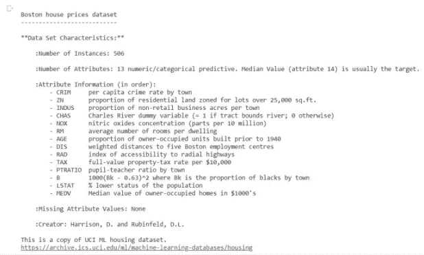
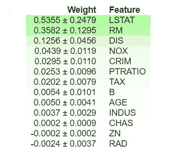

# 使用排列重要性的机器学习可解释性

> 原文:[https://www . geesforgeks . org/机器学习-可解释性-使用-排列-重要性/](https://www.geeksforgeeks.org/machine-learning-explainability-using-permutation-importance/)

机器学习模型通常充当黑盒，这意味着它们可以做出好的预测，但很难完全理解驱动这些预测的决策。从模型中获得洞察力并不是一件容易的事情，尽管事实上它们可以帮助调试、特征工程、指导未来的数据收集、为人类决策提供信息，以及最终建立对模型预测的信任。

关于模型最琐碎的问题之一可能是确定哪些特征对预测有最大的影响，称为**特征重要性**。评估这个指标的一种方法是**排列重要性**。

一旦在训练集上训练了模型，就计算置换重要性。它询问:如果单个属性的**数据点被随机打乱**(在验证集中)，保留所有剩余数据不变，**使用这个新数据会对准确性产生什么影响**？

理想情况下，对列的随机重新排序应该会导致准确性降低，因为新数据与真实世界的统计数据几乎没有关联。当模型非常依赖的一个重要特征被打乱时，模型的准确性会受到最大的影响。有了这一认识，过程如下:

1.  找个训练有素的模特。
2.  打乱单个属性的值，并使用这些数据获得新的预测。接下来，使用这些新值和预测来评估损失函数的变化，以确定洗牌的效果。性能的下降量化了被打乱的特性的重要性。
3.  反向上一步中完成的洗牌，以获得原始数据。使用下一个属性重复步骤 2，直到确定每个特征的重要性。

Python 的 [ELI5 库](https://eli5.readthedocs.io/en/latest/)提供了一种计算排列重要性的便捷方法。它在 Python 2.7 和 Python 3.4+中工作。目前需要 scikit-learn 0.18+。您可以使用 pip 安装 ELI5:

```
pip install eli5
```

或者使用:

```
conda install -c conda-forge eli5
```

我们将使用 [scikitlearn 的波士顿房价数据集](https://scikit-learn.org/stable/modules/generated/sklearn.datasets.load_boston.html)训练一个[随机森林回归器](https://www.geeksforgeeks.org/random-forest-regression-in-python/)，并使用训练好的模型计算排列重要性。

## 加载数据集

## 蟒蛇 3

```
from sklearn.datasets import load_boston

boston = load_boston()
print(boston.DESCR[20:1420])
```

**输出:**



## 分成训练集和测试集

## 蟒蛇 3

```
from sklearn.model_selection import train_test_split

# separate data into target & independent variables
x = boston.data
y = boston.target

# split data into train and test set
x_train, x_test, y_train, y_test = train_test_split(x, y, train_size=0.8)
print('Size of: ')
print('Training Set x: ', x_train.shape)
print('Training Set y: ', y_train.shape)
print('Test Set x: ', x_test.shape)
print('Test Set y: ', y_test.shape)
```

**输出:**

```
Size of: 
Training Set x: (404, 13)
Training Set y: (404,)
Test Set x: (102, 13)
Test Set y: (102,)

```

## 火车模型

## 蟒蛇 3

```
from sklearn.ensemble import RandomForestRegressor

# train model on training set
rf = RandomForestRegressor()

# fit model on training set
rf.fit(x_train, y_train)

# calculate score on test set
print('R2 score for test set: ')
print(rf.score(x_test, y_test))
```

**输出:**

```
R2 score for test set: 0.857883705095584

```

## 评估排列重要性

## 蟒蛇 3

```
import eli5
from eli5.sklearn import PermutationImportance

# create permutation importance object using model
# and fit on test set
perm = PermutationImportance(rf, random_state=1).fit(x_test, y_test)

# display weights using PermutationImportance object
eli5.show_weights(perm, feature_names = boston.feature_names)
```

**输出:**



## 解释

*   表格顶部的值是我们模型中最重要的特性，而底部的值最不重要。
*   每一行中的第一个数字使用与模型相同的性能指标(在本例中为 R2 分数)来指示随机洗牌会降低多少模型性能。
*   之后的数字衡量不同洗牌之间的性能差异，即多个洗牌之间的随机性程度。
*   置换重要性的负值表示对混洗(或有噪声)数据的预测比真实数据更准确。这意味着该特征对预测的贡献不大(重要性接近于 0)，但是随机机会使得对混合数据的预测更加准确。这在小数据集上更常见。

在我们的示例中，前 3 个特性是 LSTAT、RM 和 DIS，而最不重要的 3 个特性是 RAD、CHAS 和 ZN。

## 摘要

本文简要介绍了 Python 中使用排列重要性的机器学习可解释性。获得特征对模型性能影响的直觉可以帮助调试并提供对数据集的洞察，使其成为数据科学家的有用工具。

## 参考

1.  [EL5 文件](https://eli5.readthedocs.io/en/latest/index.html)
2.  [卡格尔机器学习可解释课程](https://www.kaggle.com/learn/machine-learning-explainability)
3.  [硬化随机应变仪](https://scikit-learn.org/stable/modules/generated/sklearn.ensemble.RandomForestRegressor.html)
4.  [波士顿房价数据集](https://scikit-learn.org/stable/modules/generated/sklearn.datasets.load_boston.html)