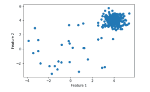
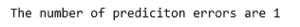
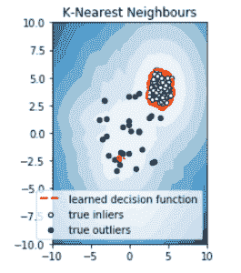

# 异常检测的机器学习

> 原文:[https://www . geeksforgeeks . org/机器学习用于异常检测/](https://www.geeksforgeeks.org/machine-learning-for-anomaly-detection/)

**异常检测**是一种识别罕见事件或观察结果的技术，这些事件或观察结果与其他观察结果在统计上不同，可能会引起怀疑。这种“异常”行为通常会转化为某种问题，如信用卡欺诈、服务器故障、网络攻击等。
异常可以大致分为三类–

1.  **点异常:**数据集中的元组如果离其余数据较远，则称为点异常。
2.  **上下文异常:**如果由于观察的上下文而成为异常，则观察为上下文异常。
3.  **集体异常:**一组数据实例有助于发现异常。

异常检测可以使用**机器学习**的概念来完成。可以通过以下方式完成–

1.  **监督异常检测:**该方法需要包含正常和异常样本的标记数据集来构建预测模型，以对未来的数据点进行分类。为此最常用的算法有监督神经网络、[支持向量机学习](https://www.geeksforgeeks.org/classifying-data-using-support-vector-machinessvms-in-python/)、 [K 近邻分类器](https://www.geeksforgeeks.org/k-nearest-neighbours/)等。
2.  **无监督异常检测:**这种方法不需要任何训练数据，而是假设数据有两点，即只有一小部分数据是异常的，任何异常在统计上都不同于正常样本。基于上述假设，然后使用相似性度量对数据进行聚类，并且远离聚类的数据点被认为是异常。

我们现在演示在合成数据集上使用 K 近邻算法进行异常检测的过程，该算法包含在 [pyod 模块](https://pyod.readthedocs.io/en/latest/pyod.models.html)中。
**第一步:导入所需库**

## 蟒蛇 3

```
import numpy as np
from scipy import stats
import matplotlib.pyplot as plt
import matplotlib.font_manager
from pyod.models.knn import KNN
from pyod.utils.data import generate_data, get_outliers_inliers
```

**第二步:创建合成数据**

## 蟒蛇 3

```
# generating a random dataset with two features
X_train, y_train = generate_data(n_train = 300, train_only = True,
                                                   n_features = 2)

# Setting the percentage of outliers
outlier_fraction = 0.1

# Storing the outliers and inliners in different numpy arrays
X_outliers, X_inliers = get_outliers_inliers(X_train, y_train)
n_inliers = len(X_inliers)
n_outliers = len(X_outliers)

# Separating the two features
f1 = X_train[:, [0]].reshape(-1, 1)
f2 = X_train[:, [1]].reshape(-1, 1)
```

**第三步:可视化数据**

## 蟒蛇 3

```
# Visualising the dataset
# create a meshgrid
xx, yy = np.meshgrid(np.linspace(-10, 10, 200),
                     np.linspace(-10, 10, 200))

# scatter plot
plt.scatter(f1, f2)
plt.xlabel('Feature 1')
plt.ylabel('Feature 2')
```



**第四步:模型的训练和评估**

## 蟒蛇 3

```
# Training the classifier
clf = KNN(contamination = outlier_fraction)
clf.fit(X_train, y_train)

# You can print this to see all the prediction scores
scores_pred = clf.decision_function(X_train)*-1

y_pred = clf.predict(X_train)
n_errors = (y_pred != y_train).sum()
# Counting the number of errors

print('The number of prediction errors are ' + str(n_errors))
```



**第五步:观想预测**

## 蟒蛇 3

```
# threshold value to consider a
# datapoint inlier or outlier
threshold = stats.scoreatpercentile(scores_pred, 100 * outlier_fraction)

# decision function calculates the raw
# anomaly score for every point
Z = clf.decision_function(np.c_[xx.ravel(), yy.ravel()]) * -1
Z = Z.reshape(xx.shape)

# fill blue colormap from minimum anomaly
# score to threshold value
subplot = plt.subplot(1, 2, 1)
subplot.contourf(xx, yy, Z, levels = np.linspace(Z.min(),
                  threshold, 10), cmap = plt.cm.Blues_r)

# draw red contour line where anomaly
# score is equal to threshold
a = subplot.contour(xx, yy, Z, levels =[threshold],
                     linewidths = 2, colors ='red')

# fill orange contour lines where range of anomaly
# score is from threshold to maximum anomaly score
subplot.contourf(xx, yy, Z, levels =[threshold, Z.max()], colors ='orange')

# scatter plot of inliers with white dots
b = subplot.scatter(X_train[:-n_outliers, 0], X_train[:-n_outliers, 1],
                                    c ='white', s = 20, edgecolor ='k')

# scatter plot of outliers with black dots
c = subplot.scatter(X_train[-n_outliers:, 0], X_train[-n_outliers:, 1],
                                    c ='black', s = 20, edgecolor ='k')
subplot.axis('tight')

subplot.legend(
    [a.collections[0], b, c],
    ['learned decision function', 'true inliers', 'true outliers'],
    prop = matplotlib.font_manager.FontProperties(size = 10),
    loc ='lower right')

subplot.set_title('K-Nearest Neighbours')
subplot.set_xlim((-10, 10))
subplot.set_ylim((-10, 10))
plt.show()
```



**参考:**[https://www . analyticsvidhya . com/blog/2019/02/离群点-检测-python-pyod/](https://www.analyticsvidhya.com/blog/2019/02/outlier-detection-python-pyod/)