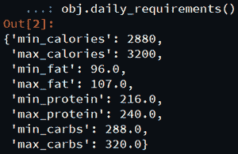
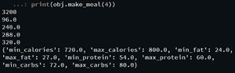
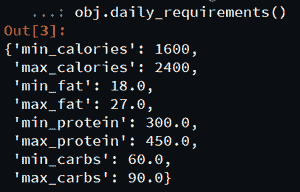

# 使用 Python 中的健身工具模块进行宏营养分析

> 原文:[https://www . geesforgeks . org/macro 营养素-分析-使用-健身-工具-python 中的模块/](https://www.geeksforgeeks.org/macronutrient-analysis-using-fitness-tools-module-in-python/)

良好的饮食是平衡生活方式不可或缺的一部分。它定义了人类的幸福。营养素分为两类，即大量营养素和微量营养素。**常量营养素**是身体需要大量的营养。大量营养素提供热量或能量另一方面**微量营养素**是身体需要的较小剂量的营养素，如钙、钾、钠、铁、锌等。

在本文中，我们将编写 python 脚本，从给定的数据中获取宏营养信息。

我们将使用**健身工具**模块来计算常量营养素化合物。这个包的目标是自动化这些计算，这样你就可以花更多的时间来完成你的营养计划。

**安装:**

```
pip install fitness-tools

```

**让我们用实现来理解这个模块:**

*make _ dine()***类方法根据您的输入并通过函数传递 int，返回一顿饭的推荐卡路里和大量营养素的字典。**

****语法:****

> ****健身工具.餐食.制餐器。美餐(**体重，目标=无，体型=无，活动水平=无，最小卡路里=无，最大卡路里=无，脂肪百分比=无，蛋白质百分比=无，碳水化合物百分比=无 **)**** 
> 
> ****参数:****
> 
> *   ****体重:**输入你当前的体重。**
> *   ****目标:**选择一个目标，‘减重’‘维持’‘增重’或‘无’。**
> *   ****体型:**选择体型:“内形态”、“外形态”、“中形态”或“无”。**
> *   ****活动水平:**选择活动水平，“久坐”、“中等”、“非常”、“T2”或“无”。**
> *   ****min_cal:** 输入所需的每磅最小卡路里，默认为无。**
> *   ****max_cal:** 输入所需的每磅最大卡路里，默认为无。**
> *   ****脂肪百分比:**输入所需的热量百分比，脂肪默认为无。**
> *   ****蛋白质百分比:**从蛋白质默认值
>     输入所需的卡路里百分比至无。**
> *   ****碳水化合物百分比:**输入碳水化合物所需的卡路里百分比
>     默认为无。**

****以下是**实现**使用 fitness_tools 模块进行宏营养分析的一些程序:****

****例 1:****

**用*每日 _ 需求()*法获取常量营养素。**

## **蟒蛇 3**

```
# Import required modules
from fitness_tools.meals.meal_maker import MakeMeal

# Create object
obj = MakeMeal(160, goal='weight_gain', activity_level='moderate',
               body_type='mesomorph')

# Call required method
obj.daily_requirements()
```

****输出:****

****

****例 2:****

## **蟒蛇 3**

```
# Import required module
from fitness_tools.meals.meal_maker import MakeMeal

# Create object
obj = MakeMeal(160, goal='weight_gain', activity_level='moderate',
               body_type='mesomorph')

# Traverse each object
print(obj.daily_max_calories())
print(obj.daily_min_fat())
print(obj.daily_max_protein())
print(obj.daily_min_carbs())
print(obj.daily_max_carbs())

# Return calories and macronutrients
# for one meal.
print(obj.make_meal(4))
```

****输出:****

****

****例 3:****

**手动获取宏量营养素百分比和热量范围。**

## **蟒蛇 3**

```
# Import required module
from fitness_tools.meals.meal_maker import MakeMeal

# Create object
obj = MakeMeal(160, min_cal=10, max_cal=15, fat_percent=0.1,
               protein_percent=0.75, carb_percent=0.15)

# returns calories, fat, protein,
# and carbs in grams for one day
obj.daily_requirements()
```

****输出:****

****

****注意:**T2 脂肪百分比()、蛋白质百分比()、和【T4 碳水化合物百分比()之和必须等于 1。**