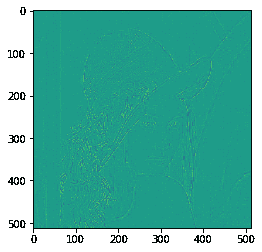
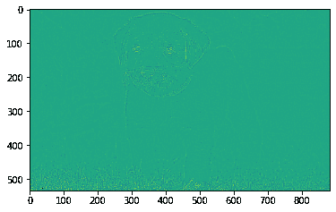

# 马霍塔斯-2D 拉普拉斯滤波器

> 原文:[https://www.geeksforgeeks.org/mahotas-2d-laplacian-filter/](https://www.geeksforgeeks.org/mahotas-2d-laplacian-filter/)

在本文中，我们将了解如何将 2D 拉普拉斯过滤器应用于 mahotas 中的图像。拉普拉斯滤波器是一种边缘检测器，用于计算图像的二阶导数，测量一阶导数的变化率。这决定了相邻像素值的变化是来自边缘还是连续进展。

在本教程中我们将使用“lena”图像，下面是加载它的命令。

```
mahotas.demos.load('lena')
```

下图是莉娜形象


> 为此，我们将使用 mahotas.laplacian_2D 方法
> **语法:**maho tas . laplacian _ 2D(img)
> **参数:**它以图像对象作为参数
> **返回:**它返回图像对象

**注意:**输入图像应被过滤或加载为灰色

为了过滤图像，我们将获取 numpy.ndarray 的图像对象，并在索引的帮助下过滤它，下面是这样做的命令

```
image = image[:, :, 0]
```

下面是实现

## 蟒蛇 3

```
# importing required libraries
import mahotas
import mahotas.demos
from pylab import gray, imshow, show
import numpy as np
import matplotlib.pyplot as plt

# loading image
img = mahotas.demos.load('lena')

# filtering image
img = img.max(2)

print("Image")

# showing image
imshow(img)
show()

# applying 2D Laplacian filter
new_img = mahotas.laplacian_2D(img)

# showing image
print("2D Laplacian filter")
imshow(new_img)
show()
```

**输出:**

```
Image
```


2D 拉普拉斯滤波器



另一个例子

## 蟒蛇 3

```
# importing required libraries
import mahotas
import numpy as np
from pylab import gray, imshow, show
import os
import matplotlib.pyplot as plt

# loading image
img = mahotas.imread('dog_image.png')

# filtering image
img = img[:, :, 0]

print("Image")

# showing image
imshow(img)
show()

# applying 2D Laplacian filter
new_img = mahotas.laplacian_2D(img)

# showing image
print("2D Laplacian filter")
imshow(new_img)
show()
```

**输出:**

```
Image
```


2D 拉普拉斯滤波器

