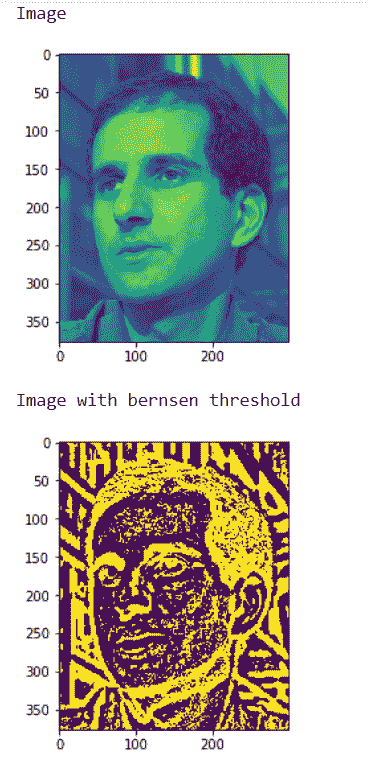

# maho tas-Bernsen 局部阈值

> 原文:[https://www . geesforgeks . org/maho tas-Bern sen-local-thresholding/](https://www.geeksforgeeks.org/mahotas-bernsen-local-thresholding/)

在本文中，我们将看到如何在 mahotas 中实现 bernsen 局部阈值化。Bernsen 方法是为图像分割开发的局部自适应二值化方法之一。在本研究中，实现了 Bernsen 的局部自适应二值化方法，并对不同的灰度图像进行了测试。

在本教程中，我们将使用“luispedro”图像，下面是加载它的命令。

```
mahotas.demos.load('luispedro')
```

下面是路易斯德罗的照片


为了做到这一点，我们将使用 mahotas.thresholding.bernsen 方法

> **语法:**maho tas . thresholding . bernsen(image，contrast_threshold，global_threshold)
> **参数:**它以图像对象和两个整数作为参数
> **返回:**它返回图像对象

**注意:**输入图像应被过滤或加载为灰色

为了过滤图像，我们将获取 numpy.ndarray 的图像对象，并在索引的帮助下过滤它，下面是这样做的命令

```
image = image[:, :, 0]
```

**例 1:**

## 蟒蛇 3

```
# importing required libraries
import mahotas
import mahotas.demos
import numpy as np
from pylab import imshow, gray, show
from os import path

# loading the image
photo = mahotas.demos.load('luispedro')

# loading image as grey
photo = mahotas.demos.load('luispedro', as_grey = True)

# converting image type to unit8
# because as_grey returns floating values
photo = photo.astype(np.uint8)

# showing original image
print("Image")
imshow(photo)
show()

# bernsen threshold
photo = mahotas.thresholding.bernsen(photo, 7, 200)

print("Image with bernsen threshold")

# showing image
imshow(photo)
show()
```

**输出:**



**例 2:**

## 蟒蛇 3

```
# importing required libraries
import mahotas
import numpy as np
from pylab import imshow, show
import os

# loading image
img = mahotas.imread('dog_image.png')

# setting filter to the image
img = img[:, :, 0]

print("Image")

# showing the image
imshow(img)
show()

# bernsen threshold
img = mahotas.thresholding.bernsen(img, 5, 100)

print("Image with bernsen threshold")

# showing image
imshow(img)
show()
```

**输出:**

