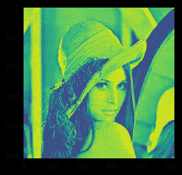

# maho tas–给定图像的质心

> 原文:[https://www . geesforgeks . org/maho tas-给定图像的质心/](https://www.geeksforgeeks.org/mahotas-center-of-mass-of-given-image/)

在本文中，我们将看到如何在 mahotas 中获得图像的质心。质心(对于二进制图像)是一种有点复杂的说法“每个维度的平均值”。换句话说——取所有 x 坐标并取平均值——你就得到你的“质心”的 x 坐标，y 也是一样的。
在本教程中我们将使用“lena”图像，下面是加载它的命令。

```py
mahotas.demos.load('lena')
```

下图是莉娜形象


> 为此，我们将使用 mahotas .质心方法
> **语法:** mahotas .质心(img)
> **参数:**它将图像对象作为参数
> **返回:**它返回质心坐标

**注意:**输入图像应该被过滤或者应该被加载为灰色
为了过滤图像，我们将获取 numpy.ndarray 的图像对象，并借助索引对其进行过滤，下面是这样做的命令

```py
image = image[:, :, 0]
```

下面是实现

## 蟒蛇 3

```py
# importing required libraries
# importing required libraries
import mahotas
import mahotas.demos
from pylab import gray, imshow, show
import numpy as np

# loading image
img = mahotas.demos.load('lena')

# grey image
g = img[:, :, 1]

# multiplying grey image values
g = g * 100

# filtering image
img = img.max(2)

# showing image
imshow(img)
show()

# getting center of mass
center = mahotas.center_of_mass(img)

# printing center of mass co-ordinate
print("Center of Mass : " + str(center))
```

**输出:**



```py
Center of Mass : [246.64854256 259.45157125]
```

另一个例子

## 蟒蛇 3

```py
# importing required libraries
import mahotas
import numpy as np
from pylab import gray, imshow, show
import os

# loading image
img = mahotas.imread('dog_image.png')

# filtering image
img = img[:, :, 0]

# showing image
imshow(img)
show()

# getting center of mass
center = mahotas.center_of_mass(img)

# printing center of mass co-ordinate
print("Center of Mass : " + str(center))
```

**输出:**


```py
Center of Mass : [265.35619268 482.66701402]
```