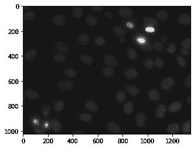
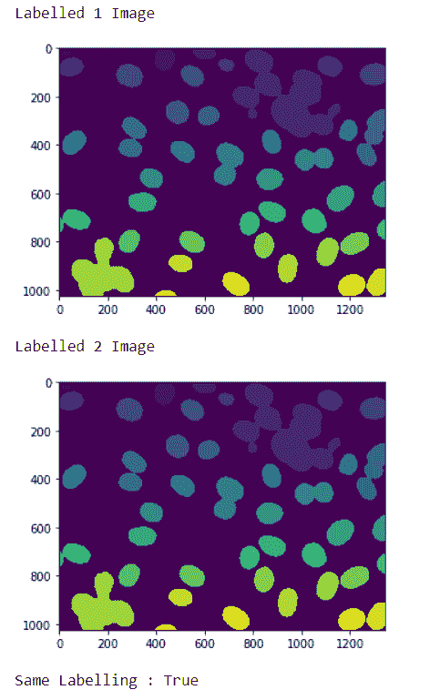
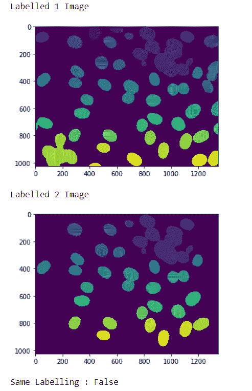

# maho tas–检查两幅图像是否代表相同的标签

> 原文:[https://www . geesforgeks . org/maho tas-checking-if-two-images-president-same-labling/](https://www.geeksforgeeks.org/mahotas-checking-if-two-images-represent-same-labeling/)

在本文中，我们将看到如何在 mahotas 中检查这两幅图像是否表示相同的标签。为此，我们将使用来自核分割基准的荧光显微图像。借助下面给出的命令，我们可以得到图像

```
mahotas.demos.nuclear_image()
```

下面是核图像



为了做到这一点，我们将使用 maho tas . label . is _ same _ labling 方法

> **语法:**maho tas . label . is _ same _ labing(label 1。标签 2)
> **参数:**它以两个标签图像作为参数
> **返回:**它返回 bool

**注意:**这个的输入应该是被标注的过滤后的图像对象

为了过滤图像，我们将获取 numpy.ndarray 的图像对象，并在索引的帮助下过滤它，下面是这样做的命令

```
image = image[:, :, 0]
```

**例 1 :**

## 蟒蛇 3

```
# importing required libraries
import mahotas
import numpy as np
from pylab import imshow, show
import os

# loading nuclear image
f1 = mahotas.demos.load('nuclear')

# setting filter to the image
f1 = f1[:, :, 0]

# setting gaussian filter
f1 = mahotas.gaussian_filter(f1, 4)

# setting threshold value
f1 = (f1> f1.mean())

# creating a labeled image
labeled1, n_nucleus1 = mahotas.label(f1)

# showing the labeled image
print("Labelled 1 Image")
imshow(labeled1)
show()

# loading nuclear image
f2 = mahotas.demos.load('nuclear')

# setting filter to the image
f2 = f2[:, :, 0]

# setting gaussian filter
f2 = mahotas.gaussian_filter(f2, 4)

# setting threshold value
f2 = (f2> f2.mean())

# creating a labeled image
labeled2, n_nucleus2 = mahotas.label(f2)

# showing the labeled image
print("Labelled 2 Image")
imshow(labeled2)
show()

# c hecking if both the labeled images are same
check = mahotas.labeled.is_same_labeling(labeled1, labeled2)

# printing check
print("Same Labelling : "+ str(check))
```

**输出:**



```
Same Labelling : True
```

**例 2 :**

## 蟒蛇 3

```
# importing required libraries
import mahotas
import numpy as np
from pylab import imshow, show
import os

# loading nuclear image
f1 = mahotas.demos.load('nuclear')

# setting filter to the image
f1 = f1[:, :, 0]

# setting gaussian filter
f1 = mahotas.gaussian_filter(f1, 4)

# setting threshold value
f1 = (f1> f1.mean())

# creating a labeled image
labeled1, n_nucleus1 = mahotas.label(f1)

# showing the labeled image
print("Labelled 1 Image")
imshow(labeled1)
show()

# loading nuclear image
f2 = mahotas.demos.load('nuclear')

# setting filter to the image
f2 = f2[:, :, 0]

# setting gaussian filter
f2 = mahotas.gaussian_filter(f2, 4)

# setting threshold value
f2 = (f2> f2.mean())

# creating a labeled image
labeled2, n_nucleus2 = mahotas.label(f2)

# removing border
labeled2 = mahotas.labeled.remove_bordering(labeled2)

# showing the labeled image
print("Labelled 2 Image")
imshow(labeled2)
show()

# checking if both the labeled images are same
check = mahotas.labeled.is_same_labeling(labeled1, labeled2)

# printing check
print("Same Labelling : "+ str(check))
```

**输出:**



```
Same Labelling : False
```