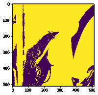

# maho tas–关闭图像中的孔

> 原文:[https://www . geesforgeks . org/maho tas-关闭图像中的孔/](https://www.geeksforgeeks.org/mahotas-closing-holes-in-image/)

在本文中，我们将看到如何在 mahotas 中关闭图像的漏洞。关闭孔意味着去除图像中存在的孔，关闭是首先执行膨胀操作然后执行侵蚀操作的过程。它从获得的图像中消除了小孔，用于平滑轮廓和融合狭窄的断裂。

在本教程中我们将使用“lena”图像，下面是加载它的命令。

```py
mahotas.demos.load('lena')
```

下面是莉娜的形象


> 为此，我们将使用 mahotas.close_holes 方法
> 
> **语法:** mahotas.close_holes(img)
> 
> **自变量:**以图像对象为自变量
> 
> **返回:**返回图像对象

**注意:**输入图像应被过滤或加载为灰色

为了过滤图像，我们将获取 numpy.ndarray 的图像对象，并在索引的帮助下过滤它，下面是这样做的命令

```py
image = image[:, :, 0]
```

下面是实现

## 蟒蛇 3

```py
# importing required libraries
import mahotas
import mahotas.demos
from pylab import gray, imshow, show
import numpy as np

# loading image
img = mahotas.demos.load('lena')

# filtering image
img = img.max(2)

# otsu method
T_otsu = mahotas.otsu(img)

# image values should be greater than otsu value
img = img > T_otsu

print("Image threshold using Otsu Method")

# showing image
imshow(img)
show()

# closing holes
new_img = mahotas.close_holes(img)

print("Closed Hole Image")

# showing image
imshow(new_img)
show()
```

**输出:**

```py
Image threshold using Otsu Method
```


莉娜·大津

```py
Closed Hole Image
```



关闭孔

另一个例子

## 蟒蛇 3

```py
# importing required libraries
import mahotas
import numpy as np
from pylab import gray, imshow, show
import os

# loading image
img = mahotas.imread('dog_image.png')

# filtering image
img = img[:, :, 0]

# otsu method
T_otsu = mahotas.otsu(img)  

# image values should be greater than otsu value
img = img > T_otsu

print("Image threshold using Otsu Method")

# showing image
imshow(img)
show()

# closing holes
new_img = mahotas.close_holes(img)

print("Closed Hole Image")

# showing image
imshow(new_img)
show()
```

**输出:**

```py
Image threshold using Otsu Method
```


```py
Closed Hole Image
```

