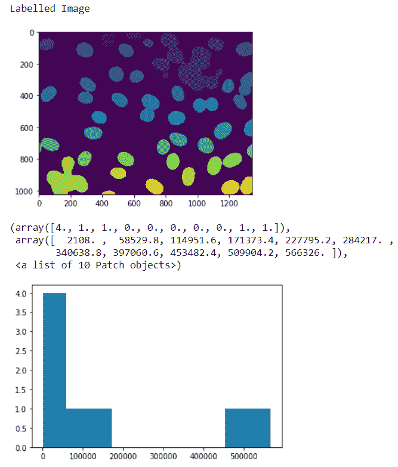
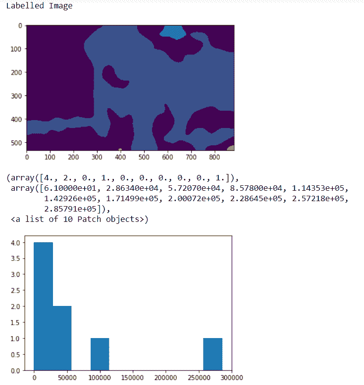

# maho tas–计算线性二进制模式

> 原文:[https://www . geesforgeks . org/maho tas-计算-线性-二进制-模式/](https://www.geeksforgeeks.org/mahotas-computing-linear-binary-patterns/)

在本文中，我们将看到如何在 mahotas 中获得图像的线性二进制模式。局部二值模式是计算机视觉中用于分类的一种视觉描述符。LBP 是 1990 年提出的纹理谱模型的特例。1994 年首次描述了 LBP。为此，我们将使用来自核分割基准的荧光显微图像。我们可以借助下面给出的命令
获得图像

```py
mahotas.demos.nuclear_image()
```

下图是核 _ 图像


为此，我们将使用 mahotas.features.lbp 方法

> **语法:** mahotas.features.lbp(图像、半径、点)
> **参数:**它以图像对象和两个整数作为参数
> **返回:**它返回一维数字数组即直方图特征

**注意:**的输入应该是过滤后的图像或者加载为灰色
为了对图像进行过滤，我们将获取 numpy.ndarray 的图像对象，并借助索引对其进行过滤，下面是这样做的命令

```py
image = image[:, :, 0]
```

**例 1 :**

## 蟒蛇 3

```py
# importing various libraries
import mahotas
import mahotas.demos
import mahotas as mh
import numpy as np
from pylab import imshow, show
import matplotlib.pyplot as plt

# loading nuclear image
nuclear = mahotas.demos.nuclear_image()

# filtering image
nuclear = nuclear[:, :, 0]

# adding gaussian filter
nuclear = mahotas.gaussian_filter(nuclear, 4)

# setting threshold
threshed = (nuclear > nuclear.mean())

# making is labelled image
labeled, n = mahotas.label(threshed)

# showing image
print("Labelled Image")
imshow(labelled)
show()

# Computing Linear Binary Patterns
value = mahotas.features.lbp(labelled, 200, 5)

# showing histograph
plt.hist(value)
```

**输出:**



**例 2 :**

## 蟒蛇 3

```py
# importing required libraries
import numpy as np
import mahotas
from pylab import imshow, show
import matplotlib.pyplot as plt

# loading image
img = mahotas.imread('dog_image.png')

# filtering the image
img = img[:, :, 0]

# setting gaussian filter
gaussian = mahotas.gaussian_filter(img, 15)

# setting threshold value
gaussian = (gaussian > gaussian.mean())

# making is labelled image
labeled, n = mahotas.label(gaussian)

# showing image
print("Labelled Image")
imshow(labelled)
show()

# Computing Linear Binary Patterns
value = mahotas.features.lbp(labelled, 200, 5, ignore_zeros = False)

# showing histograph
plt.hist(value)
```

**输出:**

