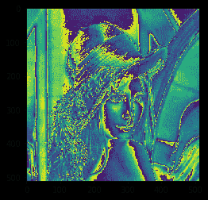

# maho tas–条件腐蚀图像

> 原文:[https://www . geesforgeks . org/maho tas-条件-侵蚀-图像/](https://www.geeksforgeeks.org/mahotas-conditional-eroding-image/)

在本文中，我们将看到如何在 mahotas 中有条件地腐蚀图像。侵蚀是形态学图像处理中的两个基本操作之一(另一个是膨胀)，所有其他形态学操作都基于这两个操作。它最初是为二值图像定义的，后来扩展到灰度图像，随后又扩展到完整的点阵。

在本教程中我们将使用“lena”图像，下面是加载它的命令。

```
mahotas.demos.load('lena')
```

下面是莉娜的形象


> 为此，我们将使用 mahotas.cerode 方法
> **语法:** mahotas.cerode(img，c_grey)
> **参数:**它以图像对象、条件图像为参数
> **返回:**它返回图像对象

**注意:**输入图像应被过滤或加载为灰色

为了过滤图像，我们将获取 numpy.ndarray 的图像对象，并在索引的帮助下过滤它，下面是这样做的命令

```
image = image[:, :, 0]
```

下面是实现

## 蟒蛇 3

```
# importing required libraries
import mahotas
import mahotas.demos
from pylab import gray, imshow, show
import numpy as np

# loading image
img = mahotas.demos.load('lena')

# grey image
g = img[:, :, 1]

# multiplying grey image values
g = g * 3

# filtering image
img = img.max(2)

# otsu method
T_otsu = mahotas.otsu(img)  

# image values should be greater than otsu value
img = img > T_otsu

print("Image threshold using Otsu Method")

# showing image
imshow(img)
show()

# eroding image using conditional grey image
new_img = mahotas.cerode(img, g)

# showing eroded image
print("Eroded Image")
imshow(new_img)
show()
```

**输出:**

```
Image threshold using Otsu Method
```


```
Eroded Image
```



另一个例子

## 蟒蛇 3

```
# importing required libraries
import mahotas
import numpy as np
from pylab import gray, imshow, show
import os

# loading image
img = mahotas.imread('dog_image.png')

# getting grey image
g = img[:, :, 0]

# multiplying grey image values
g = g * 2

# filtering image
img = img[:, :, 0]

# otsu method
T_otsu = mahotas.otsu(img)  

# image values should be greater than otsu value
img = img > T_otsu

print("Image threshold using Otsu Method")

# showing image
imshow(img)
show()

# eroding image using conditional grey image
new_img = mahotas.cerode(img, g)

# showing eroded image
print("Eroded Image")
imshow(new_img)
show()
```

**输出:**

```
Image threshold using Otsu Method
```


```
Eroded Image
```

