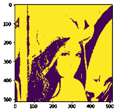
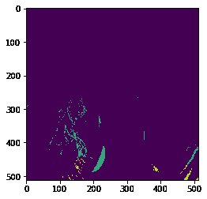
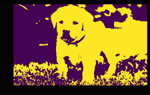
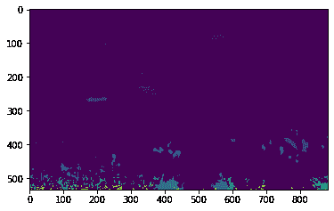

# maho tas–图像的条件分水岭

> 原文:[https://www . geesforgeks . org/maho tas-条件-图像分水岭/](https://www.geeksforgeeks.org/mahotas-conditional-watershed-of-image/)

在本文中，我们将看到如何在 mahotas 中对图像进行条件分水岭变换。在图像处理的研究中，分水岭是在灰度图像上定义的变换。这个名字比喻为一个地质分水岭，或排水分水岭，将相邻的排水盆地分开。

在本教程中我们将使用“lena”图像，下面是加载它的命令。

```py
mahotas.demos.load('lena')
```

下面是莉娜的形象


> 为此，我们将使用 mahotas.cwatershed 方法
> 
> **语法:** mahotas.cwatershed(img，marker)
> 
> **自变量:**以图像对象和标注标记为自变量
> 
> **返回:**返回图像对象

**注意:**输入图像应被过滤或加载为灰色

为了过滤图像，我们将获取 numpy.ndarray 的图像对象，并在索引的帮助下过滤它，下面是这样做的命令

```py
image = image[:, :, 0]
```

下面是实现

## 蟒蛇 3

```py
# importing required libraries
import mahotas
import mahotas.demos
from pylab import gray, imshow, show
import numpy as np

# loading image
img = mahotas.demos.load('lena')

# filtering image
img = img.max(2)

# otsu method
T_otsu = mahotas.otsu(img)  

# image values should be greater than otsu value
img = img > T_otsu

print("Image threshold using Otsu Method")

# creating a labelled image
marker, n_nucleus = mahotas.label(img)

# showing image
imshow(img)
show()

# watershed of image
new_img = mahotas.cwatershed(img, marker)

print("CWatershed Image")

# showing image
imshow(new_img)
show()
```

**输出:**

```py
Image threshold using Otsu Method
```



```py
CWatershed Image
```



另一个例子

## 蟒蛇 3

```py
# importing required libraries
import mahotas
import numpy as np
from pylab import gray, imshow, show
import os

# loading image
img = mahotas.imread('dog_image.png')

# filtering image
img = img[:, :, 0]

# otsu method
T_otsu = mahotas.otsu(img)  

# image values should be greater than otsu value
img = img > T_otsu

print("Image threshold using Otsu Method")

# showing image
imshow(img)
show()

# creating a labelled image
marker, n_nucleus = mahotas.label(img)

# watershed of image
new_img = mahotas.cwatershed(img, marker)

print("CWatershed Image")

# showing image
imshow(new_img)
show()
```

**输出:**

```py
Image threshold using Otsu Method
```



```py
CWatershed Image
```

