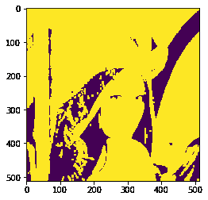
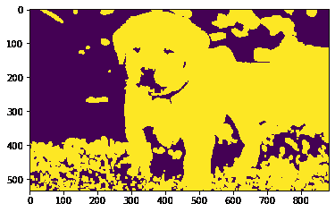

# maho tas–图像卷积

> 原文:[https://www.geeksforgeeks.org/mahotas-convolution-of-image/](https://www.geeksforgeeks.org/mahotas-convolution-of-image/)

在本文中，我们将看到如何在 mahotas 中进行图像卷积。卷积是一种简单的数学运算，是许多常见图像处理算子的基础。卷积提供了一种“相乘”两个数组的方法，这两个数组通常大小不同，但具有相同的维数，从而产生第三个具有相同维数的数组。

在本教程中，我们将使用“lena”图像，下面是加载它的命令。

```
mahotas.demos.load('lena')
```

下面是莉娜的形象


> 为了做到这一点，我们将使用 mahotas .卷积方法
> 
> **语法:**maho tas . convolume(img，weight)
> 
> **参数:**以图像对象和 numpy 和数组对象为参数
> 
> **返回:**返回图像对象

**注意:**输入图像应被过滤或加载为灰色

为了过滤图像，我们将获取 numpy.ndarray 的图像对象，并在索引的帮助下过滤它，下面是这样做的命令

```
image = image[:, :, 0]
```

下面是实现

## 蟒蛇 3

```
# importing required libraries
import mahotas
import mahotas.demos
from pylab import gray, imshow, show
import numpy as np

# loading image
img = mahotas.demos.load('lena')

# filtering image
img = img.max(2)

# otsu method
T_otsu = mahotas.otsu(img)  

# image values should be greater than otsu value
img = img > T_otsu

print("Image threshold using Otsu Method")

# showing image
imshow(img)
show()

# weight
weight = np.ones((5, 5), float)

# convolving image
new_img = mahotas.convolve(img, weight)

print("Convolved Image")

# showing image
imshow(new_img)
show()
```

**输出:**

```
Image threshold using Otsu Method
```


```
Convolved Image
```



另一个例子

## 蟒蛇 3

```
# importing required libraries
import mahotas
import numpy as np
from pylab import gray, imshow, show
import os

# loading image
img = mahotas.imread('dog_image.png')

# filtering image
img = img[:, :, 0]

# otsu method
T_otsu = mahotas.otsu(img)  

# image values should be greater than otsu value
img = img > T_otsu

print("Image threshold using Otsu Method")

# showing image
imshow(img)
show()

# weight
weight = np.ones((5, 5), float)

# convolving image
new_img = mahotas.convolve(img, weight)

print("Convolved Image")

# showing image
imshow(new_img)
show()
```

**输出:**

```
Image threshold using Otsu Method 
```


```
Convolved Image
```

