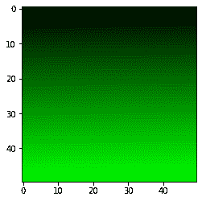
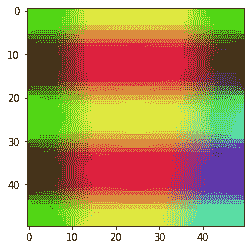

# maho tas–创建 RGB 图像

> 原文:[https://www.geeksforgeeks.org/mahotas-creating-rgb-image/](https://www.geeksforgeeks.org/mahotas-creating-rgb-image/)

在本文中，我们将看到如何在 mahotas 中创建一个 RGB 图像。RGB 图像，有时也称为真彩色图像，在 MATLAB 中存储为一个 m 乘 n 乘 3 的数据数组，该数组定义了每个单独像素的红色、绿色和蓝色分量。RGB 图像可以借助于每个通道的数组来创建。

> 为了做到这一点，我们将使用`as_rgb`方法
> 
> **语法:** mahotas.as_rgb(r，g，b)
> 
> **参数:**以三个 numpy 数组作为参数
> 
> **返回:**返回 RGB 数组对象

下面是实现

```
# importing required libraries
import mahotas
import mahotas.demos
from pylab import gray, imshow, show
import numpy as np

# creating array of shape 50x50
# for red channel
r = np.arange(2500).reshape(50, 50)

# for blue channel
g = np.arange(2500).reshape(50, 50)

# for blue channel
b = np.arange(2500).reshape(50, 50)

# making red channel values to 0
r = r * 0

# increasing green channel values
g = g * 100

# making blue channel values to 0
b = b * 0

# creating rgb image from these three channel
img = mahotas.as_rgb(r, g, b)

# showing image
imshow(img)
show()
```

**输出:**


另一个例子

```
# importing required libraries
import mahotas
import mahotas.demos
from pylab import gray, imshow, show
import numpy as np

# creating numpy linspace
z1 = np.linspace(0, np.pi)

# creating numpy meshgrid
X, Y = np.meshgrid(z1, z1)

# creating rgb channels
# creating red channel through sin function
red = np.sin(X)

# creating green channel through cos function
green = np.cos(4 * Y)

# creating blue channel
blue = X * Y

# creating rgb image from these three channel
img = mahotas.as_rgb(red, green, blue)

# showing image
imshow(img)
show()
```

**输出:**
