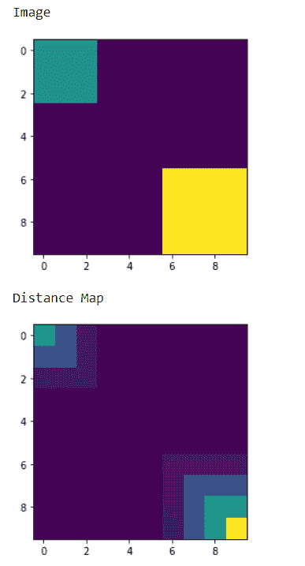
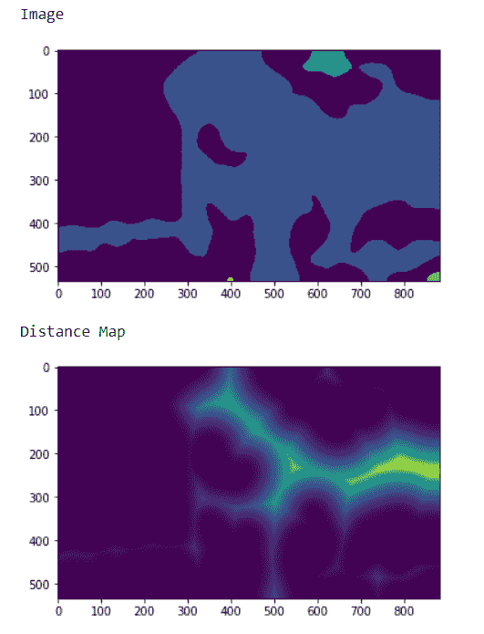

# maho tas–距离二值图像的距离

> 原文:[https://www . geeksforgeeks . org/maho tas-与二进制图像的距离/](https://www.geeksforgeeks.org/mahotas-distance-from-binary-image/)

在本文中，我们将看到如何在 mahotas 中获得二值图像的距离图。距离变换，也称为距离图或距离场，是数字图像的派生表示。术语的选择取决于对所讨论的对象的观点:初始图像是被转换成另一种表示，还是仅仅被赋予了额外的地图或场。为了做到这一点，我们将使用 mahotas.distance 方法

> **语法:**maho tas . distance(img)
> **参数:**它以应该是二进制的图像对象作为参数
> **返回:**它返回图像对象

**注意:**输入的图像应该是二值图像它也可以被标记，图像应该被过滤或者应该被加载为灰色以使其二值化
为了过滤图像，我们将获取 numpy.ndarray 的图像对象并借助索引对其进行过滤，下面是这样做的命令

```py
image = image[:, :, 0]
```

**例 1:**

## 蟒蛇 3

```py
# importing required libraries
import mahotas as mh
import numpy as np
from pylab import imshow, show

# creating region
# numpy.ndarray
regions = np.zeros((10, 10), bool)

# setting 1 value to the region
regions[:3, :3] = 1
regions[6:, 6:] = 1

# getting labeled function
labeled, nr_objects = mh.label(regions)

# showing the image with interpolation = 'nearest'
print("Image")
imshow(labeled, interpolation ='nearest')
show()

# getting distance map
dmap = mahotas.distance(labeled)

# showing image
print("Distance Map")
imshow(dmap)
show()
```

**输出:**



**例 2:**

## 蟒蛇 3

```py
# importing required libraries
import numpy as np
import mahotas
from pylab import imshow, show

# loading image
img = mahotas.imread('dog_image.png')

# filtering the image
img = img[:, :, 0]

# setting gaussian filter
gaussian = mahotas.gaussian_filter(img, 15)

# setting threshold value
gaussian = (gaussian > gaussian.mean())

# creating a labeled image
labeled, n_nucleus = mahotas.label(gaussian)

print("Image")
# showing the gaussian filter
imshow(labeled)
show()

# getting distance map
dmap = mahotas.distance(labeled)

# showing image
print("Distance Map")
imshow(dmap)
show()
```

**输出:**

