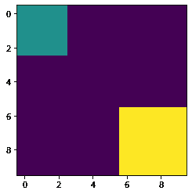
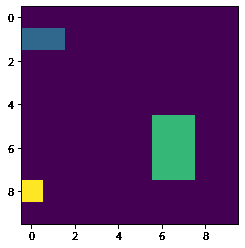
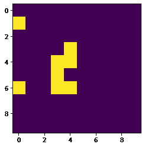

# maho tas–对二值图像使用高斯差的边缘

> 原文:[https://www . geeksforgeeks . org/maho tas-edges-使用高斯差分对二进制图像/](https://www.geeksforgeeks.org/mahotas-edges-using-difference-of-gaussian-for-binary-image/)

在本文中，我们将看到如何借助 DoG 算法在 mahotas 中对二值图像进行边缘检测。在成像科学中，差分高斯(difference of Gaussians，DoG)是一种特征增强算法，涉及从原始图像的另一个模糊程度较低的版本中减去原始图像的一个模糊版本。

> 为了做到这一点，我们将使用`mahotas.dog`方法
> 
> **语法:** mahotas.dog(img)
> 
> **自变量:**它以二值图像对象为自变量
> 
> **返回:**返回图像对象

下面是实现

```py
# importing required libraries
import mahotas as mh
import numpy as np
from pylab import imshow, show

# creating region
# numpy.ndarray
regions = np.zeros((10, 10), bool)

# setting 1 value to the region
regions[:3, :3] = 1
regions[6:, 6:] = 1

# getting labeled function
labeled, nr_objects = mh.label(regions)

# showing the image with interpolation = 'nearest'
print("Binary Image")
imshow(labeled, interpolation ='nearest')
show()

# getting edges using dog algo
dog = mahotas.dog(labeled)

# showing image
print("Edges using DoG algo")
imshow(dog)
show()
```

**输出:**

```py
Binary Image
```



```py
Edges using DoG algo
```

另一个例子

```py
# importing required libraries
import mahotas as mh
import numpy as np
from pylab import imshow, show

# creating region
# numpy.ndarray
regions = np.zeros((10, 10), bool)

# setting 1 value to the region
regions[1, :2] = 1
regions[5:8, 6: 8] = 1
regions[8, 0] = 1

# getting labeled function
labeled, nr_objects = mh.label(regions)

# showing the image with interpolation = 'nearest'
print("Image")
imshow(labeled, interpolation ='nearest')
show()

# getting edges
dog = mahotas.dog(labeled)

# showing image
print("Edges using DoG algo")
imshow(dog)
show()
```

**输出:**

```py
Binary Image
```



```py
Edges using DoG algo
```

