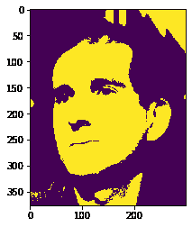
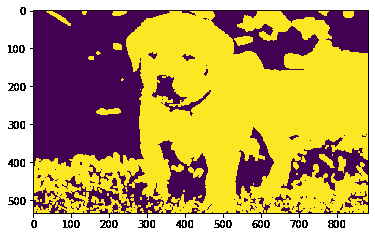

# maho tas–用于扩展图像的元素结构

> 原文:[https://www . geesforgeks . org/maho tas-element-structure-for-expanding-image/](https://www.geeksforgeeks.org/mahotas-element-structure-for-dilating-image/)

在本文中，我们将看到如何在 mahotas 中设置图像扩展的元素结构。膨胀将像素添加到图像中对象的边界，而侵蚀将移除对象边界上的像素。从图像中的对象添加或移除的像素数量取决于用于处理图像的结构化元素的大小和形状。为了放大图像，我们使用了 maho tas . morph . exploit 方法。通过设置元素结构，我们可以增加或减少对图像的扩张效果。

在本教程中我们将使用“luispedro”图像，下面是加载它的命令。

```
mahotas.demos.load('luispedro')
```

下面是路易斯德罗的照片


> 实施步骤:
> 1。加载图像
> 2。过滤图像
> 3。对图像的阈值使用 otsu 方法
> 4。借助二进制值的 numpy ndarray 创建元素结构
> 5。使用扩张图像的元素

下面是实现

## 蟒蛇 3

```
# importing required libraries
import mahotas
import mahotas.demos
from pylab import gray, imshow, show
import numpy as np

# loading image
luispedro = mahotas.demos.load('luispedro')

# filtering image
luispedro = luispedro.max(2)

# otsu method
T_otsu = mahotas.otsu(luispedro)

# image values should be greater than otsu value
img = luispedro > T_otsu

print("Image threshold using Otsu Method")

# showing image
imshow(img)
show()

# erode structure
es = np.array([
        [1, 1, 1, 1],
        [1, 1, 1, 1],
        [1, 1, 1, 1],
        [1, 1, 1, 1]], bool)

# dilating image
dilate_img = mahotas.morph.dilate(img, es)

# showing dilated image
print("Dilated Image")
imshow(dilate_img)
show()
```

**输出:**

```
Image threshold using Otsu Method
```



```
Dilated Image
```


另一个例子

## 蟒蛇 3

```
# importing required libraries
import mahotas
import numpy as np
import matplotlib.pyplot as plt
import os

# loading image
img = mahotas.imread('dog_image.png')

# setting filter to the image
img = img[:, :, 0]

# otsu method
T_otsu = mahotas.otsu(img)

# image values should be greater than otsu value
img = img > T_otsu

print("Image threshold using Otsu Method")

# showing image
imshow(img)
show()

# erode structure
es = np.array([
        [1, 1, 1, 1],
        [1, 1, 1, 1],
        [1, 1, 1, 1],
        [1, 1, 1, 1]], bool)

# dilating image
dilate_img = mahotas.morph.dilate(img, es)

# showing dilated image
print("Dilated Image")
imshow(dilate_img)
show()
```

**输出:**

```
Image threshold using Otsu Method
```


```
Dilated Image
```

