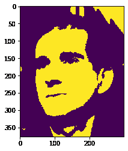
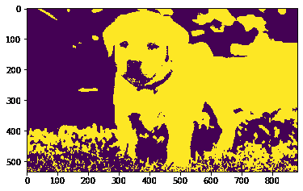

# maho tas–腐蚀图像的元素结构

> 原文:[https://www . geeksforgeeks . org/maho tas-元素-结构-腐蚀-图像/](https://www.geeksforgeeks.org/mahotas-element-structure-for-eroding-image/)

在本文中，我们将看到如何在 mahotas 中为图像的腐蚀设置元素结构。侵蚀(通常以？)是形态学图像处理中的两个基本操作(另一个是膨胀)之一，所有其他形态学操作都基于这两个基本操作。它最初是为二值图像定义的，后来扩展到灰度图像，随后又扩展到完整的点阵。为了腐蚀图像，我们使用了 mahotas.morph.erode 方法。

在本教程中，我们将使用“luispedro”图像，下面是加载它的命令。

```
mahotas.demos.load('luispedro')
```

下面是路易斯德罗的照片


下面是侵蚀元素的默认结构，它是一个 1 叉

```
np.array([
        [0, 1, 0],
        [1, 1, 1],
        [0, 1, 0]], 
        bool)
```

下面是实现

## 蟒蛇 3

```
# importing required libraries
import mahotas
import mahotas.demos
from pylab import gray, imshow, show
import numpy as np

# loading image
luispedro = mahotas.demos.load('luispedro')

# filtering image
luispedro = luispedro.max(2)

# otsu method
T_otsu = mahotas.otsu(luispedro)

# image values should be greater than otsu value
img = luispedro > T_otsu

print("Image threshold using Otsu Method")

# showing image
imshow(img)
show()

# erode structure
es = np.array([
        [1, 1, 1],
        [1, 1, 1],
        [1, 1, 1]], bool)

# eroding image using element structure
new_img = mahotas.morph.erode(img, es)

# showing dilated image
print("Eroded Image")
imshow(new_img)
show()
```

**输出:**

```
Image threshold using Otsu Method
```


```
Eroded Image
```



另一个例子

## 蟒蛇 3

```
# importing required libraries
import mahotas
import numpy as np
import matplotlib.pyplot as plt
import os

# loading image
img = mahotas.imread('dog_image.png')

# setting filter to the image
img = img[:, :, 0]

# otsu method
T_otsu = mahotas.otsu(img)

# image values should be greater than otsu value
img = img > T_otsu

print("Image threshold using Otsu Method")

# showing image
imshow(img)
show()

# erode structure
es = np.array([
        [0, 0, 0],
        [0, 1, 0],
        [0, 0, 0]], bool)

# eroding image using element structure
new_img = mahotas.morph.erode(img, es)

# showing dilated image
print("Eroded Image")
imshow(new_img)
show()
```

**输出:**

```
Image threshold using Otsu Method 
```


```
Eroded Image
```

