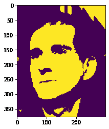
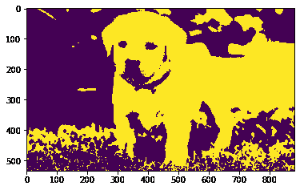

# maho tas–腐蚀图像

> 原文:[https://www.geeksforgeeks.org/mahotas-eroding-image/](https://www.geeksforgeeks.org/mahotas-eroding-image/)

在本文中，我们将看到如何侵蚀 mahotas 中的图像。侵蚀(通常以？)是形态学图像处理中的两个基本操作(另一个是膨胀)之一，所有其他形态学操作都基于这两个基本操作。它最初是为二值图像定义的，后来扩展到灰度图像，随后又扩展到完整的点阵。

在本教程中我们将使用“luispedro”图像，下面是加载它的命令。

```py
mahotas.demos.load('luispedro')
```

下面是路易斯德罗的照片


为此，我们将使用 mahotas.morph.erodemethod

> **语法:**maho tas . morph . erode(image)
> **参数:**它以图像对象作为参数
> **返回:**它返回图像对象

**注意:**输入图像应被过滤或加载为灰色

为了过滤图像，我们将获取 numpy.ndarray 的图像对象，并在索引的帮助下过滤它，下面是这样做的命令

```py
image = image[:, :, 0]
```

下面是实现

## 蟒蛇 3

```py
# importing required libraries
import mahotas
import mahotas.demos
from pylab import gray, imshow, show
import numpy as np

# loading image
luispedro = mahotas.demos.load('luispedro')

# filtering image
luispedro = luispedro.max(2)

# otsu method
T_otsu = mahotas.otsu(luispedro)

# image values should be greater than otsu value
img = luispedro > T_otsu

print("Image threshold using Otsu Method")

# showing image
imshow(img)
show()

# eroding image
new_img = mahotas.morph.erode(img)

# showing eroded image
print("Eroded Image")
imshow(new_img)
show()
```

**输出:**

```py
Image threshold using Otsu Method 
```


```py
Eroded Image 
```



另一个例子

## 蟒蛇 3

```py
# importing required libraries
import mahotas
import numpy as np
import matplotlib.pyplot as plt
import os

# loading image
img = mahotas.imread('dog_image.png')

# setting filter to the image
img = img[:, :, 0]

# otsu method
T_otsu = mahotas.otsu(img)

# image values should be greater than otsu value
img = img > T_otsu

print("Image threshold using Otsu Method")

# showing image
imshow(img)
show()

# eroding image
new_img = mahotas.morph.erode(img)

# showing eroded image
print("Eroded Image")
imshow(new_img)
show()
```

**输出:**

```py
Image threshold using Otsu Method 
```


```py
Eroded Image
```

