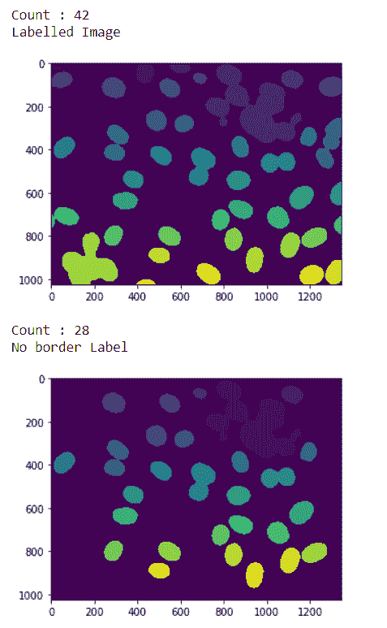
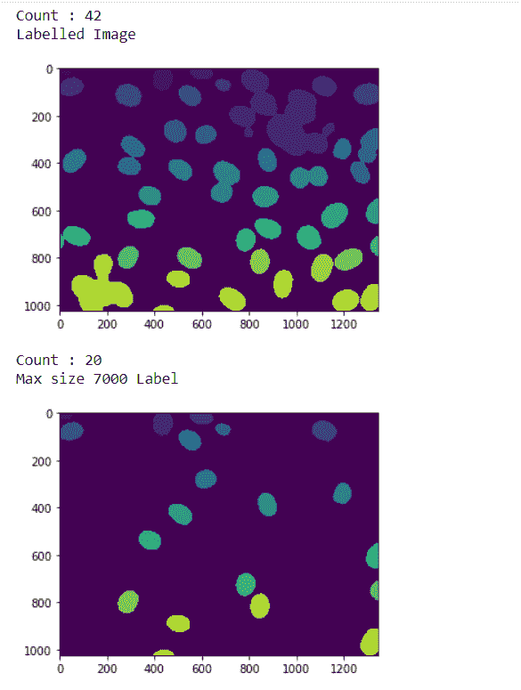

# maho tas–过滤标签

> 原文:[https://www.geeksforgeeks.org/mahotas-filtering-labels/](https://www.geeksforgeeks.org/mahotas-filtering-labels/)

在本文中，我们将看到如何在 mahotas 中过滤标签图像的标签。过滤标签类似于实现重新标记功能，但不同之处在于过滤时，我们将删除，即在调用过滤方法时过滤标签，过滤将为我们提供新的标记图像和标签数量。我们使用 mahotas.label 方法来标记图像
为此，我们将使用来自核分割基准的荧光显微图像。我们可以借助下面给出的命令
获得图像

```py
mhotas.demos.nuclear_image()
```

下图是核 _ 图像


**标记图像**是整数图像，其中的值对应于不同的区域。也就是说，区域 1 是值为 1 的所有像素，区域 2 是值为 2 的像素，以此类推
为了做到这一点，我们将使用 maho tas . label . filter _ label 方法

> **语法:**maho tas . label . filter _ label(label _ image，filter1，filter2)
> **参数:**它以带标签的图像对象和过滤器为参数
> **返回:**它返回带标签的图像和整数即标签数

**注意:**滤镜可以是边框标签滤镜，最大大小不限。
**例 1:**

## 蟒蛇 3

```py
# importing required libraries
import mahotas
import numpy as np
from pylab import imshow, show
import os

# loading nuclear image
f = mahotas.demos.load('nuclear')

# setting filter to the image
f = f[:, :, 0]

# setting gaussian filter
f = mahotas.gaussian_filter(f, 4)

# setting threshold value
f = (f> f.mean())

# creating a labelled image
labelled, n_nucleus = mahotas.label(f)

# printing number of labels
print("Count : " + str(n_nucleus))

# showing the labelled image
print("Labelled Image")
imshow(labelled)
show()

# filtering the label image
# adding border filter
relabelled, n_left = mahotas.labelled.filter_labelled(labelled, remove_bordering = True)

# showing number of labels
print("Count : " + str(n_left))

# showing the image
print("No border Label")
imshow(relabelled)
show()
```

## 蟒蛇 3

```py
# importing required libraries
import mahotas
import numpy as np
from pylab import imshow, show
import os

# loading nuclear image
f = mahotas.demos.load('nuclear')

# setting filter to the image
f = f[:, :, 0]

# setting gaussian filter
f = mahotas.gaussian_filter(f, 4)

# setting threshold value
f = (f> f.mean())

# creating a labelled image
labelled, n_nucleus = mahotas.label(f)

# printing number of labels
print("Count : " + str(n_nucleus))

# showing the labelled image
print("Labelled Image")
imshow(labelled)
show()

# filtering the label image
# adding border filter
relabelled, n_left = mahotas.labelled.filter_labelled(labelled, remove_bordering = True)

# showing number of labels
print("Count : " + str(n_left))

# showing the image
print("No border Label")
imshow(relabelled)
show()
```

## 蟒蛇 3

```py
# importing required libraries
import mahotas
import numpy as np
from pylab import imshow, show
import os

# loading nuclear image
f = mahotas.demos.load('nuclear')

# setting filter to the image
f = f[:, :, 0]

# setting gaussian filter
f = mahotas.gaussian_filter(f, 4)

# setting threshold value
f = (f> f.mean())

# creating a labelled image
labelled, n_nucleus = mahotas.label(f)

# printing number of labels
print("Count : " + str(n_nucleus))

# showing the labelled image
print("Labelled Image")
imshow(labelled)
show()

# filtering the label image
# adding border filter
relabelled, n_left = mahotas.labelled.filter_labelled(labelled, remove_bordering = True)

# showing number of labels
print("Count : " + str(n_left))

# showing the image
print("No border Label")
imshow(relabelled)
show()
```

**输出:**



**例 2:**

## 蟒蛇 3

```py
# importing required libraries
import mahotas
import numpy as np
from pylab import imshow, show
import os

# loading nuclear image
f = mahotas.demos.load('nuclear')

# setting filter to the image
f = f[:, :, 0]

# setting gaussian filter
f = mahotas.gaussian_filter(f, 4)

# setting threshold value
f = (f> f.mean())

# creating a labelled image
labelled, n_nucleus = mahotas.label(f)

# printing number of labels
print("Count : " + str(n_nucleus))

# showing the labelled image
print("Labelled Image")
imshow(labelled)
show()

# filtering the label image
# adding max size filter
relabelled, n_left = mahotas.labelled.filter_labelled(labelled, max_size = 7000)

# showing number of labels
print("Count : " + str(n_left))

# showing the image
print("Max size 7000 Label")
imshow(relabelled)
show()
```

## 蟒蛇 3

```py
# importing required libraries
import mahotas
import numpy as np
from pylab import imshow, show
import os

# loading nuclear image
f = mahotas.demos.load('nuclear')

# setting filter to the image
f = f[:, :, 0]

# setting gaussian filter
f = mahotas.gaussian_filter(f, 4)

# setting threshold value
f = (f> f.mean())

# creating a labelled image
labelled, n_nucleus = mahotas.label(f)

# printing number of labels
print("Count : " + str(n_nucleus))

# showing the labelled image
print("Labelled Image")
imshow(labelled)
show()

# filtering the label image
# adding max size filter
relabelled, n_left = mahotas.labelled.filter_labelled(labelled, max_size = 7000)

# showing number of labels
print("Count : " + str(n_left))

# showing the image
print("Max size 7000 Label")
imshow(relabelled)
show()
```

**输出:**

