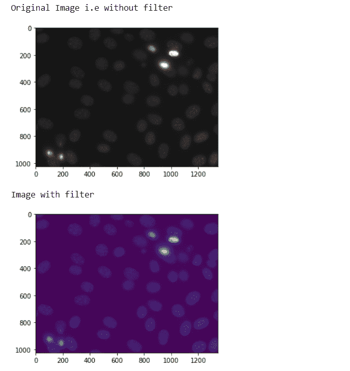
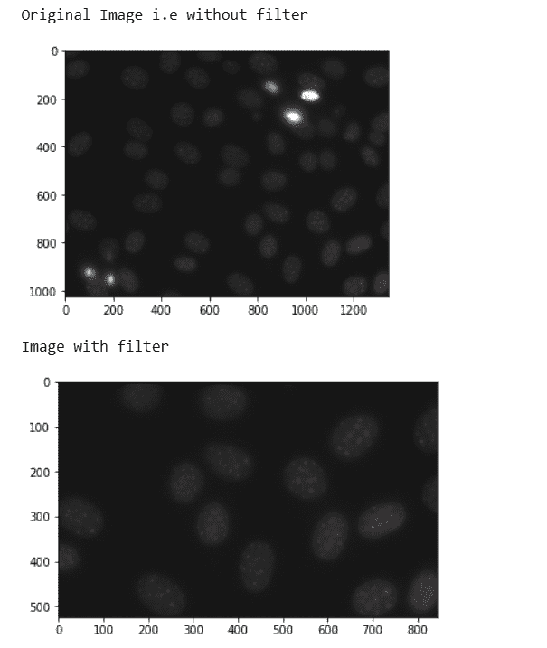

# maho tas–过滤区域

> 原文:[https://www.geeksforgeeks.org/mahotas-filtering-region/](https://www.geeksforgeeks.org/mahotas-filtering-region/)

在本文中，我们将看到如何在 mahotas 中过滤区域。为此，我们将使用来自核分割基准的荧光显微图像。我们可以在下面给出的命令的帮助下获得图像–

```
mhotas.demos.nuclear_image()
```

下图是
核 _ 像

为了过滤这个图像，我们将获取 numpy.ndarray 的图像对象，并在索引的帮助下对其进行过滤，下面是这样做的命令

```
nuclear = nuclear[:, :, 0]
```

**例 1 :**

```
# importing required libraries
import mahotas as mh
import mahotas.demos
import numpy as np
from pylab import imshow, show

# getting nuclear image
nuclear = mh.demos.nuclear_image()

print("Original Image i.e without filter")
# show the original image
imshow(nuclear)
show()

# filtering the image
nuclear = nuclear[:, :, 0]

print("Image with filter")
# showing the image
imshow(nuclear)
show()
```

**输出:**


**例 2 :**

```
# importing required libraries
import mahotas as mh
import mahotas.demos
import numpy as np
from pylab import imshow, show

# getting nuclear image
nuclear = mh.demos.nuclear_image()

print("Original Image i.e without filter")
# show the original image
imshow(nuclear)
show()

# filtering the image
nuclear = nuclear[500:, 500:, :]

print("Image with filter")
# showing the image
imshow(nuclear)
show()
```

**输出:**
