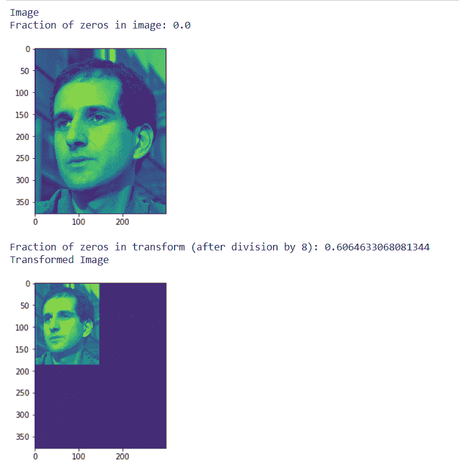

# maho tas–图像中零的分数

> 原文:[https://www . geeksforgeeks . org/maho tas-图像中零的分数/](https://www.geeksforgeeks.org/mahotas-fraction-of-zeros-in-image/)

在本文中，我们将看到如何在 mahotas 中获取图像中的零的分数。零的分数是统计数据为零的百分比。它与统计模型相关，在统计模型中，大量对象的值为零。
在本教程中我们将使用“luispedro”图像，下面是加载它的命令。

```
mahotas.demos.load('luispedro')
```

下面是路易斯德罗的图片


为了做到这一点，我们将使用 np.mean 方法

> **语法:** np.mean(img==0)
> **自变量:**以图像对象为自变量
> **返回:**返回 numpy.float64

**注意:**输入图像应该被过滤或者应该被加载为灰色
为了过滤图像，我们将获取 numpy.ndarray 的图像对象，并借助索引对其进行过滤，下面是这样做的命令

```
image = image[:, :, 0]
```

**例 1:**

## 蟒蛇 3

```
# importing various libraries
import numpy as np
import mahotas
import mahotas.demos
from mahotas.thresholding import soft_threshold
from pylab import imshow, show
from os import path

# loading image
f = mahotas.demos.load('luispedro', as_grey = True)

# showing image
print("Image")

# getting fraction of zeros in image
fraction = np.mean(f == 0)

print("Fraction of zeros in image: {0}".format(fraction))
imshow(f)
show()

# Transform using D8 Wavelet to obtain transformed image t
t = mahotas.daubechies(f, 'D8')

# Discard low-order bits:
t /= 8
t = t.astype(np.int8)

# getting fraction of zeros in image
fraction = np.mean(t == 0)

print("Fraction of zeros in transform (after division by 8): {0}".format(fraction))

# showing transformed image
print("Transformed Image")
imshow(t)
show()
```

**输出:**



**例 2:**

## 蟒蛇 3

```
# importing required libraries
import mahotas
import numpy as np
from pylab import imshow, show
import os

# loading image
img = mahotas.imread('dog_image.png')

# filtering image
img = img[:, :, 0]

# getting fraction of zeros in image
fraction = np.mean(img == 0)

print("Fraction of zeros in image: {0}".format(fraction))
imshow(img)
show()

# Transform using D8 Wavelet to obtain transformed image t
t = mahotas.daubechies(img, 'D8')

# Discard low-order bits:
t /= 8
t = t.astype(np.int8)

# getting fraction of zeros in image
fraction = np.mean(t == 0)

print("Fraction of zeros in transform (after division by 8): {0}".format(fraction))

# showing transformed image
print("Transformed Image")
imshow(t)
show()
```

**输出:**

