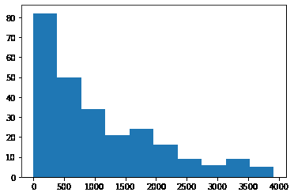
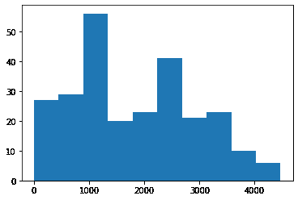

# maho tas–图像的完整直方图

> 原文:[https://www . geesforgeks . org/maho tas-完整图像直方图/](https://www.geeksforgeeks.org/mahotas-full-histogram-of-image/)

在本文中，我们将看到如何在 mahotas 中绘制图像的直方图。图像直方图是一种直方图，作为数字图像中色调分布的图形表示。它绘制了每个色调值的像素数。通过查看特定图像的直方图，观众将能够一目了然地判断整个色调分布。
在本教程中我们将使用“lena”图像，下面是加载它的命令。

```py
mahotas.demos.load('lena')
```

下图是莉娜形象


> 为了做到这一点，我们将使用 maho tas . full 直方图方法
> **语法:**maho tas . full 直方图(img)
> **参数:**它以图像对象作为参数
> **返回:**它返回 np.uint32
> 类型的数组

**注意:**输入图像应该被过滤或者应该被加载为灰色
为了过滤图像，我们将获取 numpy.ndarray 的图像对象，并借助索引对其进行过滤，下面是这样做的命令

```py
image = image[:, :, 0]
```

下面是实现

## 蟒蛇 3

```py
# importing required libraries
import mahotas
import mahotas.demos
from pylab import gray, imshow, show
import numpy as np
import matplotlib.pyplot as plt

# loading image
img = mahotas.demos.load('lena')

# filtering image
img = img.max(2)

print("Image")

# showing image
imshow(img)
show()

# Computing histogram
value = mahotas.fullhistogram(img)

# showing histograph
plt.hist(value)
```

**输出:**

```py
Image
```


```py
(array([82., 50., 34., 21., 24., 16.,  9.,  6.,  9.,  5.]),
 array([   0.,  391.9,  783.8, 1175.7, 1567.6, 1959.5, 2351.4, 2743.3,
        3135.2, 3527.1, 3919\. ]),
 a list of 10 Patch objects)
```



另一个例子

## 蟒蛇 3

```py
# importing required libraries
import mahotas
import numpy as np
from pylab import gray, imshow, show
import os
import matplotlib.pyplot as plt

# loading image
img = mahotas.imread('dog_image.png')

# filtering image
img = img[:, :, 0]

print("Image")

# showing image
imshow(img)
show()

# Computing histogram
value = mahotas.fullhistogram(img)

# showing histograph
plt.hist(value)
```

**输出:**

```py
Image
```


```py
(array([27., 29., 56., 20., 23., 41., 21., 23., 10.,  6.]),
 array([1.0000e+00, 4.4780e+02, 8.9460e+02, 1.3414e+03, 1.7882e+03,
        2.2350e+03, 2.6818e+03, 3.1286e+03, 3.5754e+03, 4.0222e+03,
        4.4690e+03]),
 a list of 10 Patch objects>
```

