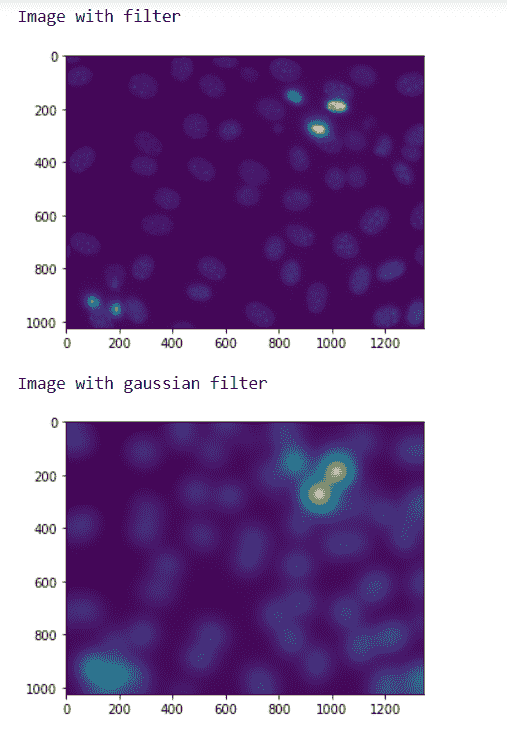
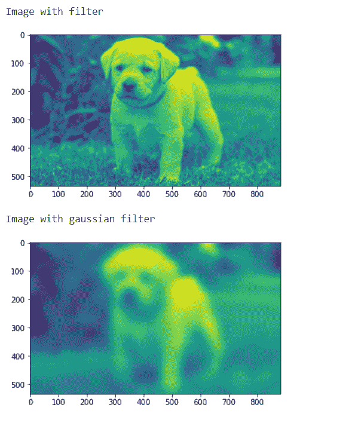

# maho tas–高斯滤波

> 原文:[https://www.geeksforgeeks.org/mahotas-gaussian-filtering/](https://www.geeksforgeeks.org/mahotas-gaussian-filtering/)

在本文中，我们将看到如何在 mahotas 中进行高斯滤波。为此，我们将使用来自核分割基准的荧光显微图像。我们可以借助下面给出的命令
获得图像

```py
mhotas.demos.nuclear_image()
```

A **高斯滤波器**是线性滤波器。它通常用于模糊图像或减少噪声。如果您使用其中的两个并减去，您可以将它们用于“反锐化掩模”(边缘检测)。高斯滤波器本身会模糊边缘并降低对比度。
下图是核 _ 图


为此，我们将使用 mahotas.gaussian_filter 方法

> **语法:**maho tas . Gaussian _ filter(nuclear，20)
> **参数:**它以 numpy.ndarray 对象作为参数和一个整数
> **返回:**它返回 numpy.ndarray 对象

**注意:**高斯滤波器的输入应该是滤波后的图像对象
为了对图像进行滤波，我们将取 numpy.ndarray 的图像对象，借助索引进行滤波，下面是这样做的命令

```py
image = image[:, :, 0]
```

**例 1 :**

## 蟒蛇 3

```py
# importing required libraries
import mahotas
import mahotas.demos
import numpy as np
from pylab import imshow, show

# getting nuclear image
nuclear = mh.demos.nuclear_image()

# filtering the image
nuclear = nuclear[:, :, 0]

print("Image with filter")
# showing the image
imshow(nuclear)
show()

# setting gaussian filter
nuclear = mahotas.gaussian_filter(nuclear, 35)

print("Image with gaussian filter")
# showing the gaussian filter
imshow(nuclear)
show()
```

**输出:**



**例 2:**

## 蟒蛇 3

```py
# importing required libraries
import numpy as np
import mahotas
from pylab import imshow, show

# loading image
img = mahotas.imread('dog_image.png')

# filtering the image
img = img[:, :, 0]

print("Image with filter")
# showing the image
imshow(img)
show()

# setting gaussian filter
gaussian = mahotas.gaussian_filter(img, 15)

print("Image with gaussian filter")
# showing the gaussian filter
imshow(gaussian)
show()
```

**输出:**

