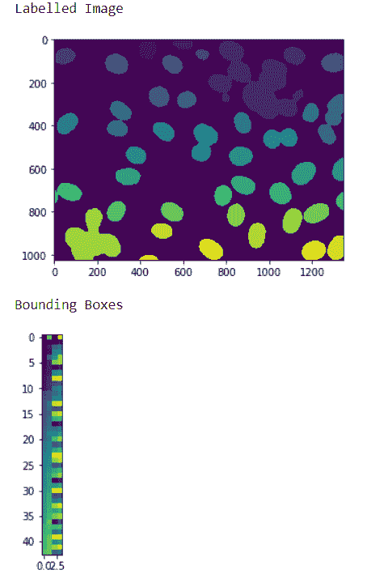
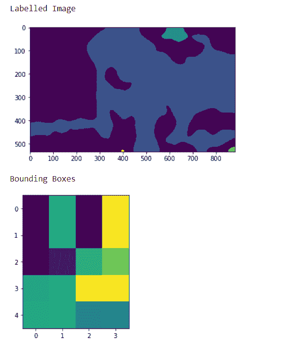

# maho tas–获取标记图像的边界框

> 原文:[https://www . geeksforgeeks . org/maho tas-get-bounding-box-of-labed-image/](https://www.geeksforgeeks.org/mahotas-getting-bounding-boxes-of-labelled-image/)

在本文中，我们将看到如何在 mahotas 中获取标签图像中所有对象的边界框。为此，我们将使用来自核分割基准的荧光显微图像。我们可以借助下面给出的命令
获得图像

```
mhotas.demos.nuclear_image()
```

下图是核 _ 图像


为了做到这一点，我们将使用 maho tas . labled . bbox 方法

> **语法:**maho tas . tagged . bbox(tagged _ image)
> **参数:**它以 numpy . ndaray 对象为参数即 tagged image
> **返回:**它返回 numpy . ndaray 对象即包围盒图像

**注意:**这个的输入应该是标记为
的过滤后的图像对象，为了过滤图像，我们将取 numpy.ndarray 的图像对象，借助索引进行过滤，下面是做这个的命令

```
image = image[:, :, 0]
```

**例 1 :**

## 蟒蛇 3

```
# importing required libraries
import mahotas
import numpy as np
from pylab import imshow, show
import os

# loading nuclear image
f = mahotas.demos.load('nuclear')

# setting filter to the image
f = f[:, :, 0]

# setting gaussian filter
f = mahotas.gaussian_filter(f, 4)

# setting threshold value
f = (f> f.mean())

# creating a labelled image
labelled, n_nucleus = mahotas.label(f)

# showing the labelled image
print("Labelled Image")
imshow(labelled)
show()

# getting bounding boxes
relabeled = mahotas.labelled.bbox(labelled)

# showing the image
print("Bounding Boxes")
imshow(relabelled)
show()
```

**输出:**



**例 2 :**

## 蟒蛇 3

```
# importing required libraries
import numpy as np
import mahotas
from pylab import imshow, show

# loading image
img = mahotas.imread('dog_image.png')

# filtering the image
img = img[:, :, 0]

# setting gaussian filter
gaussian = mahotas.gaussian_filter(img, 15)

# setting threshold value
gaussian = (gaussian > gaussian.mean())

# creating a labelled image
labelled, n_nucleus = mahotas.label(gaussian)

print("Labelled Image")
# showing the gaussian filter
imshow(labelled)
show()

# getting bounding boxes
relabelled = mahotas.labelled.bbox(labelled)

# showing the image
print("Bounding Boxes")
imshow(relabelled)
show()
```

**输出:**

