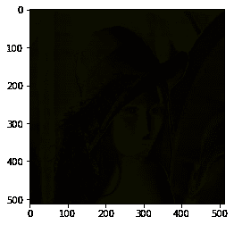
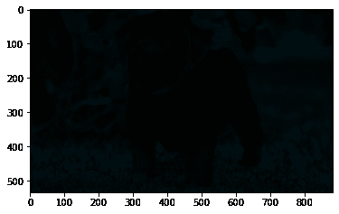

# maho tas–获取每个像素的信息清晰度

> 原文:[https://www . geeksforgeeks . org/maho tas-get-infocusness-of-per-pixel/](https://www.geeksforgeeks.org/mahotas-getting-infocusness-of-each-pixel/)

在本文中，我们将看到如何获得 mahotas 中每个像素的信息焦点。为了得到每个像素的信息，我们将使用 sobel 算子。索贝尔算子，有时称为索贝尔-费尔德曼算子或索贝尔滤波器，用于图像处理和计算机视觉，特别是在边缘检测算法中，它创建强调边缘的图像。

在本教程中我们将使用“lena”图像，下面是加载它的命令。

```py
mahotas.demos.load('lena')
```

下面是莉娜的形象


> 为此，我们将使用 mahotas.sobel 方法
> **语法:**maho tas . Sobel(2d _ img)
> **参数:**它以二维图像对象作为参数
> **返回:**它返回图像对象

下面是实现

## 蟒蛇 3

```py
# importing required libraries
import mahotas
import mahotas.demos
from pylab import gray, imshow, show
import numpy as np

# loading image
img = mahotas.demos.load('lena')

# showing image
print("Image")
imshow(img)
show()

# getting infocusness of each pixel
focus = np.array([mahotas.sobel(t, just_filter = True) for t in img])

# showing focus pixel
print("Focus Image")
imshow(focus)
show()
```

**输出:**

```py
Image
```


```py
Focus Image
```



另一个例子

## 蟒蛇 3

```py
# importing required libraries
import mahotas
import numpy as np
from pylab import gray, imshow, show
import os

# loading image
img = mahotas.imread('dog_image.png')

# filtering image
img = img[:, :, :3]

# showing image
print("Image")
imshow(img)
show()

# getting infocusness of each pixel
focus = np.array([mahotas.sobel(t, just_filter = True) for t in img])

# showing focus pixel
print("Foucs Image")
imshow(focus)
show()
```

**输出:**

```py
Image 
```


```py
Focus Image
```

