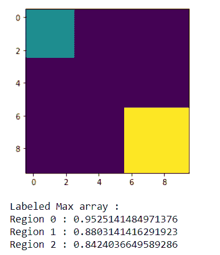
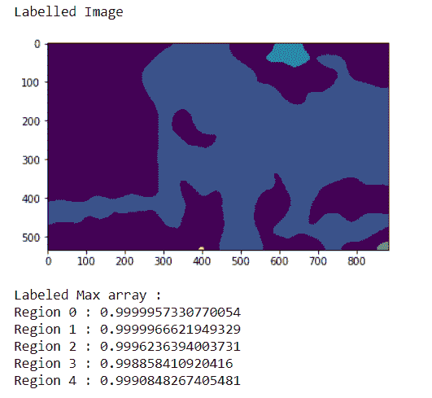

# maho tas–获得标记的最大数组

> 原文:[https://www . geeksforgeeks . org/maho tas-get-label-max-array/](https://www.geeksforgeeks.org/mahotas-getting-labeled-max-array/)

在本文中，我们将了解如何获取 in mahotas 的标记 max 数组。标记图像是整数图像，其中的值对应于不同的区域。即，区域 1 是具有值 1 的所有像素，区域 2 是具有值 2 的像素，以此类推。按照惯例，区域 0 是背景，通常处理方式不同。我们可以在 mahotas.label 方法的帮助下创建一个标记区域。
我们可以借助 mahotas.label_size 方法得到每个区域的大小，这个大小简单地用每个区域的像素数来衡量。相反，我们可以测量每个区域的总重量。
为了做到这一点，我们将使用 maho tas . label . label _ max 方法

> **语法:**maho tas . label . label _ max(array，label _ img)
> **参数:**它以两个 numpy.ndarray 对象作为参数，即区域形状的随机数组和标签区域
> **返回:**它返回 numpy.float64 值的数组

**例 1:**

## 蟒蛇 3

```py
# importing required libraries
import mahotas
import numpy as np
from pylab import imshow, show

# creating region
# numpy.ndarray
regions = np.zeros((10, 10), bool)

# setting 1 value to the region
regions[:3, :3] = 1
regions[6:, 6:] = 1

# getting labeled function
labeled, nr_objects = mahotas.label(regions)

# showing the image with interpolation = 'nearest'
imshow(labeled, interpolation ='nearest')
show()

# random agaary of region shapes   
array = np.random.random_sample(regions.shape)

# getting labeld max array
l_array = mahotas.labeled.labeled_max(array, labeled)

print("Labeled Max array :")
# printing the  values
for i in range(len(l_array)):
    print("Region " + str(i) + " : " + str(l_array[i]))
```

**输出:**



```py
Labeled Max array :
Region 0 : 0.9980513142322492
Region 1 : 0.624390200202312
Region 2 : 0.9210927640926101
```

**例 2:**

## 蟒蛇 3

```py
# importing required libraries
import numpy as np
import mahotas
from pylab import imshow, show

# loading image
img = mahotas.imread('dog_image.png')

# filtering the image
img = img[:, :, 0]

# setting gaussian filter
gaussian = mahotas.gaussian_filter(img, 15)

# setting threshold value
gaussian = (gaussian > gaussian.mean())

# creating a labeled image
labeled, n_nucleus = mahotas.label(gaussian)

print("Labelled Image")
# showing the gaussian filter
imshow(labeled)
show()

# random agary of region shapes   
array = np.random.random_sample(labeled.shape)

# getting labeld max array
l_array = mahotas.labeled.labeled_max(array, labeled)

print("Labeled Max array :")
# printing the  values
for i in range(len(l_array)):
    print("Region " + str(i) + " : " + str(l_array[i]))
```

**输出:**



```py
Labeled Max array :
Region 0 : 0.9999995478951564
Region 1 : 0.9999944289534851
Region 2 : 0.999718434740755
Region 3 : 0.9996236088210476
Region 4 : 0.9861670123032187
```