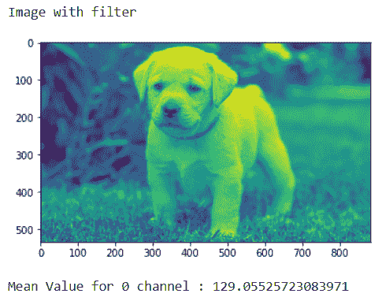
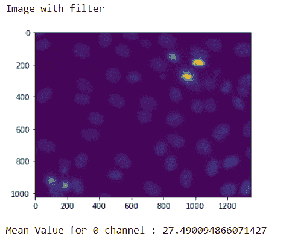

# maho tas–获取图像的平均值

> 原文:[https://www . geesforgeks . org/maho tas-get-mean-value-of-image/](https://www.geeksforgeeks.org/mahotas-getting-mean-value-of-image/)

在本文中，我们将看到如何在 mahotas 中获得图像的平均值。平均值是像素值的总和除以像素值的总数。
**像素值**存储在计算机中的代表图像的每个像素都有一个像素值，该值描述了该像素有多亮和/或应该是什么颜色。在最简单的二进制图像的情况下，像素值是指示前景或背景的 1 位数字。
**均值**是所有统计量中最基本的。几何和分析中常用的手段；为了这些目的，已经开发了多种手段。在图像处理竞赛中，使用均值的滤波被归类为空间滤波，用于降噪。
为了做到这一点，我们将使用均值法

> **语法:** img.mean()
> **参数:**不需要参数
> **返回:**返回 float32

这里 img 是使用 mahotas 加载的图像，这可以在 mahotas.imread(image_name)方法的帮助下完成。
**注意:**图像在取均值前要先过滤，因为一次可以计算一个通道
**例 1 :**

## 蟒蛇 3

```
# importing required libraries
import numpy as np
import mahotas
from pylab import imshow, show

# loading image
img = mahotas.imread('dog_image.png')

# filtering the image
img = img[:, :, 0]

print("Image with filter")
# showing the image
imshow(img)
show()

# getting mean value
mean = img.mean()

# printing mean value
print("Mean Value for 0 channel : " + str(mean))
```

**输出:**



```
Mean Value for 0 channel : 129.05525723083971
```

**例 2 :**

## 蟒蛇 3

```
# importing required libraries
import mahotas as mh
import mahotas.demos
import numpy as np
from pylab import imshow, show

# getting nuclear image
nuclear = mh.demos.nuclear_image()

# filtering the image
nuclear = nuclear[:, :, 0]

print("Image with filter")
# showing the image
imshow(nuclear)
show()

# getting mean value
mean = nuclear.mean()

# printing mean value
print("Mean Value for 0 channel : " + str(mean))
```

**输出:**



```
Mean Value for 0 channel : 27.490094866071427
```

**注意:**每个通道都有不同的平均值，平均值可以作为设置图像阈值的一个很好的选项。