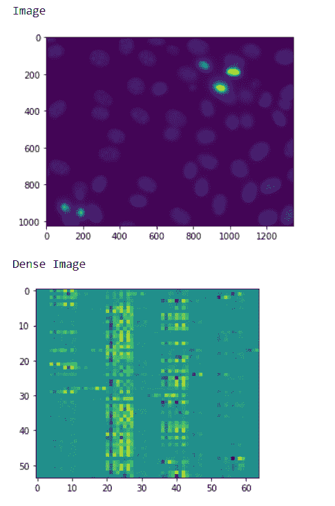
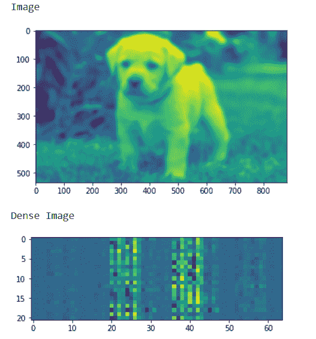

# maho tas–获取冲浪密集点

> 原文:[https://www . geesforgeks . org/maho tas-get-surf-dense-points/](https://www.geeksforgeeks.org/mahotas-getting-surf-dense-points/)

在本文中，我们将看到如何在 mahotas 中获得加速的鲁棒的图像密集特征。在计算机视觉中，加速鲁棒特征是一种专利的局部特征检测器和描述符。它可用于对象识别、图像配准、分类或三维重建等任务。它部分地受到尺度不变特征变换描述符的启发。为此，我们将使用来自核分割基准的荧光显微图像。我们可以借助下面给出的命令
获得图像

```py
mahotas.demos.nuclear_image()
```

下图是核 _ 图像


为了做到这一点，我们将使用冲浪密集法

> **语法:** surf.surf(img，spacing)
> **参数:**它以图像对象和整数作为参数
> **返回:**它返回 numpy.ndarray 即密集点处的描述符

**例 1 :**

## 蟒蛇 3

```py
# importing various libraries
import mahotas
import mahotas.demos
import mahotas as mh
import numpy as np
from pylab import imshow, show
from mahotas.features import surf

# loading nuclear image
nuclear = mahotas.demos.nuclear_image()

# filtering image
nuclear = nuclear[:, :, 0]

# adding gaussian filter
nuclear = mahotas.gaussian_filter(nuclear, 4)

# showing image
print("Image")
imshow(nuclear)
show()

# getting Speeded-Up Robust dense points
dense_img = surf.dense(nuclear, 120)

# showing image
print("Dense Image")
imshow(dense_img)
show()
```

**输出:**



**例 2 :**

## 蟒蛇 3

```py
# importing required libraries
import numpy as np
import mahotas
from pylab import imshow, show
from mahotas.features import surf

# loading image
img = mahotas.imread('dog_image.png')

# filtering the image
img = img[:, :, 0]

# setting gaussian filter
gaussian = mahotas.gaussian_filter(img, 5)

# showing image
print("Image")
imshow(gaussian)
show()

# getting Speeded-Up Robust dense points
dense_img = surf.dense(gaussian, 80)

# showing image
print("Dense Image")
imshow(dense_img)
show()
```

**输出:**

