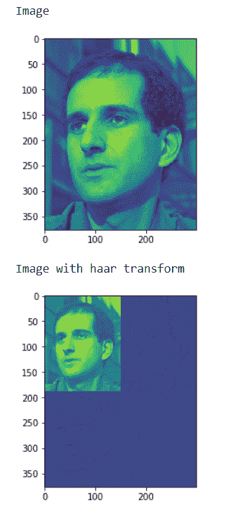
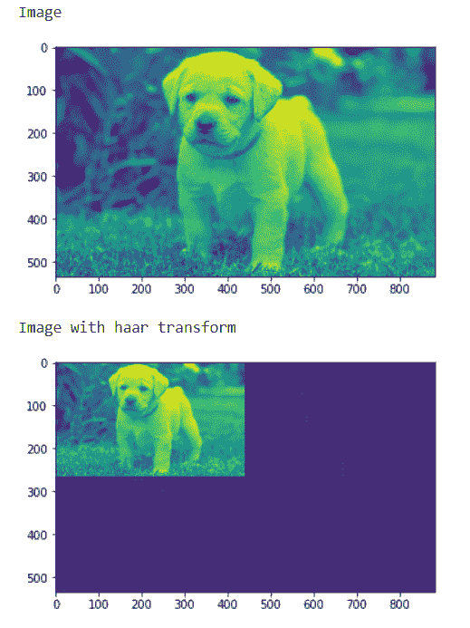

# 马霍斯-哈尔变换

> 原文:[https://www.geeksforgeeks.org/mahotas-haar-transform/](https://www.geeksforgeeks.org/mahotas-haar-transform/)

在本文中，我们将看到如何在 mahotas 中进行图像哈尔变换。哈尔小波是一系列重新标度的“方形”函数，它们共同构成一个小波族或基。小波分析类似于傅立叶分析，因为它允许用正交基来表示一个区间上的目标函数。哈尔序列现在被认为是第一个已知的小波基，并被广泛用作教学例子。
在本教程中我们将使用“luispedro”图像，下面是加载它的命令。

```
mahotas.demos.load('luispedro')
```

下面是路易斯德罗的图片


为了做到这一点，我们将使用 mahotas.haar 方法

> **语法:** mahotas.haar(img)
> **自变量:**它以图像对象为自变量
> **返回:**它返回图像对象

**注意:**输入图像应该被过滤或者应该被加载为灰色
为了过滤图像，我们将获取 numpy.ndarray 的图像对象，并借助索引对其进行过滤，下面是这样做的命令

```
image = image[:, :, 0]
```

**例 1:**

## 蟒蛇 3

```
# importing various libraries
import numpy as np
import mahotas
import mahotas.demos
from mahotas.thresholding import soft_threshold
from pylab import imshow, show
from os import path

# loading image
f = mahotas.demos.load('luispedro', as_grey = True)

# showing image
print("Image")

imshow(f)
show()

# haar transform
h = mahotas.haar(f)

# showing image
print("Image with haar transform")
imshow(h)
show()
```

**输出:**



**例 2:**

## 蟒蛇 3

```
# importing required libraries
import mahotas
import numpy as np
from pylab import imshow, show
import os

# loading image
img = mahotas.imread('dog_image.png')

# filtering image
img = img[:, :, 0]

# showing image
print("Image")

imshow(img)
show()

# haar transform
h = mahotas.haar(img)

# showing image
print("Image with haar transform")
imshow(h)
show()
```

**输出:**

